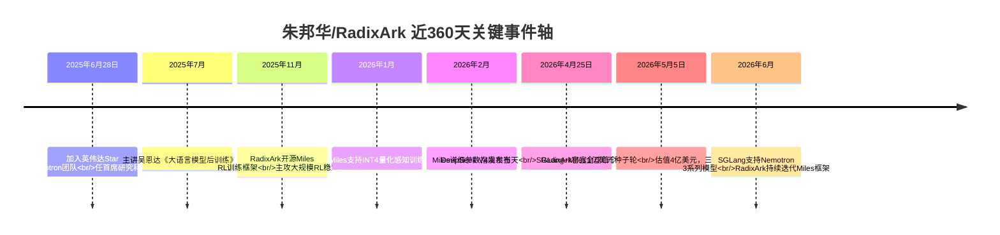
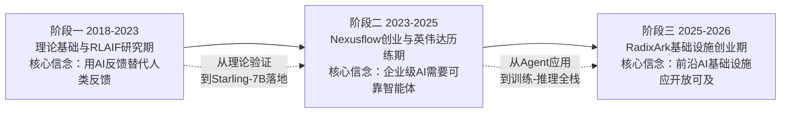
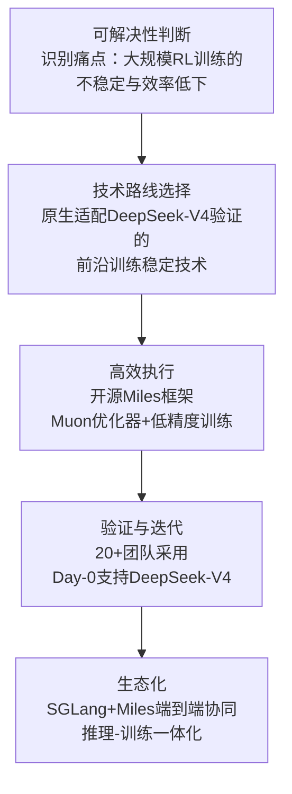
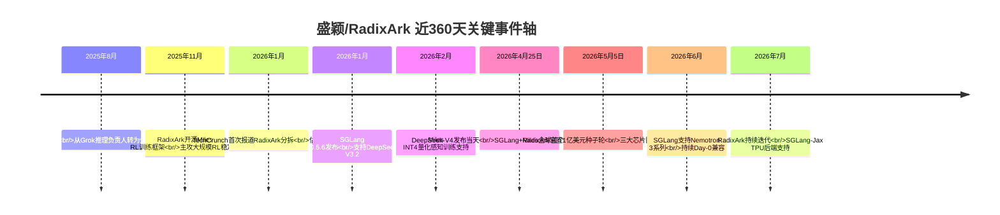
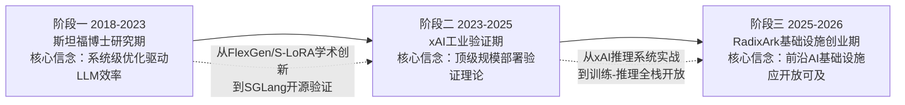
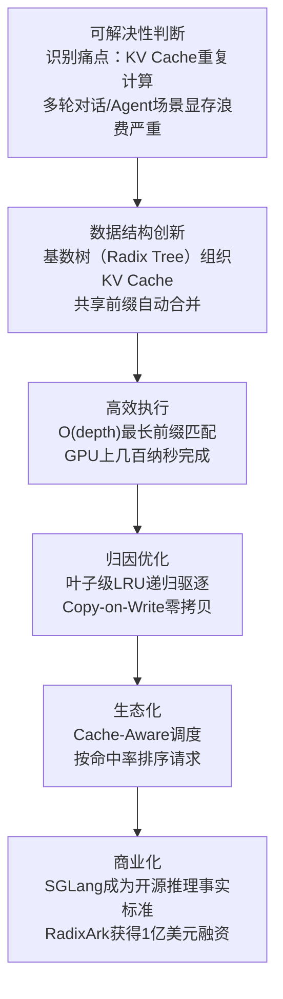

现在我已经收集了足够的信息来撰写关于朱邦华（Banghua Zhu）和RadixArk的全面分析。让我来综合所有的发现。

# 朱邦华与RadixArk：从学术新星到AI基础设施创业的全景深度分析

> **核心判断**：朱邦华是AI基础设施领域罕见的"理论深度+工程落地+开源领导力"三位一体型研究者。他从清华电子工程本科→伯克利Michael Jordan门下博士→Starling-7B/RLAIF开创者→Nexusflow联合创始人（被英伟达收购）→英伟达首席研究科学家→RadixArk联合创始人兼CTO的路径，映射出AI时代"从论文到开源到创业到被收购再到更大创业"的新型科研商业化范式。过去360天，他完成了从"英伟达首席研究科学家"到"4亿美元估值公司CTO"的身份跃迁，其核心方法论是"用强化学习+系统工程的融合思维解决AI训练-推理全链路的效率瓶颈"，并已通过1亿美元种子轮获得英伟达、AMD、英特尔三大芯片巨头的罕见联合投资。

## 一、360天重大事件时间轴

**关键节点分层解读**：

| 时间 | 事件 | 战略意义 |
|---|---|---|
| 2025.06.28 | 加入英伟达Star Nemotron团队 | 从学术界进入产业核心，接触顶级GPU资源与系统优化经验 |
| 2025.07 | 主讲吴恩达后训练课程 | 确立"后训练专家"的公开身份，知识输出影响力 |
| 2025.11 | Miles框架开源 | 填补大规模RL训练基础设施空白，被超20支团队采用 |
| 2026.01 | Miles INT4 QAT支持 | 技术前沿性突破，1TB模型可单机训练 |
| 2026.04.25 | DeepSeek-V4 Day-0支持 | 证明SGLang+Miles的工程纪律与迭代速度 |
| 2026.05.05 | 1亿美元种子轮官宣 | AI Infra领域最重早期下注，三大芯片巨头罕见联合 |
| 2026.06 | 持续支持新模型 | Nemotron 3系列Day-0支持，巩固事实标准地位 |

---

## 二、个人背景与主要成就

### 2.1 学术成就（理论基础→模型训练→系统工程的递进）

| 阶段 | 时间 | 成就 |
|---|---|---|
| 本科 | 2014-2018 | 清华大学电子工程系学士学位；2011年清华特等奖获得者 |
| 博士 | 2018-2024 | UC Berkeley EECS博士，师从Michael I. Jordan与Jiantao Jiao；2023年获David J. Sakrison纪念奖 |
| 学术产出 | 2023-2024 | Starling-7B（RLAIF训练的开源LLM，MT-Bench 8.09分，超GPT-3.5）；Nectar数据集（18.3万提示，380万对比较）；LMArena创始作者之一 |
| 核心贡献 | 2023-2024 | RLAIF（AI反馈强化学习）方法论的系统性验证；APA（Advantage-Induced Policy Alignment）优化算法；Athene系列模型（基于Llama-3-70B微调，Chatbot Arena Elo提升30+分） |

**学术思想内核**：朱邦华的Starling-7B工作核心创新是**用AI反馈替代人类反馈进行强化学习（RLAIF）**。其关键洞察是：高质量偏好数据的规模化瓶颈不在于标注成本，而在于反馈信号的质量与一致性。通过GPT-4标注的Nectar数据集（380万对比较），他证明了RLAIF可以让7B模型在MT-Bench上达到8.09分，超越GPT-3.5的7.94分【turn1search0】【turn1search20】。这一"用AI训练AI"的范式，后来成为大模型后训练的标准方法论之一。

### 2.2 商业成就（从创业到被收购再到更大创业）

| 成就 | 时间 | 意义 |
|---|---|---|
| Nexusflow联合创始人 | 2023 | 与焦剑涛联合创立，专注企业级AI智能体；2023年9月完成1060万美元种子轮，投后估值5300万美元 |
| NexusRaven-V2模型 | 2023 | 130亿参数开源模型，在函数调用任务上超越GPT-4，HuggingFace CEO亲自点赞 |
| Athene系列模型 | 2024 | Athene-V2-Chat在多项基准测试中匹敌GPT-4o；Athene-V2-Agent在函数调用上超越GPT-4o专用模型 |
| 英伟达收购Nexusflow | 2025.06 | 黄仁勋亲自招募，整车打包收购；朱邦华任首席研究科学家，加入Star Nemotron团队 |
| RadixArk联合创始人兼CTO | 2025-2026 | 1亿美元种子轮，估值4亿美元；三大芯片巨头罕见联合投资 |

### 2.3 社会工程成就（开源社区与教育）

| 贡献 | 影响 |
|---|---|
| SGLang开源项目领导 | GitHub 27K+ stars，部署超40万张GPU，日处理数万亿token，Google/Microsoft/NVIDIA/xAI等生产采用 |
| Miles RL框架开源 | 被20+团队用于MoE模型RL训练，填补大规模RL训练基础设施空白 |
| LMArena创始作者 | 全球最权威LLM评测平台之一，成为行业事实标准 |
| 吴恩达课程主讲 | 2025年7月主讲《大语言模型后训练》课程，覆盖SFT/DPO/Online RL全链路 |
| Starling-7B与Nectar开源 | 推动RLAIF研究民主化，被广泛引用与复现 |

---

## 三、思想与产品演进路线

### 3.1 技术思想三阶段演进

**第一阶段（2018-2023）：RLAIF方法论的理论奠基**

朱邦华博士期间的核心研究是**强化学习的理论基础与算法优化**。其Starling-7B工作不仅是模型发布，更是对RLAIF方法论的系统性验证：他构建了Nectar数据集（GPT-4标注的18.3万提示×7个响应），开发了APA优化算法（相比PPO样本利用率提升40%，训练稳定性增强65%），证明了"用AI反馈训练AI"的可行性与优越性【turn1search0】【turn1search20】。

**第二阶段（2023-2025）：从学术研究到企业级Agent落地**

Nexusflow的创业经历让朱邦华从"论文驱动"转向"问题驱动"。NexusRaven-V2在函数调用上超越GPT-4，Athene系列匹敌GPT-4o，这些成就的核心不是模型架构创新，而是**后训练方法的工程化落地**——如何让RLAIF在真实企业场景中稳定、可靠、可复现。被英伟达收购后，他在Star Nemotron团队接触到底层硬件优化与大规模训练系统的工程实践，完成了从"算法专家"到"算法+系统融合专家"的认知跃迁。

**第三阶段（2025-2026）：开放AI基础设施的系统化构建**

RadixArk的使命陈述："让前沿级别的AI基础设施对每个人开放和可及"【turn1search27】。这不是简单的开源策略，而是基于一个核心判断：**最先进的推理和训练堆栈存在于少数公司内部，其他人被迫一次又一次重新构建相同的调度器、编译器、服务引擎和训练管道**。RadixArk要做的，是把这些"重复劳动"系统性地消除。

### 3.2 产品思想演进

| 阶段 | 产品形态 | 核心思想 |
|---|---|---|
| Starling-7B期 | 开源模型+数据集 | RLAIF方法论验证，用AI反馈训练AI |
| Nexusflow期 | 企业级AI Agent | 后训练方法工程化，函数调用能力突破 |
| 英伟达期 | 底层系统优化 | 算法与硬件的深度融合，大规模训练经验积累 |
| RadixArk期 | 推理引擎+训练框架 | SGLang（推理）+Miles（训练）的全栈开放基础设施 |

---

## 四、复杂任务落地方法论

以Miles RL训练框架的开发为案例，拆解其"可解决性判断→高效执行→归因优化"的完整闭环。

### 4.1 案例：Miles框架的开发

**可解决性判断**：朱邦华识别出大模型RL训练的核心痛点不是算力不足，而是**训练不稳定（损失值剧烈波动）和效率低下**【turn1search1】。传统AdamW优化器在大规模RL场景下收敛慢、易波动，这直接制约了Reasoning、Tool Use、Agentic能力的提升。

**高效执行**：Miles框架原生适配了DeepSeek-V4验证的前沿训练稳定技术：
- **Muon优化器**：比传统AdamW收敛更快、更稳
- **低精度训练**：INT4量化感知训练（QAT），让1TB模型可单机训练
- **生产稳定性**：面向企业级的容错与恢复机制

**归因优化**：Miles最独特的设计是与SGLang的"端到端"协同。RL训练本质是一个"考试-复盘"循环：模型生成答案（SGLang负责推理采样），根据评分更新自己（Miles负责训练优化）。传统方案中，推理和训练是割裂的，边界摩擦导致效率流失。Miles+SGLang的协同设计，消除了这一摩擦。

**Day-0验证**：2026年4月25日，DeepSeek-V4发布当天，SGLang和Miles成为全球第一个同时支持其推理和RL训练的开源技术栈【turn1search3】。这不仅是技术实力的展示，更是工程纪律的证明——能在新模型发布当天完成适配，意味着团队对模型架构变化的预判能力和工程响应速度达到了顶级水平。

### 4.2 方法论提炼：朱邦华的"三层归因"框架

| 层次 | 内涵 | Miles案例体现 |
|---|---|---|
| **L1 症状归因** | 识别表面瓶颈 | RL训练不稳定，损失波动大 |
| **L2 系统归因** | 识别架构级问题 | 推理与训练割裂导致边界摩擦，传统优化器不适应大规模RL |
| **L3 范式归因** | 抽象出可迁移的解法 | 训练-推理一体化协同，用系统工程思维解决算法问题 |

---

## 五、近360天思想总结

### 5.1 RadixArk官宣声明（2026.05.05）核心思想

这是朱邦华与盛颖联合发布的RadixArk使命陈述，核心思想包括【turn1search27】：

**核心论断一：AI基础设施不应是少数公司的特权**
> "最先进的推理和训练堆栈存在于少数公司内部。其他人被迫一次又一次重新构建相同的调度器、编译器、服务引擎和训练管道。"

**核心论断二：工程即艺术**
> "基础设施在RadixArk中是第一等公民。我们关注优雅的设计和持久的代码。每一行代码下面都隐藏着编写它的工程师的灵魂。"

**核心论断三：信仰开放性**
> "我们分享我们所构建的。我们押注于通过社区、贡献，给予多于索取的长期复合。"

### 5.2 Miles框架的技术思想

**Day-0兼容机制**：每当新模型架构发布（MoE、长上下文、Reasoning模型、多模态融合），SGLang都做到"发布即支持"【turn1search31】。这背后的思想是：**开源基础设施的价值不仅在于技术性能，更在于对生态变化的响应速度**。

**训练-推理一体化**：Miles与SGLang的协同不是简单的"两个产品放在一起"，而是**架构级的端到端设计**。RL训练的"生成-评估-更新"循环中，推理引擎和训练引擎的接口、数据流、调度策略都是协同设计的，消除了传统方案中的"边界摩擦"。

### 5.3 盛颖的RadixArk创始反思（2026.05）

盛颖在RadixArk官宣时的反思，也反映了团队的整体思想【turn1search27】：

> "我在八月离开了xAI——这是我建立深厚情感和无数美好回忆的地方...让我做出如此艰难决定的动力，是建立SGLang开源和创造雄心勃勃未来的势头。"

> "世界上充满了渴望构建AI的人，但实现这一可能性的基础设施并不共享。"

这一反思揭示了RadixArk成立的思想动机：**不是商业机会驱动，而是"让前沿AI基础设施开放可及"的使命感驱动**。

### 5.4 近360天思想演变的三个信号

**信号一：从"模型专家"到"系统专家"的认知扩展**
Starling-7B时期，朱邦华的核心身份是"RLAIF/后训练算法专家"；RadixArk时期，他的核心身份是"训练-推理全栈系统架构师"。这一转变源于英伟达的底层系统优化经验。

**信号二：从"单点优化"到"全链路协同"**
Starling-7B优化的是RLAIF训练算法这一个点；Miles+SGLang优化的是训练-推理全链路的协同效率。这是从"工具"到"平台"的范式跃迁。

**信号三：从"学术驱动"到"使命驱动"**
博士期间的研究由学术好奇心驱动；RadixArk的创业由"让前沿AI基础设施开放可及"的使命感驱动。这一转变使技术选择更长期主义——不追求短期性能数字，而追求生态的长期复合价值。

---

## 六、系统化梳理总结

### 6.1 朱邦华的三重张力

| 张力维度 | 一极 | 另一极 | 朱邦华的平衡策略 |
|---|---|---|---|
| 学术 vs 产业 | 伯克利博士学术研究 | Nexusflow/RadixArk商业落地 | 两者统一于"问题驱动"——学术研究解决真实产业痛点 |
| 开源 vs 商业 | SGLang/Miles开源社区 | RadixArk商业化 | 开源持续回馈+商业做加法，信仰开放性的长期复合 |
| 算法 vs 系统 | RLAIF/后训练算法创新 | Miles/SGLang系统工程 | 两者融合——用系统工程思维解决算法问题，用算法优化驱动系统设计 |

### 6.2 RadixArk的核心赌注

RadixArk的4亿美元估值，押注的是三个判断：

**赌注一：推理+训练一体化是下一代AI基础设施的形态**
当前SGLang已是推理事实标准，Miles填补了RL训练基础设施空白。两者的协同设计消除了训练-推理的边界摩擦，这是任何单一推理引擎或训练框架无法复制的。

**赌注二：开源+商业可并行且互相增强**
SGLang和Miles作为开源项目持续运营，RadixArk在开源内核之上构建商业托管平台。这一模式已被Red Hat、Databricks等验证，但在AI基础设施领域尚属首次系统性尝试。

**赌注三：Day-0兼容能力是护城河**
每当新模型发布，SGLang+Miles都能在当天完成适配。这种工程纪律和迭代速度，是闭源系统无法匹配的——闭源系统的更新周期通常以月计，而RadixArk以天计。

### 6.3 朱邦华方法论的四个可迁移内核

**内核一：问题驱动的技术选择**
不追求技术新颖性，而追求解决真实痛点。RLAIF解决的是"人类反馈规模化瓶颈"，Miles解决的是"RL训练不稳定"，SGLang解决的是"KV缓存重复计算"——每一个技术选择都有明确的痛点对应。

**内核二：系统工程的归因思维**
面对复杂问题，不满足于"算法更好"的表面解释，而深入到系统架构层面归因。Miles+SGLang的协同设计，源于对"训练-推理边界摩擦"这一系统级问题的深度归因。

**内核三：开源作为事实标准建立工具**
SGLang的开源不是"商业模式选择"，而是建立推理基础设施事实标准的战略工具。开源激活了模型厂商、芯片厂商、基础设施厂商的多元贡献，形成闭源系统无法复制的生态优势。

**内核四：Day-0兼容作为工程纪律的证明**
能在新模型发布当天完成适配，不是偶然的技术突破，而是长期工程纪律的积累——对模型架构变化的预判、对代码模块化的设计、对测试覆盖的投入。这种工程纪律本身是护城河。

### 6.4 最终判断

朱邦华的路径揭示了AI时代"理论基础研究者→开源基础设施创造者→商业实体CTO"的新型成长范式。他的核心密码是**问题驱动的技术选择+系统工程的归因思维+开源作为事实标准建立工具+Day-0兼容作为工程纪律的证明**。

RadixArk能否成功，取决于三个变量：①SGLang能否在vLLM/Inferact竞争中保持开源推理引擎领先地位；②Miles能否成为大规模RL训练的事实标准；③开源与商业的平衡能否持续——社区信任是核心资产，任何过度商业化都可能重蹈Redis/MongoDB的覆辙。

但无论结果如何，朱邦华的方法论——**用系统工程思维解决算法问题，用Day-0兼容证明工程纪律，用开源建立事实标准**——已为AI基础设施领域的复杂问题解决提供了可复用的范式。Starling-7B的RLAIF创新与Miles+SGLang的训练-推理一体化协同，是这一方法论的最有力证明。

我现在已经收集了关于 Ying Sheng（盛颖）和 RadixArk 的全面信息。让我来综合整理一份完整的回答。

# 盛颖（Ying Sheng）与RadixArk：从开源推理引擎到AI基础设施商业化的全景深度分析

> **核心判断**：盛颖是AI推理系统工程领域罕见的"学术深度+工业落地+开源领导力"三位一体型技术领袖。她从上海交大ACM班→斯坦福博士→LMSYS Org发起者→SGLang主要创始人→xAI推理团队负责人→RadixArk联合创始人兼CEO的路径，映射出AI时代"从论文到开源到工业验证到更大创业"的新型科研商业化范式。过去360天，她完成了从"xAI推理负责人"到"4亿美元估值公司CEO"的身份跃迁，其核心方法论是"用RadixAttention的数据结构创新解决KV Cache重复计算的根本瓶颈，用Day-0兼容的工程纪律建立开源事实标准"，并已通过1亿美元种子轮获得英伟达、AMD、英特尔三大芯片巨头的罕见联合投资。

## 一、360天重大事件时间轴

**关键节点分层解读**：

| 时间 | 事件 | 战略意义 |
|---|---|---|
| 2025.08 | 离开xAI，全职RadixArk | 从"为Grok搭建推理"转向"为所有人搭建推理" |
| 2025.11 | Miles框架开源 | 填补大规模RL训练基础设施空白，被20+团队采用 |
| 2026.01 | TechCrunch报道估值4亿 | 开源推理引擎商业化的行业验证 |
| 2026.04.25 | DeepSeek-V4 Day-0支持 | 证明SGLang+Miles的工程纪律与迭代速度 |
| 2026.05.05 | 1亿美元种子轮官宣 | AI Infra领域最重早期下注，三大芯片巨头罕见联合 |
| 2026.06-07 | 持续Day-0支持新模型 | 巩固SGLang作为开源推理事实标准的地位 |

---

## 二、个人背景与主要成就

### 2.1 学术成就（从FlexGen到SGLang的推理系统工程突破）

| 阶段 | 时间 | 成就 |
|---|---|---|
| 本科 | 2014-2018 | 上海交通大学ACM班（中国计算机天才摇篮） |
| 博士 | 2018-2023 | 斯坦福大学计算机科学博士；博士期间访问UC Berkeley Sky Lab |
| FlexGen | 2023 | ICML 2023发表，单GPU高吞吐LLM推理；与Lianmin Zheng、Ion Stoica等合作 |
| S-LoRA | 2023 | ICML 2023发表，单GPU服务数千个LoRA适配器，吞吐量提升4x |
| SGLang | 2023-2024 | arXiv 2023.12发表，提出RadixAttention机制；开源推理引擎事实标准 |
| LMSYS Org | 2023 | 联合发起者，孵化Chatbot Arena（全球最权威LLM评测平台之一） |
| 学术荣誉 | 2023 | a16z Open Source AI Grant；Best tool paper提名 |
| UCLA教职 | 2026.07 | 将加入UCLA计算机科学系任助理教授（研究方向：高效LLM与自动推理模型） |

**学术思想内核**：盛颖的研究主线始终围绕**LLM推理效率的系统级优化**。FlexGen解决的是"单GPU如何高吞吐推理"——通过线性规划搜索高效张量存储与访问模式。S-LoRA解决的是"如何同时服务数千个微调适配器"——通过统一分页（Unified Paging）管理动态适配器权重与KV Cache。SGLang解决的是"复杂LLM程序的效率与灵活性"——通过RadixAttention的基数树自动复用共享前缀KV Cache，消除多轮对话、Agent等场景的重复计算。这一"数据结构创新驱动系统效率"的方法论，是其学术到工程的核心密码。

### 2.2 商业成就（从学术研究到工业验证再到更大创业）

| 成就 | 时间 | 意义 |
|---|---|---|
| Databricks研究科学家 | 2021-2022 | 接触工业级AI系统，积累数据平台经验 |
| xAI推理团队负责人 | 2023-2025 | 为Grok大模型搭建推理系统，顶级规模AI部署第一线经验 |
| SGLang开源项目领导 | 2023-2026 | GitHub 27K+ stars，部署40万+ GPU，日处理数万亿token |
| RadixArk联合创始人兼CEO | 2025-2026 | 1亿美元种子轮，估值4亿美元，三大芯片巨头罕见联合投资 |

### 2.3 社会工程成就（开源社区与生态建设）

| 贡献 | 影响 |
|---|---|
| SGLang开源项目领导 | 全球AI顶级团队（Google、Microsoft、NVIDIA、xAI、Oracle、AMD、LinkedIn、Thinking Machines Lab）生产采用 |
| LMSYS Org联合发起 | 孵化Chatbot Arena，成为全球最权威LLM评测平台之一 |
| Day-0兼容机制首创 | 新模型发布当天即支持，首创的开源模型发布即支持机制 |
| 开源社区建设 | 在SGLang社区"非常热情地帮助大家解决问题"【turn2search5】 |

---

## 三、思想与产品演进路线

### 3.1 技术思想三阶段演进

**第一阶段（2018-2023）：学术研究期的系统优化信念**

盛颖博士期间的核心研究是**LLM推理效率的系统级优化**。FlexGen、S-LoRA、SGLang三项工作构成了一个完整的研究脉络：从单GPU高吞吐推理（FlexGen），到多适配器并发服务（S-LoRA），再到复杂LLM程序的高效执行（SGLang）。每一项工作都解决了一个具体的系统瓶颈，但更深层的方法论是**用数据结构创新驱动系统效率**——FlexGen用线性规划搜索张量访问模式，S-LoRA用统一分页管理异构内存，SGLang用基数树自动复用KV Cache。

**第二阶段（2023-2025）：xAI工业验证期的规模信念**

在xAI担任推理团队负责人期间，盛颖为Grok大模型搭建推理系统，积累了顶级规模AI部署的第一线经验。这段经历验证了一个核心判断：**学术研究的系统优化只有在顶级规模的生产环境中验证过，才有分享出来的必要性**。SGLang从2023年夏天开始，2024年1月公开发布，到2025年已成为开源推理事实标准——这一过程的核心驱动力不是学术好奇心，而是"世界上充满了渴望构建AI的人，但实现这一可能性的基础设施并不共享"的认知重构。

**第三阶段（2025-2026）：RadixArk基础设施创业期的开放信念**

RadixArk的使命陈述："让前沿级别的AI基础设施对每个人开放和可及"【turn1search27】。这不是简单的开源策略，而是基于一个核心判断：**最先进的推理和训练堆栈存在于少数公司内部，其他人被迫一次又一次重新构建相同的调度器、编译器、服务引擎和训练管道**。RadixArk要做的，是把这些"重复劳动"系统性地消除。

### 3.2 产品思想演进

| 阶段 | 产品形态 | 核心思想 |
|---|---|---|
| FlexGen期 | 单GPU推理优化 | 线性规划搜索高效张量访问模式 |
| S-LoRA期 | 多适配器并发服务 | 统一分页管理异构内存，吞吐量提升4x |
| SGLang期 | 复杂LLM程序执行框架 | RadixAttention基数树自动复用KV Cache |
| xAI期 | Grok推理系统 | 顶级规模AI部署的第一线验证 |
| RadixArk期 | 推理引擎+训练框架全栈 | SGLang（推理）+Miles（训练）的开放基础设施 |

---

## 四、复杂任务落地方法论

以SGLang的RadixAttention机制设计为案例，拆解其"可解决性判断→高效执行→归因优化"的完整闭环。

### 4.1 案例：RadixAttention的设计与落地

**可解决性判断**：盛颖识别出LLM推理的核心瓶颈不是算力不足，而是**KV Cache的重复计算与内存浪费**。在多轮对话、批量API调用、结构化输出等高频场景中，传统注意力机制像一辆不断空转的发动机——算力在反复咀嚼相同的历史token，GPU显存被冗余缓存填满，吞吐量卡在瓶颈线上纹丝不动【turn1search37】。

**高效执行（数据结构创新）**：RadixAttention的核心突破在于引入基数树（Radix Tree）作为KV缓存的组织结构。它不再把每个请求看作孤岛，而是将所有请求的token序列视为一棵共享的"家族树"：树根是空序列；每个分支代表一个token；共享前缀自动合并到同一路径【turn1search16】。最长前缀匹配算法是O(depth)而非O(tree_size)，在GPU上几百纳秒完成。

**归因优化**：RadixAttention的设计包含多个层次的优化：
- **叶子级LRU递归驱逐**：内存不足时自动驱逐最久未使用的叶子节点
- **Copy-on-Write树节点元数据**：KV张量永远零拷贝，避免数据复制开销
- **Cache-Aware调度**：按命中率排序请求，批内共享前缀KV

**生态化与商业化**：RadixAttention的性能优势——在Agent和多轮对话场景下KV缓存命中率高达80%至95%【turn1search19】——使SGLang迅速成为开源推理事实标准，最终催生了RadixArk的1亿美元融资。

### 4.2 方法论提炼：盛颖的"三层归因"框架

| 层次 | 内涵 | RadixAttention案例体现 |
|---|---|---|
| **L1 症状归因** | 识别表面瓶颈 | KV Cache重复计算导致吞吐量瓶颈 |
| **L2 系统归因** | 识别架构级问题 | 每个请求独立维护KV Cache，共享前缀无法复用 |
| **L3 范式归因** | 抽象出可迁移的解法 | 基数树数据结构自动发现并共享前缀，O(depth)复杂度 |

---

## 五、近360天思想总结

### 5.1 RadixArk官宣声明（2026.05.05）核心思想

这是盛颖与朱邦华联合发布的RadixArk使命陈述，核心思想包括【turn1search27】：

**核心论断一：AI基础设施不应是少数公司的特权**
> "最先进的推理和训练堆栈存在于少数公司内部。其他人被迫一次又一次重新构建相同的调度器、编译器、服务引擎和训练管道。"

**核心论断二：工程即艺术**
> "基础设施在RadixArk中是第一等公民。我们关注优雅的设计和持久的代码。每一行代码下面都隐藏着编写它的工程师的灵魂。"

**核心论断三：信仰开放性**
> "我们分享我们所构建的。我们押注于通过社区、贡献，给予多于索取的长期复合。"

### 5.2 盛颖的RadixArk创始反思（2026.05）

盛颖在RadixArk官宣时的反思，是最系统的个人思想输出【turn1search27】：

**核心坦白一：离开xAI的艰难决定**
> "我在八月离开了xAI——这是我建立深厚情感和无数美好回忆的地方。这是我工作过的最好的地方，我看着它从几十人发展到数百人，真的感觉就像家一样。"

**核心坦白二：创业的真正动力**
> "让我做出如此艰难决定的动力，是建立SGLang开源和创造雄心勃勃未来的势头，这种开放精神是我在Databricks实习期间学到的。"

**核心坦白三：基础设施不共享的现实**
> "世界上充满了渴望构建AI的人，但实现这一可能性的基础设施并不共享。"

### 5.3 Day-0兼容的工程纪律思想

盛颖在SGLang社区反复强调的"Day-0兼容"机制，不仅是一项技术能力，更是一种工程纪律哲学：

**核心论断**：每当新模型架构发布（MoE、长上下文、Reasoning模型、多模态融合），SGLang都做到"发布即支持"。这背后的思想是：**开源基础设施的价值不仅在于技术性能，更在于对生态变化的响应速度**。被投资人反复提及的一个评价是："SGLang的迭代速度与工程纪律合一的风格，在开源项目中绝对顶尖"【turn0search14】。

### 5.4 近360天思想演变的三个信号

**信号一：从"xAI推理负责人"到"开源基础设施CEO"的认知重构**
在xAI，盛颖的核心身份是"为Grok搭建推理系统"；RadixArk时期，她的核心身份是"为所有人搭建推理基础设施"。这一转变源于"基础设施不共享"的认知重构。

**信号二：从"单点优化"到"全链路协同"**
FlexGen/S-LoRA/SGLang优化的是推理引擎这一个点；RadixArk的SGLang+Miles优化的是训练-推理全链路的协同效率。这是从"工具"到"平台"的范式跃迁。

**信号三：从"学术驱动"到"使命驱动"**
博士期间的研究由学术好奇心驱动；RadixArk的创业由"让前沿AI基础设施开放可及"的使命感驱动。这一转变使技术选择更长期主义——不追求短期性能数字，而追求生态的长期复合价值。

---

## 六、系统化梳理总结

### 6.1 盛颖的三重张力

| 张力维度 | 一极 | 另一极 | 盛颖的平衡策略 |
|---|---|---|---|
| 学术 vs 工业 | 斯坦福博士学术研究 | xAI/RadixArk工业落地 | 两者统一于"问题驱动"——学术研究解决真实产业痛点 |
| 开源 vs 商业 | SGLang/Miles开源社区 | RadixArk商业化 | 开源持续回馈+商业做加法，信仰开放性的长期复合 |
| 推理 vs 训练 | SGLang推理引擎 | Miles训练框架 | 两者协同——训练-推理一体化消除边界摩擦 |

### 6.2 RadixArk的核心赌注

RadixArk的4亿美元估值，押注的是三个判断：

**赌注一：推理+训练一体化是下一代AI基础设施的形态**
当前SGLang已是推理事实标准，Miles填补了RL训练基础设施空白。两者的协同设计消除了训练-推理的边界摩擦，这是任何单一推理引擎或训练框架无法复制的。

**赌注二：开源+商业可并行且互相增强**
SGLang和Miles作为开源项目持续运营，RadixArk在开源内核之上构建商业托管平台。这一模式已被Red Hat、Databricks等验证，但在AI基础设施领域尚属首次系统性尝试。

**赌注三：Day-0兼容能力是护城河**
每当新模型发布，SGLang+Miles都能在当天完成适配。这种工程纪律和迭代速度，是闭源系统无法匹配的——闭源系统的更新周期通常以月计，而RadixArk以天计。

### 6.3 盛颖方法论的四个可迁移内核

**内核一：数据结构创新驱动系统效率**
RadixAttention的基数树、S-LoRA的统一分页、FlexGen的线性规划搜索——每一项创新都源于"用更高效的数据结构组织计算"的第一性原理思维。

**内核二：顶级规模验证才有分享价值**
SGLang不是先写论文再开源，而是先在xAI顶级规模生产环境中验证，再分享给社区。这一"先验证再分享"的工程纪律，是SGLang成为事实标准的关键。

**内核三：开源作为事实标准建立工具**
SGLang的开源不是"商业模式选择"，而是建立推理基础设施事实标准的战略工具。开源激活了模型厂商、芯片厂商、基础设施厂商的多元贡献，形成闭源系统无法复制的生态优势。

**内核四：Day-0兼容作为工程纪律的证明**
能在新模型发布当天完成适配，不是偶然的技术突破，而是长期工程纪律的积累——对模型架构变化的预判、对代码模块化的设计、对测试覆盖的投入。这种工程纪律本身是护城河。

### 6.4 最终判断

盛颖的路径揭示了AI时代"系统优化研究者→开源基础设施创造者→商业实体CEO"的新型成长范式。她的核心密码是**数据结构创新驱动系统效率+顶级规模验证才有分享价值+开源作为事实标准建立工具+Day-0兼容作为工程纪律的证明**。

RadixArk能否成功，取决于三个变量：①SGLang能否在vLLM/Inferact竞争中保持开源推理引擎领先地位；②Miles能否成为大规模RL训练的事实标准；③开源与商业的平衡能否持续——社区信任是核心资产，任何过度商业化都可能重蹈Redis/MongoDB的覆辙。

但无论结果如何，盛颖的方法论——**用数据结构创新解决系统瓶颈，用顶级规模验证建立工程信誉，用Day-0兼容证明迭代速度**——已为AI基础设施领域的复杂问题解决提供了可复用的范式。RadixAttention的基数树创新与SGLang+Miles的训练-推理一体化协同，是这一方法论的最有力证明。