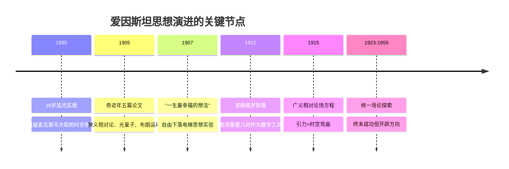
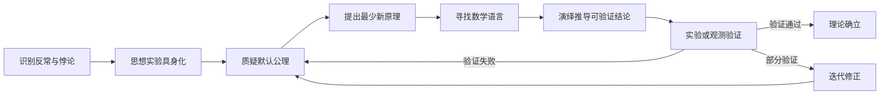

# 爱因斯坦的思想演进、核心理念与第一性原理思维

爱因斯坦思想体系的核心，是"从尽可能少的公理出发，通过逻辑演绎概括尽可能多的经验事实"——这是一种以直觉跃迁抵达原理、以数学演绎构建体系、以实验裁判完成验证的探索性演绎法，它把"自然在本性上是简单的、统一的、和谐的"这一信念作为整个思维活动的第一性原理【turn0search15】【turn0search23】。理解他的思想演进与方法论，价值不在于复述相对论，而在于学习一种"如何面对一个无现成答案的复杂问题"的认知范式。

## 一、思想演进脉络：从怀疑公理到追求统一

爱因斯坦的思想并非一蹴而就的灵感闪现，而是一条经历了多次逻辑纠偏与模型重建的漫长路径。根纳（Jürgen Renn）系统梳理其早期笔记、通信与回忆录后指出，他的思想实验是一种经过长期锤炼的认知工具，而非偶然的异想天开【turn0search5】。

**追光实验（1895）**是这一切的起点。16岁的爱因斯坦幻想自己追逐一束光，如果以光速前进，光波在他看来会成为一个"在空间上振荡但停滞不前的电磁场"——这直觉性地挑战了麦克斯韦电磁理论的时空结构预设。十年后，这一思维路径在狭义相对论中成熟，促成了光速不变原理的确立【turn0search3】【turn0search5】。这个思想实验的真正意义不在于答案，而在于它对一个"所有人都接受但从未被检验"的隐性公理——绝对 simultaneity（同时性）——提出了质疑。

**1905奇迹年**是方法论成熟的标志。五篇论文覆盖了分子大小测定、布朗运动、狭义相对论、质能关系和光量子假说，表面主题分散，底层逻辑却一致：每篇都是从一处理论与经验的不协调出发，质疑被默认的公理，用最少的新假设重建解释框架。爱因斯坦自己将这种路径称为"原理理论"方法——不构造物质模型，而是寻找若干经验上充分证实的高级约束（如相对性原理、光速不变原理），让它们反过来限制可能的理论形式【turn0search17】。

**1907年的"自由下落电梯"**被爱因斯坦称为"一生最幸福的想法"：一个从屋顶自由下落的人感受不到自己的重量。这个具身模拟把引力与加速度的等效性从抽象概念变成了可感知的物理图景，成为通往广义相对论的种子【turn0search1】【turn0search5】。值得注意的是，这一溯因飞跃靠的不是文本或符号演算，而是将自己置身于虚拟物理场景中的"具身模拟"——这与后来他自述"我很少用语言来思考，一旦某个想法出现，我最后才会尝试用语言来表达它"高度吻合【turn0search35】。

**1912年的数学转向**是思想演进中常被忽略却至关重要的一环。爱因斯坦已有广义相对论的物理直觉，却苦于无法描述弯曲时空。同学格罗斯曼向他介绍了黎曼几何和张量分析——这套数学工具已在纯粹数学领域沉睡了半个多世纪，被认为只是"逻辑构造的数学游戏"。格罗斯曼敏锐地意识到它正是爱因斯坦需要的，两人合著论文把黎曼几何、张量分析与引力理论结合起来，为1915年的场方程奠定了数学基础【turn0search10】【turn0search15】【turn0search19】。这个节点揭示了一个常被忽略的真相：**第一性原理的突破往往需要等待合适的数学语言，而不是凭空跃迁**。

**晚年统一场论（1923-1955）**是思想演进的终点，也是方法论局限性最深刻的注脚。爱因斯坦试图把引力与电磁力纳入同一几何框架，但当时强相互作用和弱相互作用尚未被发现，量子力学的统计性诠释也与他"上帝不掷骰子"的连续性信仰相悖。他孤身在普林斯顿办公室推演了三十多年，直至去世仍未完成【turn0search24】【turn0search25】。这段"失败"不是方法论破产，而是启示了第一性原理思维的边界——当可质疑的公理与待发现的经验事实之间的距离过大时，单凭逻辑与美学的内部约束无法跨越。

> **折叠框：今日映射——从追光实验到Transformer**
> 爱因斯坦"质疑所有人接受但无人检验的隐性公理"的路径，在现代AI革命中重现。Transformer架构的突破，正是质疑了RNN/CNN时代"序列必须逐步处理"这一默认假设，从注意力机制这一更底层的原理出发重构架构【turn0search27】。与爱因斯坦一样，突破者做的不是"改进现有理论"，而是"找到那个所有人都没意识到自己在相信的公理，然后推翻它"。

## 二、核心理念：直觉—演绎—验证的认知三角

爱因斯坦的方法论可以用他自己的一个图示概括：**E（直接经验）→ A（公理或假设）→ 推论 → 事实验证**。其中E到A之间"不存在任何必然的逻辑联系，只有一个不是必然的直觉的（心理的）联系"；A到推论是严格的演绎逻辑；推论到事实验证又依赖直觉判断对应关系是否可靠【turn0search15】【turn0search39】。这条链路的每一环都值得单独审视。

### 1. 直觉跃迁：从特殊到一般没有逻辑道路

爱因斯坦明确指出："从特殊到一般的道路是直觉的，而从一般到特殊的道路则是逻辑的。"他进一步说："要通向那些普遍的根本定律，并没有逻辑的道路；只有通过那种以对经验的共鸣的理解为根据的直觉，才能得到这些定律。"【turn0search37】

这里的"直觉"绝非神秘主义，而是一种长期沉浸后对模式与不协调的敏感。爱因斯坦的思维机制有强烈的视觉性：他自述"语言文字在思维机制中似乎不起作用——我的思维依赖于或多或少清晰的视觉意象和部分肌肉型意象"【turn0search31】【turn0search35】。追光实验、电梯实验都是他先在头脑中"看见"一个场景，感受其中的物理张力，再将其转译为符号。这种"先具身模拟，后符号化"的路径，对今天强调"先写prompt再理解问题"的工作方式是一种根本的反拨。

### 2. 思想实验：把抽象问题转化为可感知的模型

思想实验是爱因斯坦最独特的工具，它不是"想象一个例子"，而是构造一个逻辑上自洽、感官上可把握的虚拟场景，逼迫隐含假设显形。根纳特别指出，现存的苏黎世联邦理工学院课堂笔记表明，追光实验经历了多次逻辑纠偏与模型重建，而非一蹴而就【turn0search5】。

思想实验的威力在于它能暴露"理论内部的不协调"——当你在头脑中运行一个场景，理论与直觉的冲突会以悖论的形式显现。1919年爱因斯坦区分"原理理论"与"构造理论"时明确说，相对论就是原理理论，它通过相对性原理和光原理这两个约束来限制可能的理论形式，而不是从物质结构模型出发去构造【turn0search17】。这种"用约束替代模型"的思路，至今仍是理论物理的核心方法论。

### 3. 数学作为自然的语言：寻找合适的表达形式

爱因斯坦不擅长数学（大学时数学课常逃课，靠借格罗斯曼笔记复习），但他深刻理解数学在物理中的角色：**数学不是物理的工具，而是物理的结构化表达**。当物理直觉领先于数学工具时，他不会放弃直觉去迁就数学，而是去寻找或等待合适的数学语言【turn0search13】【turn0search15】。

黎曼几何的故事最能说明这一点。1854年黎曼创立弯曲空间几何，此后半个多世纪被认为是"纯粹逻辑构造的数学游戏，没有任何实际物理对应"。直到1912年爱因斯坦需要描述弯曲时空，才发现这套工具完美匹配他的需求——度规张量、曲率张量直接成为描述引力时空效应的核心语言【turn0search11】【turn0search19】。后来杨振宁明确表示，爱因斯坦"几何动力学对称性"思想对他研究规范场论产生了重要影响，"对称性支配相互作用"成为现代粒子物理学的基石【turn0search21】。

### 4. 统一性与简单性信念

爱因斯坦坚信"自然界的和谐性"与"科学的统一性"，把"在世界图像中尽可能地寻求逻辑的统一"看作科学的目标，认为最高层次的理论就是"具有可想像的最大统一性和最少的逻辑基础概念的理论"。他对不具有统一性的理论感到无法容忍，而具有统一性的理论则激起他的"壮丽的感觉"，是"思想领域中最高的音乐神韵"【turn0search23】。

这种信念不是美学偏好，而是方法论约束：它要求理论家用最少的假设解释最多的现象。从1900年第一篇论文《毛细管现象所得的推论》（追求分子引力与牛顿超距力的统一），到晚年统一场论，他的研究工作无一不体现对统一性的追求【turn0search23】。这种"以少驭多"的取向，正是第一性原理思维的本义。

### 5. 实验是最高的裁判

尽管爱因斯坦的方法常被描述为"先验的"，但他明确说："在这里所观察的事实无疑地也还是最高的裁判者。"【turn0search15】广义相对论完成后，他立即列出三个可验证预言：光线偏折、水星近日点进动、引力红移。1919年爱丁顿的日食观测验证了光线偏折，使相对论从抽象数学走向公共认知【turn0search1】【turn0search7】。

值得注意的是，爱因斯坦对实验裁判的态度是辩证的。当水星近日点进动的观测值与理论不符时，他不会立即放弃理论，而是先检查是否是边界条件或观测误差。但他也明确接受：如果理论与实验不一致，无论多美、无论作者多聪明，理论就是错的——这与费曼后来那句"如果与实验不符，就是错的。就是这样"完全一致【turn0search9】。

> **折叠框：今日映射——AI时代的方法论悖论**
> 大模型时代，"经验"以数据形式涌现，"数学工具"以架构形式存在，但"从经验到原理的直觉跃迁"这一环反而更稀缺了。AI擅长在既有公理体系内做演绎（推理、生成），但难以完成从特殊到一般的溯因飞跃——爱因斯坦完成相对论飞跃靠的是具身模拟与视觉意象，这正是当前AI最薄弱的能力【turn0search1】。

## 三、面对一件复杂事情的完整思考路径

把上述方法论落到一个具体复杂问题上，爱因斯坦的思考与实施路径可以概括为以下流程：

以广义相对论的创立为例，可以清晰看到每一阶段的实际运作：

**第一步：识别反常。** 狭义相对论完成后，爱因斯坦发现一个深层不协调：牛顿引力理论中引力是瞬时超距作用，但狭义相对论限制信号传播速度不能超过光速。同时，水星近日点进动的观测值与牛顿理论有每百年43角秒的偏差，长期被归因为"未被发现的行星"。爱因斯坦把这两处不协调识别为"理论本身的危机"，而非"观测误差"或"边界修正"【turn0search17】。

**第二步：思想实验具身化。** 1907年的"自由下落电梯"把引力与加速度的等效性变成可感知的物理图景。爱因斯坦不是先写方程，而是先在头脑中"进入"那个电梯，感受失重与加速的体感差异。这种具身模拟让他抓住了引力与时空几何的关联——引力不是"力"，而是物体在弯曲时空中沿测地线的自然运动【turn0search1】【turn0search5】。

**第三步：质疑默认公理。** 牛顿引力理论默认"时空是平直的、引力是力"。爱因斯坦质疑的正是这个公理：如果时空本身是弯曲的，"引力"就不再是独立的力，而是时空几何的表现。这一步是最艰难的，因为它要推翻的不是某个方程，而是整个物理学共同体默认的时空背景【turn0search26】。

**第四步：提出最少新原理。** 爱因斯坦确立广义协变原理——物理定律在所有参考系中形式相同——作为新理论的核心约束。这与狭义相对论确立"相对性原理+光速不变原理"的方法一致：不构造物质模型，而是寻找原理性约束【turn0search17】。

**第五步：寻找数学语言。** 这是爱因斯坦最艰难的八年。他已有了物理直觉，但无法用数学表达弯曲时空。1912年求助格罗斯曼，后者从书架上抽出黎曼1854年的演讲稿说"试试这个"【turn0search15】。爱因斯坦起初对陌生符号一脸茫然，但逐渐意识到黎曼几何的度规张量、曲率张量正是他需要的语言。这里有一个关键的认知动作：**不是让物理直觉迁就现成数学，而是让数学成为物理直觉的精确表达**【turn0search19】。

**第六步：演绎推导可验证结论。** 1915年11月完成场方程 $G_{\mu\nu} + \Lambda g_{\mu\nu} = \frac{8\pi G}{c^4} T_{\mu\nu}$ 后，爱因斯坦立即推出三个可观测预言：光线偏折、水星近日点进动、引力红移。他不是等别人来验证，而是主动设计"自然的实验"——让理论去冒险，去面对可能证伪它的观测【turn0search1】【turn0search17】。

**第七步：实验验证与迭代。** 1919年爱丁顿日食观测验证光线偏折，水星近日点进动也被精确验证。但爱因斯坦也接受理论可能被修正——他后来引入宇宙学常数Λ又放弃又重新考虑，正是对理论内部不协调的持续响应。验证不是终点，而是下一轮迭代的起点【turn0search7】。

这套路径的本质，是**在"经验-原理-数学-实验"之间建立闭环反馈，而非单向推进**。任何一环出问题都会回到前面重新调整：数学工具不足就回去找新工具，实验不符就回去质疑原理，原理不自洽就回去重做思想实验。

> **折叠框：今日映射——复杂问题的现代映射**
> 这套路径在现代科研与工程中可以直接套用。以"AI对齐"问题为例：识别反常（模型产出与人类价值观的不一致）→ 思想实验（设想一个能力远超人类但目标错位的系统会做什么）→ 质疑公理（"能力越强越安全"或"规模即解药"是否成立）→ 提出新原理（可解释性、可纠正性、价值学习）→ 寻找数学语言（形式化价值函数、因果推断）→ 推导可验证结论（对齐基准测试）→ 实验验证。整个链条与爱因斯坦的路径同构。

## 四、从第一性原理出发对今天的启示

爱因斯坦方法论的当代价值，不在于鼓励每个人都去推演场方程，而在于提供一种对抗"经验主义惯性"和"权威依赖"的思维范式。可以用一张对比表来呈现这种范式差异：

| 维度 | 表象思维/类比思维 | 爱因斯坦式第一性原理思维 |
|---|---|---|
| 起点 | 从既有方案出发做改进 | 从"哪些公理被默认但未检验"出发 |
| 推理方向 | 归纳法：从案例总结规律 | 直觉-演绎法：从原理推出结论 |
| 对待权威 | 接受既有理论的框架 | 质疑框架本身的公理 |
| 数学角色 | 计算工具 | 结构化表达自然语言 |
| 失败态度 | 视为方法错误 | 视为公理识别错误的信号 |
| 验证方式 | 与同类方案对比 | 与实验/观测直接对比 |
| 时间观 | 追求短期效率 | 接受漫长酝酿（广义相对论耗时8年） |

### 1. 真正的第一性原理，是质疑"所有人接受但无人检验的公理"

爱因斯坦的突破不在算出什么，而在质疑了"同时性是绝对的"、"时空是平直的"、"引力是力"这些被默认了两百年的公理。他对第一性原理的理解比今天流行版本深刻得多：**不是"把事物分解到基本组件再重组"，而是"找到那个隐藏的、所有人都在用它但没意识到自己在用它的前提，然后检验它是否真的必要"**【turn0search17】【turn0search27】。

这对今天的启示是直接的：在任何领域遇到复杂问题时，先问"这个问题最底层的、被所有人默认的前提是什么"，而不是"现有的最佳实践是什么"。马斯克造火箭时质疑"火箭只能用一次"，Transformer质疑"序列必须逐步处理"，本质都是爱因斯坦式动作的当代复现【turn0search27】。

### 2. 数学是自然的语言，不是计算的工具

爱因斯坦与黎曼几何的故事揭示了一个常被颠倒的关系：**不是先有数学然后套用到物理，而是物理直觉先成熟，然后等待合适的数学语言来精确表达**。黎曼几何沉睡了半个多世纪才被爱因斯坦"认领"，群论诞生一百多年后才成为粒子物理的核心工具【turn0search11】。

这对今天AI与数据科学领域有特别启示：当数据与经验以指数级增长时，限制突破的往往不是算力或数据量，而是能否找到合适的数学结构来表达经验背后的规律。深度学习早期的突破（反向传播、卷积、注意力）本质都是"找到了合适的数学语言"的瞬间。爱因斯坦的教训是：**不要让直觉迁就现成工具，而要去寻找或等待与直觉匹配的工具**。

### 3. 孤独与长期主义是第一性原理思维的必要代价

爱因斯坦在专利局当三级技术员的七年里，每天八小时审查专利，剩下时间思考宇宙。他最惨的时候靠当家教糊口，一度想改行去卖保险，是格罗斯曼通过父亲的关系帮他谋到专利局的差事【turn0search15】。没有这份"稳定不累"的工作，可能就没有狭义相对论。广义相对论更是耗时八年，期间他多次陷入数学困境，向格罗斯曼、希尔伯特求助【turn0search13】。

这与今天追求"快速迭代、即时反馈"的创新文化形成尖锐对照。第一性原理思维本质上是一种**反效率**的思维——它要求在黑暗中长时间停留，接受没有产出的阶段，拒绝用"看起来在进步"的忙碌来逃避真正的思考。Lenny's Newsletter在分析第一性原理时指出，"效率是创新思维的敌人"，爱因斯坦和特斯拉如果每天都忙个不停，就不可能有惊人突破【turn0search27】【turn0search29】。

### 4. 审美驱动不是浪漫主义，而是方法论约束

爱因斯坦对理论"简单性"与"统一性"的追求，常被理解为美学偏好。但它实际上是**一种强大的方法论约束**：当多个理论都能解释同一组经验时，选择假设最少、逻辑最简洁的那个。这不是因为简单理论必然正确，而是因为复杂理论往往通过堆叠特设假设来兼容现象，失去了预测力【turn0search23】【turn0search28】。

"对称性支配相互作用"是这一约束的极致表现：爱因斯坦从广义相对论中提炼出"用对称性约束可能的相互作用形式"的思路，这一思路后来在规范场论中得到充分发展，成为现代粒子物理学的基石【turn0search21】。今天的启示是：在面对复杂系统时，与其穷尽所有可能性，不如先确定系统必须满足的对称性或不变量，让它们反过来约束解的空间。

### 5. 失败的诚实：统一场论未竟的方法论价值

爱因斯坦晚年统一场论的失败，是理解其方法论不可或缺的一部分。他失败的原因很具体：忽略了后来才发现的强相互作用和弱相互作用；数学工具不足以处理量子理论问题；执意追求连续性理论而拒绝量子力学的统计性诠释【turn0search24】。

但这段失败不是方法论的破产，而是揭示了第一性原理思维的**边界条件**：
- 当可质疑的公理与待发现的经验事实之间距离过大时，单凭内部逻辑约束无法跨越；
- 当新经验事实尚未充分涌现时，过早追求大统一会导致理论失去与实验的接触面；
- 对"简单性"与"连续性"的审美偏好，如果凌驾于实验证据之上，会变成教条。

这给今天的启示是：第一性原理思维不是万能的，它需要与经验开放性、对反例的敏感、对自身审美的怀疑相结合。爱因斯坦在量子力学问题上的固执，正是他没有完全贯彻自己"观察的事实是最高裁判"原则的后果【turn0search28】。

> **折叠框：今日映射——复杂决策中的爱因斯坦式路径**
> 面对一个真正复杂的现代问题（如AI治理、能源转型、慢性病治疗），爱因斯坦式路径可以提炼为四步自检：
> 1. **识别反常**：这个问题最让人困惑的不协调是什么？哪些现象是现有框架解释不了的？
> 2. **质疑公理**：这个问题领域里，所有人都在用但从未检验的前提是什么？
> 3. **寻找语言**：什么样的数学或形式化工具能精确表达我对问题本质的直觉？
> 4. **设计验证**：理论能推出什么可被观测证伪的结论？我愿意接受什么程度的证伪？
> 这四步的关键不是答案，而是**每一步都拒绝用"别人怎么做"来替代"我应该怎么想"**。

---

爱因斯坦留给今天的，不是一套可复制的公式，而是一种**对抗思维惯性的姿态**：在经验与原理之间保持直觉的敏感，在原理与数学之间寻找精确的表达，在理论与实验之间维持诚实的裁判关系，在审美与证据之间维持辩证的张力。他的成功与失败共同构成了第一性原理思维的完整图景——它既是抵达原理的最短路径，也是对自身局限最诚实的承认。在经验主义与类比思维大行其道的今天，这种姿态比任何时候都更稀缺，也更必要。