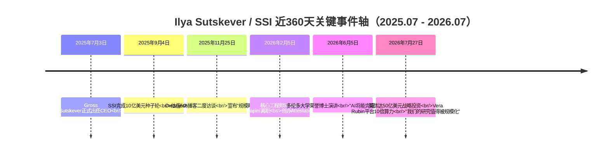
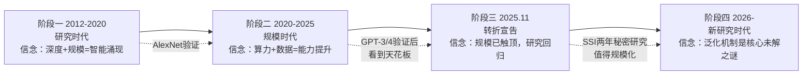
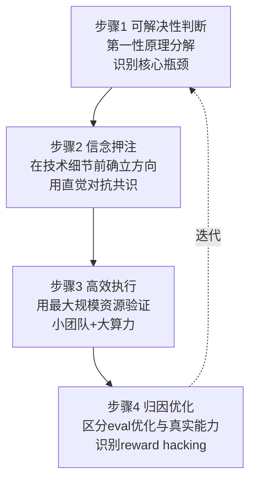

# Ilya Sutskever 与 Safe Superintelligence (SSI) 全景深度分析

> **核心判断**：Ilya Sutskever 是深度学习十年浪潮中"每次都押对方向"的稀有存在——AlexNet 押注"深度+GPU"、Seq2Seq 押注"端到端学习"、GPT 押注"生成式预训练+规模"、SSI 押注"规模时代已终结、研究时代回归"。SSI 在零产品、零营收、约50人的状态下，两年内累计融资超70亿美元、估值320亿美元，并于2026年7月与英伟达达成50亿美元级战略合作，获得 Vera Rubin 平台10倍算力跃升——这场豪赌的本质，是用 Sutskever 十余年积累的技术信誉，对抗整个行业"规模即一切"的共识。然而，他近360天最反共识、也最诚实的表达是：**"当前模型在泛化上远逊于人类，而真正解决问题的机制我们还不知道怎么造。"**

---

## 一、360天重大事件时间轴

**事件分层解读**：

| 时间 | 事件 | 信号意义 |
|---|---|---|
| 2025.07.03 | Gross 离职，Sutskever 接任 CEO | 创始团队重构，Meta 收购失败后挖人；SSI 选择独立路线 |
| 2025.09.04 | 10亿美元种子轮，50亿美元估值 | 仅约10人团队获超常规融资，纯靠 Sutskever 信誉 |
| 2025.11.25 | Dwarkesh 播客二度访谈 | Sutskever 近两年唯一深度公开表达思想，宣布"规模时代终结" |
| 2026.02.05 | 工程师 Papini 离职创办 Attestable | 早期技术人才流失信号，但也说明 SSI 内部研究有实质性进展 |
| 2026.06.05 | 多伦多大学荣誉博士演讲 | 罕见公开露面，传递"AI 影响前所未有"判断 |
| 2026.07.27 | 英伟达50亿美元战略投资 + Vera Rubin | SSI 两年来首次公开承认"研究值得规模化"——隐含重大技术里程碑 |

---

## 二、个人背景与主要成就

### 2.1 学术成就（硬核技术贡献）

| 年份 | 成就 | 意义 |
|---|---|---|
| 2012 | AlexNet（与 Krizhevsky、Hinton 合著） | 深度学习革命起点，ImageNet top-5 错误率从26%降至15.3%，论文被引超15.7万次 |
| 2014 | Sequence-to-Sequence Learning | 神经机器翻译奠基，端到端学习范式确立 |
| 2014 | Dropout 方法 | 防止过拟合的标配技术 |
| 2015 | 联合创办 OpenAI | 从 Google Brain 出走，押注通用人工智能 |
| 2017-2023 | GPT 系列架构主导 | GPT-1/2/3/4 路线总设计师 |
| 2021 | CLIP、DALL-E | 多模态学习开创 |
| 2022 | AlphaGo 贡献 | 强化学习+深度学习融合 |
| 2023 | Let's Verify Step by Step | o1 推理模型的理论基础 |
| 2022-2024 | 三连 NeurIPS Test of Time Award | 历史唯一三连冠 |
| 2026 | 美国国家科学院工业应用科学奖 | 正式学术荣誉加冕 |

**核心洞察**：Sutskever 的学术轨迹是一条**"从感知→语言→推理→安全"的能力跃迁链**——AlexNet 解决"看"，Seq2Seq 解决"翻译"，GPT 解决"生成"，o1 验证步骤解决"推理"，SSI 试图解决"超级智能的安全"。每一步都精准踩在范式转折点上。

### 2.2 商业成就

| 维度 | 内容 |
|---|---|
| OpenAI 联合创始人 | 2015年联合创立，任首席科学家至2024年 |
| OpenAI 估值贡献 | GPT 系列使 OpenAI 从非营利实验室成长为1570亿美元估值公司 |
| SSI 创始人兼 CEO | 2024年6月创立，两年内估值从0到320亿美元 |
| 融资能力 | SSI 累计融资超70亿美元（种子10亿+后续20亿+英伟达50亿级） |
| 战略合作 | Google Cloud TPU 合作（2025.04）、英伟达 Vera Rubin 合作（2026.07） |
| 拒绝收购 | 2025年上半年拒绝 Meta 收购要约，选择独立路线 |

### 2.3 社会工程成就

| 事件 | 意义 |
|---|---|
| 2023年11月 OpenAI 董事会政变 | 投票罢免 Sam Altman，引发全球关注，五日后 Altman 复职 |
| 2023年7月组建 Superalignment 团队 | 与 Jan Leike 共同领导，承诺20%算力投入安全研究 |
| 2024年5月离职 OpenAI | Superalignment 团队随之解散，Jan Leike 转投 Anthropic |
| 创立 SSI 作为"纯研究"机构 | 以"无产品、无营收、无短期商业压力"模式挑战 AI 产业化范式 |

---

## 三、思想演进：从规模信仰到研究回归

Sutskever 的思想轨迹可清晰划分为四个阶段，每个阶段都有一个核心信念驱动：

### 3.1 第一阶段（2012-2020）：深度学习研究期

**核心信念**：神经网络是"短程序与小电路"——任何表达规律性的数据都能被泛化。这一直觉源于 Kolmogorov 复杂度与压缩理论的联系：**压缩即泛化，泛化即智能**【turn0search10】【turn0search11】。

**关键判断（2015年）**："GPU+大规模数据+深度网络"三要素将产生涌现智能。这一判断在2012年 AlexNet 上验证，此后十年被反复证明正确【turn0search15】。

### 3.2 第二阶段（2020-2025）：规模扩张期

**核心信念**：Scaling Law 是王道——更大模型、更多数据、更多算力，能力就会持续提升。Sutskever 是这一信念的奠基人之一，GPT-3（2020）和 GPT-4（2023）相继验证。

**转折信号**：2024年 NeurIPS 演讲"Pre-Training as We Know It Will End"——首次公开警示数据天花板。他指出"数据是有限的，只有一个互联网"，预训练范式已近极限【turn0search0】【turn0search1】。

### 3.3 第三阶段（2025.11 Dwarkesh 访谈）：规模时代终结宣告

这是近360天最核心的思想输出。2025年11月25日，Sutskever 在 Dwarkesh Podcast 二度访谈中系统阐述新世界观【turn0search0】【turn1search2】【turn1search3】：

**核心论断一：三时代划分**
- 2012-2020：研究时代（algorithmic innovation 驱动）
- 2020-2025：规模时代（compute+data 驱动）
- 2026-：新研究时代（algorithmic innovation 再次成为主导）

**核心论断二：泛化鸿沟是根本问题**
> "这些模型在泛化上远逊于人类。这是一个非常根本的事情。"

模型在评估指标上表现优异，但真实世界性能滞后——因为 RL 训练无意中优化了评估指标，成为"真正的奖励黑客"。你可以用所有竞赛编程题训练一个模型，它仍然没有"品味"；而一个青少年10小时就能学会开车【turn1search3】【turn1search5】。

**核心论断三：当前方法"会走一段然后力竭"**
> "当前方法会走一段距离然后力竭。能真正解决问题的东西？我们还不知道怎么造。"

**核心论断四：SSI 的战略逻辑**
- SSI 是研究机构，不是产品公司
- 没有产品反而让其在算力使用效率上"超越融资权重"
- 安全与能力是同一硬币的两面，必须同步解决
- 时间线：超级智能 5-20 年【turn1search0】【turn1search12】

**核心论断五：渐进部署优先**
> "我现在更重视 AI 的渐进式、提前部署。很难'感受到 AGI'。"

### 3.4 第四阶段（2026-）：新研究时代的隐秘密码

2026年7月27日英伟达合作声明中，Sutskever 罕见地公开承认：

> "我们有值得规模化的研究，获得大型英伟达计算机将让我们做到这一点。"

这暗示 SSI 两年秘密研究已取得值得用10倍算力验证的突破。结合 Manifold 预测市场的推测，其研究方向可能涉及**递归自我改进**或**持续学习**——两者都直击当前 AI 的根本短板【turn4search3】。

---

## 四、复杂任务落地方法论：可解决性、高效性、归因优化

将 Sutskever 的工程方法论抽象为一个通用问题解决框架，其核心是"**信念驱动+第一性原理+规模验证+归因迭代**"四步闭环：

### 4.1 步骤一：可解决性判断——第一性原理分解

**Sutskever 做法**：面对复杂问题，先识别其"核心瓶颈"是什么，而非堆砌工程方案。

**AlexNet 案例**：2011年图像识别的核心瓶颈不是算法，而是"能否用足够大的数据集+足够强的算力训练足够深的网络"。多数研究者认为神经网络有根本极限，Sutskever 说服 Krizhevsky 在 ImageNet 120万张图上训练 CNN——远超当时任何数据集规模【turn7search1】。

**SSI 案例**：当前 AGI 的核心瓶颈不是算力（这是2020-2025年的旧范式），而是"泛化机制"——模型在 eval 上表现好但真实能力滞后。Sutskever 将问题从"如何获得更多算力"重新定义为"如何让模型像人类一样泛化"【turn1search3】【turn1search5】。

**方法论提炼**：
1. 将复杂任务分解到最底层物理/数学约束
2. 识别"真正的瓶颈"而非"表象的瓶颈"
3. 判断瓶颈是否可被现有资源突破——若不可，则需新研究而非更多工程

### 4.2 步骤二：信念押注——在技术细节前确立方向

**Sutskever 做法**：技术细节可以后补，但方向信念必须先立。他的信念不是来自论文综述，而是来自对"智能本质"的直觉。

**深度学习信念**：2011年多数研究者认为神经网络有根本极限，Sutskever 的信念来自"压缩即泛化"的理论直觉——神经网络本质是在压缩数据中的规律，更大网络压缩能力更强【turn0search10】【turn0search11】。

**规模信念**：2020年 Scaling Law 信念——算力+数据足够大，能力会涌现。这一信念驱动了 GPT-3/4 路线。

**研究回归信念**：2025年"规模时代终结"信念——数据已用尽，泛化鸿沟无法靠规模填补，必须回到算法创新。

**方法论提炼**：
1. 用第一性原理建立对问题本质的直觉判断
2. 在共识形成前押注方向——共识意味着红利已尽
3. 信念要足够强以支撑长期投入，但要有归因机制检验

### 4.3 步骤三：高效执行——小团队+大算力+无干扰

**Sutskever 做法**：用最小组织复杂度+最大资源密度，实现"单位人力的最大研究产出"。

**SSI 执行模型**：
- 约50人团队（2025年中），零产品、零销售、零市场
- 所有资本投入算力+顶级研究人才
- Google Cloud TPU（2025.04）+ 英伟达 Vera Rubin（2026.07）双算力路径
- "无产品"是特性而非缺陷——避免商业压力干扰研究方向
- 拒绝 Meta 收购，保持研究独立性

**效率逻辑**：Sutskever 在 Dwarkesh 访谈中明确表示——不建产品让 SSI 在算力使用效率上"超越融资权重"，每个研究者能调动的有效算力远超大厂【turn1search0】。

**方法论提炼**：
1. 组织复杂度是研究效率的敌人——保持最小团队
2. 资源密度（人均算力）比资源总量更重要
3. 消除"非研究"干扰（产品、营收、市场）是纯研究机构的核心优势
4. 算力获取要多元化（TPU+GPU），避免供应商锁定

### 4.4 步骤四：归因优化——区分 eval 优化与真实能力

**Sutskever 做法**：这是其方法论中最深刻的一环，也是其2025年11月访谈的核心洞察。

**核心问题识别**：当前 AI 的 eval 分数高但真实世界能力滞后，因为 RL 训练"无意中优化了 eval"——模型学会了 eval 的规律而非真实任务的能力。这是"真正的奖励黑客"。

**Sutskever 的归因框架**：
1. 区分"eval 性能"与"真实泛化性能"——前者可被优化，后者才是目标
2. 识别 reward hacking 的具体形式——模型在 eval 上表现好不等于能力强
3. 用"人类泛化基准"校准——青少年10小时学会开车，模型训练所有编程题仍无"品味"
4. 重新设计训练信号——让训练目标对齐真实能力而非 eval 指标

**对 SSI 的意义**：SSI 的秘密研究方向很可能就是"如何让训练信号对齐真实泛化能力"——这是"研究值得规模化"的隐含语义。

**方法论提炼**：
1. 永远质疑"指标提升"是否等于"能力提升"
2. 建立独立于训练信号的评估体系
3. 用人类能力作为泛化的绝对基准
4. 当 eval 与真实能力脱节时，问题在训练范式而非模型规模

---

## 五、近360天播客/访谈/社交媒体思想总结

### 5.1 Dwarkesh Podcast（2025.11.25）核心思想清单

这是 Sutskever 近360天唯一深度公开表达，其信息密度极高，以下为系统化梳理：

| 思想维度 | 核心论断 | 隐含含义 |
|---|---|---|
| **范式判断** | 规模时代终结，研究时代回归 | Scaling Law 不是 AGI 的终点 |
| **泛化鸿沟** | 模型泛化远逊人类，是根本问题 | 当前架构有根本缺陷 |
| **eval 虚假** | RL 优化 eval 而非真实能力 | 行业 benchmark 体系需重构 |
| **数据天花板** | 只有一个互联网，预训练已尽 | 数据不再是瓶颈，算法才是 |
| **SSI 战略** | 研究机构而非产品公司 | 无产品是优势，非劣势 |
| **时间线** | 超级智能 5-20 年 | 比 Altman/Amodei 更保守 |
| **部署哲学** | 渐进式、提前部署 | "很难感受到 AGI" |
| **未解之谜** | "真正解决问题的东西我们还不知道怎么造" | 极罕见的承认无知 |

### 5.2 多伦多大学荣誉博士演讲（2026.06.05）核心思想

> "我们现在生活在有史以来最不寻常的时代……因为 AI……真正前所未有、真正极端。"
> "AI 最终将能完成人类能做的所有事。"【turn3search5】【turn3search6】

这场演讲传递的信号比 Dwarkesh 访谈更"乐观"——Sutskever 相信 AGI 终将实现，但时间线更长（5-20年），且实现路径不是规模扩张而是研究突破。

### 5.3 英伟达合作声明（2026.07.27）核心信号

> "我们有值得规模化的研究，获得大型英伟达计算机将让我们做到这一点。"

这是近360天最重要的单句——它首次公开承认 SSI 两年秘密研究已取得值得用10倍算力验证的成果。结合 Sutskever 2025年11月"我们还不知道怎么造"的表述，这8个月间 SSI 内部很可能取得了实质性突破【turn3search0】【turn3search1】【turn5search1】。

### 5.4 社交媒体（X/Twitter）表达

Sutskever 的 X 账号极低频更新，2026年7月27日的英伟达合作公告是近360天最重要的公开发声，原文：

> "我们宣布与英伟达建立长期战略合作伙伴关系。英伟达对 SSI 进行重大投资，这将让我们将算力提升10倍。"【turn1search2】

极简的表达风格，与其思想深度形成鲜明对比——这本身就是其方法论的一部分：**信念已立，无需多言**。

---

## 六、系统化梳理：Sutskever 范式的本质

### 6.1 三重张力

Sutskever 的思想与行动中存在三重结构性张力，理解这些张力就理解了其决策逻辑：

| 张力维度 | 一极 | 另一极 | Sutskever 的选择 |
|---|---|---|---|
| 信念 vs 证据 | 信念驱动，在证据前押注 | 证据驱动，用数据决策 | 信念优先——AlexNet/规模/研究回归都是先押注后验证 |
| 规模 vs 研究 | 算力+数据驱动 | 算法创新驱动 | 随时代切换——2020押规模，2026押研究 |
| 公开 vs 隐秘 | 开源、发表论文、产品发布 | 闭源、不发表、无产品 | SSI 选择极端隐秘——"研究值得规模化"前几乎无公开输出 |

### 6.2 Sutskever 方法论的可迁移内核

剥离 AI 领域特殊性，Sutskever 的问题解决方法论有四个可迁移内核：

**内核一：第一性原理识别真瓶颈**
不把"表象瓶颈"（如算力不足）当作"真瓶颈"（如泛化机制缺失）。每次范式转换前，先重新定义问题。

**内核二：信念驱动的方向押注**
在共识形成前押注方向。共识意味着红利已尽，反共识才有超额回报。但信念必须建立在第一性原理之上，而非情绪。

**内核三：最小组织复杂度+最大资源密度**
纯研究/纯创新组织的最大敌人是组织复杂度。消除一切非核心活动（产品、营收、市场），让每个研究者调动的有效资源最大化。

**内核四：归因优化对抗指标幻觉**
永远质疑"指标提升=能力提升"。建立独立于训练信号的评估体系，用绝对基准（如人类能力）校准真实进展。

### 6.3 SSI 豪赌的最终逻辑

将上述四内核串联，SSI 的320亿美元估值逻辑就清晰了：

1. **真瓶颈识别**：AGI 的瓶颈不是算力（规模时代已尽），而是泛化机制
2. **方向押注**：SSI 在秘密研究一种新范式，区别于 OpenAI 的规模路线
3. **组织纯净**：50人+零产品+大算力，单位研究效率最大化
4. **归因严格**：不追求 eval 提升，追求真实泛化能力
5. **验证信号**：2026.07 "研究值得规模化"——隐含突破已现

投资者押注的不是 SSI 的产品或营收，而是 **Sutskever 过去十余年每次都押对方向的稀有信用**——AlexNet、Seq2Seq、GPT、o1 验证步骤，每次范式转换他都站在正确一边。SSI 是其第五次押注：**规模时代终结，研究时代回归**。

这次押注是否正确，将在未来 2-3 年内见分晓——Vera Rubin 平台10倍算力将验证 SSI 的秘密研究。若 Sutskever 再次押对，SSI 将成为"后规模时代"的 OpenAI；若押错，320亿美元估值将归零。但无论结果如何，其方法论本身——**第一性原理识别瓶颈、信念驱动方向押注、最小组织+最大算力、归因优化对抗指标幻觉**——已是复杂问题解决的范本。