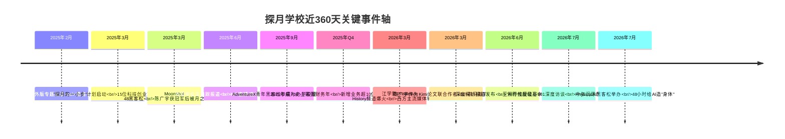
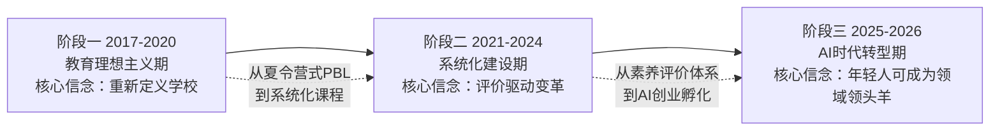

# 北京探月学校（Moonshot Academy）全景深度分析

> **核心判断**：探月学校是中国创新教育领域最具标志性的实验之一。由95后王熙乔（Jason Wang）于2017年在北大附中校内创立，以"内心丰盈的个体、积极行动的公民"为培养目标，用素养本位评价替代分数排名、用项目式学习替代课堂灌输，构建了一套从教育理念到评价体系到升学路径的完整替代方案。近360天，探月因教师江学勤的Predictive History频道爆火、AI黑客松冠军陈广宇被月之暗面发掘、与字节/腾讯/阿里的校企联培等事件密集出圈，从"教育圈内部知名"走向"公众视野中的争议焦点"。其核心方法论是"评价驱动教育变革"——不是先改教学再改评价，而是先建立MTC素养成绩单体系，倒逼课程和教学重构。

---

## 一、360天重大事件时间轴

**关键节点分层解读**：

| 时间 | 事件 | 战略意义 |
|---|---|---|
| 2025.02 | 人民日报海外版专题 | 官方媒体认可，从"边缘实验"走向"主流关注" |
| 2025.03 | "探月的一小步"计划 | 从教育者升级为科技创业者孵化器定位 |
| 2025.03 | Moonshot 48黑客松 | 探月成为AI时代中学生人才发掘平台 |
| 2026.03 | 江学勤爆火 | 学校教师的社会影响力突破教育圈层 |
| 2026.03 | 陈广宇事件 | 证明探月黑客松的"人才筛选"价值 |
| 2026.07 | 王熙乔十年访谈 | 创始人系统性反思AI时代教育方向 |

---

## 二、个人/机构背景与主要成就

### 2.1 创始人王熙乔（Jason Wang）背景

| 维度 | 内容 |
|---|---|
| 出生 | 1997年前后（95后） |
| 教育 | 北大附中国际部毕业；获南加州大学天体物理系录取后休学 |
| 创业起点 | 18岁在北大附中南楼创立探月前身（Lab School） |
| 命名灵感 | 肯尼迪"登月计划"演讲——"我们选择登月，不是因为它简单，而是因为它很难" |
| 现任职务 | 探月学校理事长兼执行校长；中国教育学会理事 |
| 核心信念 | "教育应该模拟人类社会的未来" |

### 2.2 机构背景

| 维度 | 内容 |
|---|---|
| 成立 | 2017年筹备，2018年9月正式开学（首届33名学生） |
| 性质 | 十二年一贯制民办非营利学校 |
| 校址 | 北京市朝阳区国家网球中心内（奥森校区） |
| 规模 | 约500名学生（2025年），师生比约1:5 |
| 学费 | 高中部23.8万元/学年 |
| 认证 | CIS成员校资格、Cognia认证 |
| 课程体系 | 以中国国家课标为基础，融合AP课程（18门）、PBL项目式学习 |
| 核心特色 | 选课制、混龄教学、素养本位评价、MTC成绩单 |
| 投资人 | 王建利（开普博雅），曾投资一土学校 |
| 顾问委员会 | 钱颖一（清华经管原院长）、朱永新（全国政协副主席）、杨东平（21世纪教育研究院）、王铮（原北大附中校长）等 |

### 2.3 主要成就

**教育创新成就**：

| 成就 | 详情 |
|---|---|
| MTC首个海外成员 | 2018年加入由183所美国顶尖私立高中组成的MTC联盟，成为美国之外第一所使用素养成绩单的高中 |
| 素养模型3.0 | 经历三次迭代，形成"可迁移能力+学科核心素养+思维习惯"三层架构 |
| 四届毕业生 | 去向包括芝加哥大学、康奈尔大学、西北大学、NYU、帝国理工、MIT直博等 |
| K12扩展 | 2022年接管清华附中清森学校，从高中扩展到小学和初中 |
| 非营利转型 | 所有结余100%投入教育研发和师生发展，非股东分红 |

**社会工程成就**：

| 贡献 | 影响 |
|---|---|
| PBL教学示范 | 为中国创新教育提供了可参照的完整实践案例 |
| 表现性评价体系 | 构建了"以评价驱动教育变革"的可复制模型 |
| MEA学术机构 | 支持中国主流学校完成核心素养转型 |
| AI黑客松平台 | Moonshot 48成为中学生AI人才发掘的标志性活动 |
| 校企联培 | 与字节跳动、腾讯、阿里等建立人才管道 |

---

## 三、思想与产品演进路线

### 3.1 教育思想三阶段演进

**第一阶段（2017-2020）：教育理想主义期**

王熙乔18岁在北大附中南楼创立探月，核心理念是"教育应该模拟人类社会的未来"。培养目标"内心丰盈的个体、积极行动的公民"在这一时期确立。但初创期课程被形容为"像夏令营——有趣好玩，但不够系统和深入"【turn0search30】。

**第二阶段（2021-2024）：系统化建设期**

探月经历了最关键的思想转变——**不是先改教学再改评价，而是先建评价体系**。2018年加入MTC联盟后，探月构建了基于斯坦福SCALE中心认知能力量规的表现性评价体系，素养模型迭代至3.0版本。这一阶段的核心理念是"以评价驱动教育变革"【turn0search25】。

**第三阶段（2025-2026）：AI时代转型期**

随着AI浪潮，探月的思想再次跃迁。王熙乔提出："在生成式AI的支持下，20岁以内的年轻人，在人类历史上第一次，有机会成为多数领域的领头羊"【turn0search38】。学校启动"探月的一小步"计划，将40-50%的课程时间用于真实科技创业项目，从"教育者"定位升级为"科技创业者孵化器"。

### 3.2 产品（教育体系）演进

| 阶段 | 产品形态 | 核心特征 |
|---|---|---|
| 初创期 | 夏令营式PBL | 有趣但不系统，像"中国版High Tech High" |
| 系统化期 | 素养本位课程体系 | MTC成绩单、表现性评价、3.0素养模型 |
| AI转型期 | "探月的一小步"+黑客松 | 科技创业孵化、AI项目实操、校企联培 |

---

## 四、复杂任务落地方法论

以探月构建MTC素养成绩单评价体系为案例，拆解其"可解决性判断→高效执行→归因优化"的完整闭环。

### 4.1 案例：MTC素养成绩单体系的构建与落地

**可解决性判断**：探月识别到中国教育的核心瓶颈不是"教学方法"而是"评价体系"——只要高考分数是唯一评价标准，所有教学创新都会被架空。因此，先建立替代性评价体系（MTC素养成绩单），再倒逼课程和教学变革。

**高效执行**：
1. 2018年加入MTC联盟，获得美国183所顶尖私立高中的评价标准
2. 引入斯坦福SCALE中心认知能力量规（0-8级，3-12年级通用）
3. 构建探月素养模型3.0（可迁移能力+学科核心素养+思维习惯）
4. 每门学科设置6个梯度难度，学生可跳级申请、混龄上课
5. GPA组成多元化：学术考试+小组作业+项目成果+公益活动+公共演讲+艺术作品
6. 所有成长记录可视化，形成互动式数字素养成绩单

**归因优化**：探月的评价体系不是一次性设计，而是持续迭代。从1.0到3.0的演进中，每一轮都基于毕业生升学结果和大学反馈进行校准——MIT直博、密涅瓦录取等成功案例反向验证了素养成绩单的有效性。

### 4.2 方法论提炼

| 层次 | 内涵 | MTC案例体现 |
|---|---|---|
| **L1 症状归因** | 识别表面瓶颈 | 应试教育压制创新能力 |
| **L2 系统归因** | 识别架构级问题 | 评价体系（而非教学方法）才是根本瓶颈 |
| **L3 范式归因** | 抽象出可迁移的解法 | "以评价驱动变革"——先建替代标准，再倒逼系统重构 |

---

## 五、近360天思想总结

### 5.1 王熙乔的核心思想输出

**硅谷101播客深度访谈（2026年7月）**【turn0search0】：

**核心论断一：十年探索的总结**
> "我们从一开始到现在的培养目标都叫'内心丰盈的个体，积极行动的公民'。价值观倒是有一些迭代，从2020年开始调整为'善及万物、探求真理、坚守承诺'。"

**核心论断二：AI时代的教育定位**
> "在生成式人工智能的支持下，20岁以内的年轻人，在人类历史上第一次，有机会成为多数领域的领头羊。"

**核心论断三：教育模拟未来**
> "教育在理论上应该模拟的是人类社会的未来。所以探月的教育一方面从人本身出发，希望培养内心丰盈的个体；另一方面着眼人类文明，培养积极行动的公民。"

### 5.2 AI时代的战略转向

2025年启动的"探月的一小步"计划是探月思想演进的关键转折点：

- **定位转变**：从"培养创新人才"升级为"孵化科技创业者"
- **时间分配**：40-50%时间做真实科技创业项目，30-40%时间回归第一性原理学学科核心
- **资源支持**：提供项目孵化、导师资源、融资资源
- **毕业出路**：毕业后即可开创自己热爱的项目，而非必须上大学

### 5.3 近360天思想演变的三个信号

**信号一：从"教育理想主义"到"AI时代务实主义"**
探月不再只是"另一种教育可能性"，而是明确押注"AI+年轻人=未来领袖"的判断，用黑客松和创业项目将这一判断落地。

**信号二：从"学校"到"人才发掘平台"**
Moonshot 48黑客松发掘出陈广宇（17岁被月之暗面录用、论文获马斯克点赞），证明探月的价值不限于在校生培养，而是成为AI时代中学生人才发掘的基础设施。

**信号三：从"教育圈知名"到"公众视野争议"**
江学勤的爆火和陈广宇的出圈将探月推入公众视野，同时也带来了"精英教育标签"（23.8万/年学费）、"AI天才摇篮"等争议——这是所有创新教育机构在规模化时必然面对的张力。

---

## 六、系统化梳理总结

### 6.1 探月的三重张力

| 张力维度 | 一极 | 另一极 | 当前状态 |
|---|---|---|---|
| 理想主义 vs 可持续 | 非营利、100%投入教育 | 23.8万学费、精英标签 | 非营利模式确立，但精英标签争议持续 |
| 创新教育 vs 升学结果 | 素养本位、PBL、无排名 | MIT直博、芝加哥大学等名校录取 | 四届毕业生证明升学路径可行 |
| 教育者 vs 创业孵化器 | 培养内心丰盈的个体 | "一小步"计划孵化科技创业者 | 正在融合——教育是底座，创业是出口 |

### 6.2 核心赌注

探月押注三个判断：

**赌注一：素养评价可替代分数评价**
MTC素养成绩单已被美国上百所大学认可，探月毕业生用素养成绩单成功申请MIT、芝加哥大学等名校，证明了替代评价体系的可行性。

**赌注二：AI时代年轻人可跳过大学直接创业**
"探月的一小步"计划的核心假设是：在AI工具加持下，20岁以内的年轻人可以直接成为科技创业者，不需要先上大学再创业。

**赌注三：评价驱动教育变革可规模化**
探月通过MEA学术机构，试图将"评价驱动变革"的模式推广到中国主流学校，从单校实验走向行业影响。

### 6.3 方法论的四个可迁移内核

**内核一：评价驱动而非教学驱动**
不在教学方法上创新（PBL很多学校都在做），而在评价体系上创新——先建替代标准，再倒逼系统重构。

**内核二：真实世界问题作为学习载体**
不是在教室里模拟问题，而是让学生直接面对真实社会问题（如远赴丹巴修古路、用AI开发心理辅助工具）。

**内核三：AI工具+年轻人=新生产力**
探月是最早将"AI工具作为学习基础设施"而非"学习对象"的学校——学生不是学AI，而是用AI来做项目。

**内核四：从教育者到人才发掘平台**
探月的价值不限于培养在校生，而是通过黑客松等活动成为AI时代中学生人才发掘的基础设施——Moonshot 48发掘陈广宇就是最佳证明。

### 6.4 最终判断

探月学校正处于从"创新教育实验"到"AI时代教育基础设施"的转型关键期。十年的素养本位教育实践已证明其教育理念的有效性（四届毕业生的升学和职业表现），而"探月的一小步"计划和AI黑客松则代表了面向未来的新赌注——在AI工具加持下，教育不再只是"为未来做准备"，而是"直接创造未来"。

其最大的结构性挑战在于：如何在规模化扩张中保持教育品质的"非营利纯度"，以及如何应对"精英教育"标签与"教育公平"理念之间的张力。这不仅是探月的挑战，也是所有创新教育机构在中国语境下必须回答的问题。