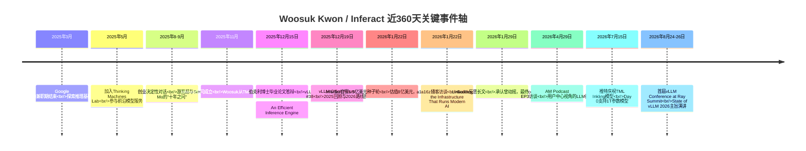
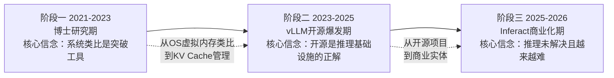
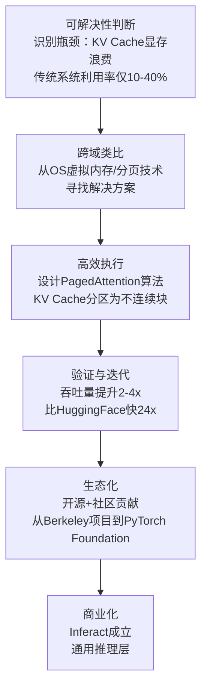
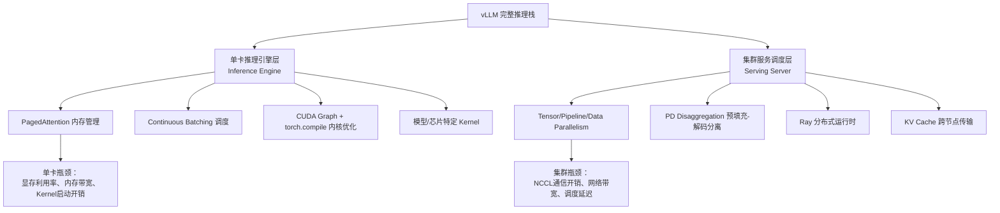
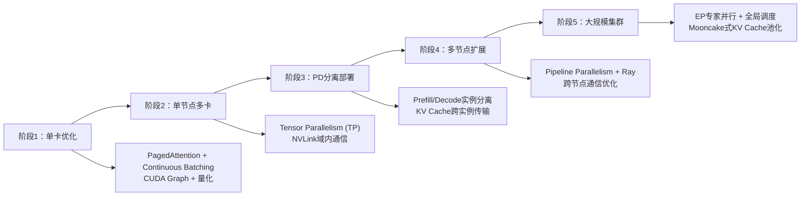
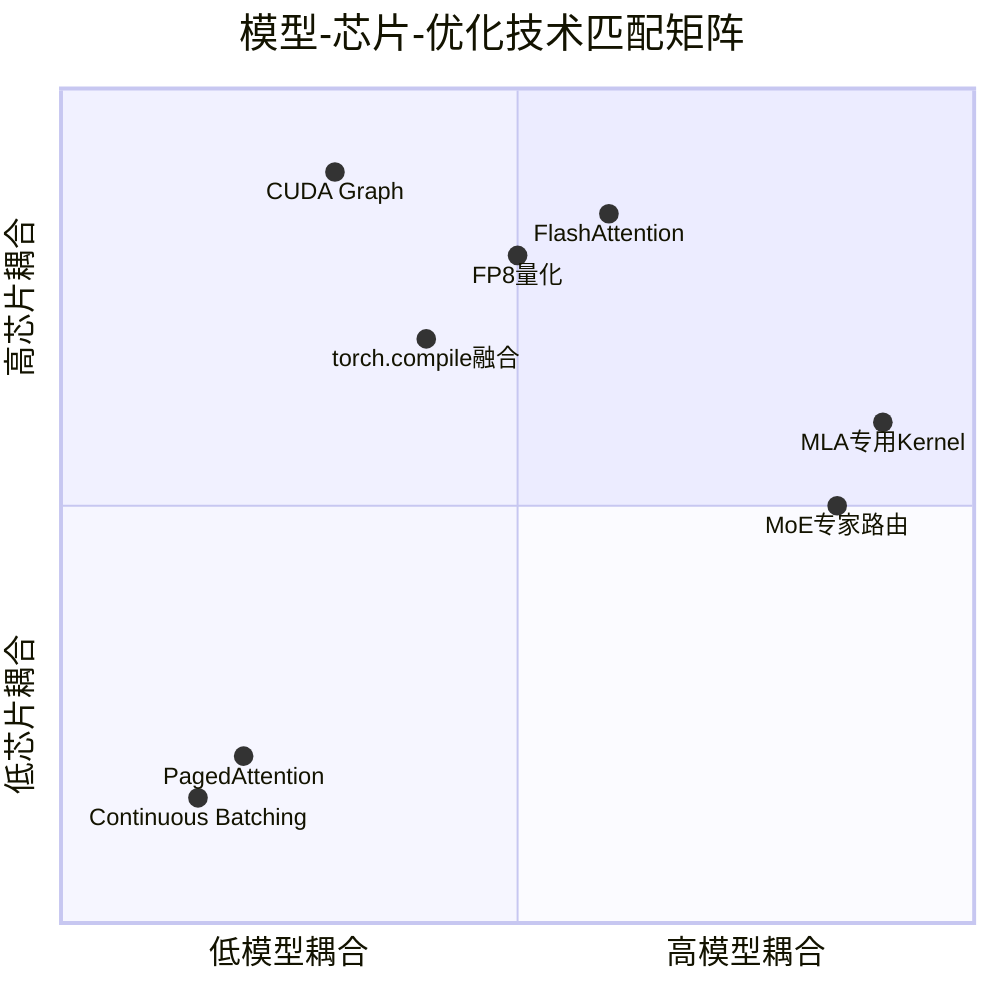

我已收集到足够的信息来撰写一份关于 Woosuk Kwon 和 Inferact 的全面报告。让我来综合所有发现。

---

# Woosuk Kwon 与 Inferact 全景深度分析

> **核心判断**：Woosuk Kwon 是大模型推理工程领域罕见的"系统架构直觉+学术深度+开源领导力"三位一体型技术领袖。他从首尔大学计算机系第一名→伯克利Ion Stoica门下博士→PagedAttention/vLLM发明者→Google DeepMind/Thinking Machines Lab历练→Inferact联合创始人兼CTO的路径，映射出AI时代"从系统研究到开源基础设施到商业化"的新型科研变现范式。过去360天，他完成了从"开源项目创造者"到"8亿美元估值公司CTO"的身份跃迁，其核心方法论是"用操作系统的虚拟内存类比解决LLM推理的KV Cache碎片化"，并已通过1.5亿美元种子轮获得a16z、Lightspeed等顶级资本验证。

## 一、360天重大事件时间轴

**关键节点分层解读**：

| 时间 | 事件 | 战略意义 |
|---|---|---|
| 2025.05-11 | Thinking Machines Lab经历 | 接触前沿模型服务，深化对推理瓶颈的认知 |
| 2025.08-09 | 创业决定性对话 | 游凯超和Simon的"十年之问"促使Woosuk放弃xAI/TML的高薪诱惑 |
| 2025.11 | Inferact成立 | 从开源贡献者转型为商业实体CTO |
| 2025.12.15 | 博士毕业 | 学术身份收官，全力转向商业化 |
| 2026.01.22 | 1.5亿美元种子轮 | AI Infra领域种子轮纪录，顶级资本验证 |
| 2026.01.22 | a16z播客 | 首次系统阐述"推理未解决且越来越难"的世界观 |
| 2026.04.29 | AM Podcast | 从用户中心视角重新审视推理基础设施设计 |
| 2026.07.15 | TML Inkling Day 0支持 | 展示vLLM对新架构的快速响应能力 |
| 2026.08.24-26 | 首届vLLM Conference | Inferact作为社区枢纽的首次大规模集结 |

---

## 二、个人背景与主要成就

### 2.1 学术成就（操作系统类比→推理系统突破）

| 阶段 | 时间 | 成就 |
|---|---|---|
| 本科 | 2015-2021 | 首尔国立大学计算机科学与数学双学位，GPA 4.18/4.30，年级第1/134（含2年义务兵役） |
| 博士 | 2021-2025 | UC Berkeley CS博士，导师Ion Stoica，GPA 4.0/4.0 |
| 核心论文 | 2023 | SOSP'23发表PagedAttention/vLLM论文，被引近8000次，成为LLM推理领域奠基性工作 |
| 博士论文 | 2025.12 | 《vLLM: An Efficient Inference Engine for Large Language Models》 |
| 学术荣誉 | 2021-2025 | KFAS奖学金（全额学费+津贴）；2023年a16z Open Source AI Grant；2024年Sequoia Open Source Fellows |
| 兼职经历 | 2024-2025 | Google DeepMind兼职（2024.03-2025.05）；Thinking Machines Lab Member of Technical Staff（2025.05-2025.11） |

**学术思想内核**：Woosuk的核心创新是**将操作系统的虚拟内存与分页技术类比到LLM的KV Cache管理**。传统系统将每个请求的KV Cache存储在连续内存空间，导致碎片化和冗余复制，显存利用率仅10-40%。PagedAttention将KV Cache分区为不连续的块（blocks），像OS管理虚拟内存一样灵活分配，实现近零浪费，吞吐量提升2-4倍【turn0search0】【turn0search3】【turn0search10】。这一"跨域类比"思维——从OS经典理论迁移到ML系统——是其方法论的核心。

### 2.2 商业成就（开源项目→商业实体）

| 成就 | 时间 | 意义 |
|---|---|---|
| vLLM联合创造者 | 2023 | 与Zhuohan Li等共同创造，成为最流行的开源LLM推理引擎 |
| vLLM项目规模 | 2026 | 支持500+模型架构、200+加速器类型，全球40万+GPU同时运行vLLM，2000+贡献者，50+核心开发者 |
| 生产采用 | 2023-2026 | Meta、Google、Character.ai等在生产环境部署 |
| Inferact联合创始人兼CTO | 2025.11- | 1.5亿美元种子轮，估值8亿美元 |
| 拒绝高薪诱惑 | 2024-2025 | 拒绝xAI基础设施负责人offer、Thinking Machines Lab邀请，选择创业 |

### 2.3 社会工程成就（开源社区生态建设）

| 贡献 | 影响 |
|---|---|
| vLLM开源项目领导 | 全球40万+GPU同时运行vLLM，成为AI推理事实标准之一 |
| PyTorch Foundation托管 | vLLM从Berkeley Sky Computing Lab项目发展为PyTorch Foundation管理社区项目 |
| 开源生态贡献者激活 | 2000+贡献者，模型厂商和硬件厂商直接贡献确保Day 0兼容 |
| 首届vLLM Conference | 2026年8月在Ray Summit主办，集结NVIDIA/AMD/Google TPU/Meta/Red Hat等全生态 |
| 技术博客与演讲 | AMD Advancing AI 2024主旨演讲、Bay.Area.AI分享、vLLM Office Hours系列 |

---

## 三、思想与产品演进路线

### 3.1 技术思想三阶段演进

**第一阶段（2021-2023）：系统类比驱动的博士研究**

Woosuk在伯克利的第一个博士项目塑造了他对基础设施工作的品味。其核心创新PagedAttention的灵感直接来自操作系统的虚拟内存与分页技术——将KV Cache从连续内存存储改为不连续块存储，像OS管理虚拟内存一样灵活分配。这一"跨域类比"思维是其方法论基石：**经典系统理论是解决新ML系统问题的丰富思想源泉**。

**第二阶段（2023-2025）：vLLM开源爆发与信念确立**

vLLM从2023年6月开源后迅速爆发，但Woosuk在LinkedIn反思中坦承："my path with vLLM hasn't been perfectly straight. Over the past three years, my passion dipped at times, and I did spend my energy exploring things I thought were more interesting than vLLM and inference."【turn1search0】【turn0search14】 他一度认为推理"已解决"（mostly "solved"），转向Google DeepMind和Thinking Machines Lab探索其他方向。

**第三阶段（2025-2026）：推理认知重构与商业化commitment**

Woosuk的世界观在2025年发生根本转变："What once felt mostly 'solved' turned out to be far from it. The rapid pace of new models, increasingly complex architectures, diverse hardware setups, and agents have made inference genuinely hard."【turn0search14】 这一认知重构——从"推理已解决"到"推理越来越难"——是Inferact创立的思想基础。

### 3.2 产品思想演进

| 阶段 | 产品形态 | 核心思想 |
|---|---|---|
| vLLM开源期 | 开源推理引擎 | PagedAttention+Continuous Batching，解决显存碎片化和吞吐量 |
| vLLM V1重构期 | 架构升级 | 解决CPU操作瓶颈，GPU计算与通信overlap，性能重回第一梯队 |
| Inferact商业期 | 通用推理层 | 任何模型、任何芯片、任何部署环境都能高效运行 |

---

## 四、复杂任务落地方法论

以PagedAttention/vLLM的创造为案例，拆解其"可解决性判断→高效执行→归因优化"的完整闭环。

### 4.1 案例：PagedAttention的发明

**可解决性判断**：Woosuk识别出LLM推理的核心瓶颈不是算力，而是**KV Cache的显存管理效率**。传统系统将每个请求的KV Cache存储在连续内存空间，导致碎片化（external fragmentation）和冗余复制（redundant duplication），显存利用率仅10-40%，严重限制批大小【turn0search0】【turn0search10】。

**高效执行（跨域类比）**：他从操作系统的虚拟内存与分页技术中找到类比——OS用分页解决物理内存碎片化，为何不能用于KV Cache？PagedAttention将KV Cache分区为固定大小的不连续块（blocks），每个块包含固定数量token的keys和values。这允许非连续内存存储，像OS管理虚拟内存一样灵活分配【turn0search3】【turn0search10】。

**归因优化**：PagedAttention不仅解决碎片化，还实现灵活的KV Cache共享——同一prompt的多个采样可共享物理块，进一步降低内存使用。这一"额外收益"来自对系统行为的深入归因分析：**并行采样场景下prompt的KV Cache是可共享的，传统系统因连续存储而无法利用这一共享性**。

**生态化与商业化**：vLLM开源后迅速爆发，从Berkeley Sky Computing Lab项目发展为PyTorch Foundation管理的社区项目，最终在2025年11月商业化为Inferact。这一路径——开源建立事实标准→社区激活→商业化变现——是AI基础设施领域的新型范式。

### 4.2 方法论提炼：Woosuk的"三层归因"框架

| 层次 | 内涵 | PagedAttention案例体现 |
|---|---|---|
| **L1 症状归因** | 识别表面瓶颈 | KV Cache显存浪费导致批大小受限 |
| **L2 系统归因** | 识别架构级问题 | 连续内存存储是碎片化和冗余复制的根因 |
| **L3 范式归因** | 跨域类比找到解法 | OS虚拟内存/分页技术是成熟解法，可迁移到ML系统 |

**关键洞察**：Woosuk方法论的核心是**跨域类比**——从经典系统理论（OS、编译器、分布式系统）中寻找解决新ML系统问题的思想源泉。这不是简单的"技术移植"，而是对问题本质的深度归因后找到的结构同构。

---

## 五、近360天播客/访谈/社交媒体思想总结

### 5.1 a16z播客（2026.01.22）核心思想

这是Inferact官宣当天的播客访谈，Woosuk与Simon Mo系统阐述了推理基础设施的世界观【turn0search8】【turn1search2】：

**核心论断一：推理未解决，且越来越难**
> "Inference is not solved. It's getting harder. Models grow larger. New architectures proliferate: mixture-of-experts, multimodal, agentic. Every breakthrough demands new infrastructure."【turn0search2】【turn0search15】

**核心论断二：模型与系统的能力鸿沟在扩大**
> "Meanwhile, hardware fragments: more accelerators, more programming models, and more combinations to optimize. The capability gap between models and the systems that serve them is widening."【turn0search15】

**核心论断三：开源是推理基础设施的正解**
vLLM的开源生态激活了模型厂商、芯片厂商、基础设施厂商的多元贡献，形成协作生态。这是闭源系统无法复制的优势。

**核心论断四：从训练瓶颈到推理瓶颈**
a16z的投资逻辑陈述："The AI industry has historically been bottlenecked by training... We're rapidly approaching a second phase that's bottlenecked by inference. In fact, we might already be there."【turn1search8】 这一判断是Inferact成立的宏观背景。

### 5.2 AM Podcast EP3（2026.04.29）核心思想

这是Woosuk与Yijia Shao的深度访谈，从用户中心视角探讨LLM推理【turn1search0】【turn1search7】：

**核心议题一：如何为广泛使用的开源项目排定功能请求优先级**
这涉及对用户需求的深度归因——不是所有功能请求都同等重要，需要理解请求背后的真实场景和影响范围。

**核心议题二：新兴应用如何重塑AI基础设施**
Agent工作流、流式请求、持续学习（RL）、端侧推理等新兴场景对推理系统提出全新要求，vLLM必须演进以适应。

**核心议题三：设计复杂系统时如何做正确假设**
> "How do you make the right assumptions when designing complex systems?"

这是Woosuk方法论的核心——系统设计的关键是识别"不变量"（如KV Cache的管理需求是持久的），在此基础上构建灵活架构。

### 5.3 LinkedIn反思长文（2026.01.29）核心思想

这是Woosuk在Inferact官宣一周后的个人反思，坦承了创业决策的曲折【turn0search14】：

**核心坦白一：对推理的认知演变**
> "My view on inference also evolved a lot along the way. What once felt mostly 'solved' turned out to be far from it."

**核心坦白二：vLLM的成功归因社区**
> "vLLM is what it is today because of the community, and I'm truly grateful for their commitment."

**核心坦白三：从动摇到commitment**
> "Somewhere along that journey, I realized how special this work really is and how uniquely positioned vLLM is. Now, I'm committed to pushing it all the way."

### 5.4 X/Twitter思想碎片

Woosuk在X上的表达极简但信息密度高：

**关于Day 0支持的承诺**：
> "Excited to support this model on Day 0! It's a versatile model with a clean, elegant architecture."【turn1search6】

这体现了Inferact的战略定位——**新模型架构发布时提供首日支持**，这是vLLM作为通用推理层的核心价值主张。

**关于KV Cache管理的判断**：
> "KV cache management is arguably one of the hardest problems in LLM inference, and advancing it requires..."【turn0search7】

这表明Woosuk持续关注推理的核心难题，而非被商业化分散注意力。

### 5.5 近360天思想演变的三个信号

**信号一：从"推理已解决"到"推理越来越难"的认知重构**
这是最根本的思想转变。2023-2024年Woosuk一度认为推理基本解决，2025年后意识到MoE、多模态、Agent等新架构让推理真正变难。这一认知重构是Inferact成立的思想前提。

**信号二：从"开源项目创造者"到"商业实体构建者"**
Woosuk在LinkedIn坦承曾动摇，甚至接受了Google DeepMind和Thinking Machines Lab的职位。最终在游凯超和Simon的"十年之问"下选择commitment——"如果十年后vLLM失败了，你会开心还是不开心？"

**信号三：从"单点优化"到"通用推理层"**
vLLM的工作聚焦PagedAttention这一单点突破；Inferact的商业愿景是"任何模型、任何芯片、任何部署环境都能高效运行"的通用推理层。这是从工具到平台的范式跃迁。

---

## 六、系统化梳理总结

### 6.1 Woosuk Kwon的三重张力

| 张力维度 | 一极 | 另一极 | Woosuk的平衡策略 |
|---|---|---|---|
| 学术 vs 商业 | 伯克利博士研究 | Inferact CTO | 博士论文即vLLM，学术与商业统一 |
| 开源 vs 闭源 | vLLM开源社区 | Inferact商业产品 | 开源持续回馈+商业做加法 |
| 探索 vs Commitment | Google DeepMind/Thinking Machines Lab | Inferact长期commitment | "十年之问"促使最终选择 |

### 6.2 Inferact的核心赌注

Inferact的8亿美元估值，押注的是三个判断：

**赌注一：推理比训练更重要**
AI行业从训练瓶颈转向推理瓶颈。a16z判断"我们可能已经进入推理瓶颈期"【turn1search8】。随着模型可靠性提升（推理时扩展、长上下文、代码训练），可构建的AI应用范围大幅扩大，推理成本成为规模化瓶颈。

**赌注二：模型与硬件的碎片化持续加剧**
MoE、多模态、Agent等新架构层出不穷，NVIDIA/AMD/Google TPU/各类NPU等硬件碎片化加剧。模型与系统的能力鸿沟在扩大，需要通用推理层弥合。

**赌注三：开源+商业可并行**
vLLM作为独立开源项目持续运营（PyTorch Foundation管理），Inferact开发商业产品解决企业级多硬件适配。这一模式已被Apache Spark、Ray等伯克利孵化的项目验证。

### 6.3 Woosuk方法论的四个可迁移内核

**内核一：跨域类比思维**
从OS虚拟内存/分页技术迁移到KV Cache管理，这是"经典系统理论是解决新ML系统问题的思想源泉"的典型范例。这一思维可迁移到任何"新系统问题"——先归因问题本质，再从经典理论中寻找结构同构的解法。

**内核二：深度归因驱动创新**
PagedAttention的发明不是来自"试错"，而是来自对KV Cache浪费根因的深度归因——碎片化和冗余复制的根因是连续内存存储。归因到根因后，解法自然浮现。

**内核三：开源作为事实标准建立工具**
vLLM的开源不是"商业模式选择"，而是建立推理基础设施事实标准的战略工具。开源激活了模型厂商、芯片厂商、基础设施厂商的多元贡献，形成闭源系统无法复制的生态优势。

**内核四：认知重构驱动commitment**
Woosuk从"推理已解决"到"推理越来越难"的认知重构，是Inferact成立的思想前提。这一认知重构不是被动接受，而是主动深度归因后的世界观更新——**真正有价值的commitment，来自对问题本质的重新认知**。

### 6.4 最终判断

Woosuk Kwon的路径揭示了AI时代"系统研究者→开源基础设施创造者→商业实体CTO"的新型成长范式。他的核心密码是**跨域类比思维+深度归因驱动创新+开源作为事实标准建立工具+认知重构驱动commitment**。

Inferact能否成功，取决于三个变量：①vLLM能否在SGLang/RadixArk竞争中保持开源推理引擎领先地位；②通用推理层能否真正解决模型-硬件碎片化痛点；③开源与商业的平衡能否持续。

但无论结果如何，Woosuk的方法论——**从经典系统理论中寻找解决新ML系统问题的思想源泉**——已为AI基础设施领域的复杂问题解决提供了可复用的范式。PagedAttention/vLLM的发明，是这一方法论的最有力证明。

# vLLM单卡与集群Infra全景：从架构本质到通用推理优化路径

## 一、vLLM的核心定位：从单卡到集群的完整栈

vLLM并非"单卡infra"或"集群infra"二选一的项目——它是一个**覆盖单卡引擎到多节点集群的完整推理服务栈**，但其技术重心和成熟度在两个层面有显著差异。官方定义明确指出："vLLM includes both an inference server (which manages network traffic), and an inference engine (to maximize computational speed)"【turn0search1】，即推理引擎（单卡优化）和推理服务器（集群调度）两层都做。

从上图可以看出，vLLM在单卡层面（引擎层）的技术积累更深、更成熟，这也是它最初成名的核心——PagedAttention和Continuous Batching都是单卡层面的创新【turn0search10】【turn0search13】。集群层面（服务层）的能力在V1版本后才快速补齐，分布式PD分离、专家并行等仍处于实验性阶段【turn1search5】。

## 二、单卡Infra：深度吃模型架构与芯片特性

单卡推理的瓶颈本质是**访存带宽**而非算力。这源于LLM推理两阶段的根本差异：

| 阶段 | 瓶颈类型 | 原因 | 优化方向 |
|---|---|---|---|
| **Prefill（预填充）** | 计算密集型 | 并行处理整个输入序列，算力拉满 | 提高FLOPS利用率 |
| **Decode（解码）** | 访存密集型 | 逐token生成，频繁读取KV Cache和权重 | 提高内存带宽利用率 |

**实测数据印证**：在64张H100的集群上，Prefill阶段Tensor Core利用率可达92%，但Decode阶段骤降至28%——90%的请求生命周期里，GPU算力大量闲置【turn0search15】。这意味着单卡优化的核心不是"跑得更快"，而是"让数据搬运更少"。

### 单卡层面的核心技术栈

| 优化技术 | 解决的瓶颈 | 与模型/芯片的耦合度 |
|---|---|---|
| **PagedAttention** | KV Cache显存碎片化，利用率从10-40%提升到90%+ | 通用（适配所有Transformer） |
| **Continuous Batching** | 静态批处理的GPU空闲槽位，利用率30-40%→75-85% | 通用 |
| **CUDA Graph** | Decode阶段每token的Kernel启动开销（微秒级） | 芯片强耦合（仅CUDA） |
| **torch.compile内核融合** | 跨层算子融合，减少中间结果写回显存 | 模型弱耦合、芯片强耦合 |
| **量化（FP8/INT4）** | Decode阶段权重和KV Cache的访存带宽 | 模型中等耦合、芯片强耦合 |
| **模型特定Kernel** | MLA、GQA等注意力变体的计算效率 | 模型强耦合 |

### 单卡优化为何深度耦合模型与芯片

**模型耦合的根源**：不同模型的注意力机制差异巨大，无法用一套通用Kernel覆盖。以DeepSeek的MLA（Multi-head Latent Attention）为例，它通过低秩KV联合压缩减少KV Cache大小，但需要完全不同的Kernel实现【turn1search0】【turn1search2】。vLLM社区专门为DeepSeek-R1做了MLA + FP8的Kernel优化，实现了3x吞吐量和10x内存容量提升【turn1search1】。Qwen的GQA、Mixtral的MoE专家路由，每一种都需要定制Kernel。

**芯片耦合的根源**：vLLM虽标榜"支持NVIDIA CUDA、AMD ROCm、Intel XPU、CPU、TPU"【turn1search4】，但各后端的优化深度天差地别。CUDA后端最成熟，有FlashAttention、FlashInfer等高度优化的注意力Kernel；ROCm后端需要AITER（AI Tensor Engine for ROCm）做专门适配【turn1search3】；Intel XPU需要vllm-xpu-kernels项目用SYCL重写核心算子【turn1search5】；TPU后端则依赖JAX和tpu-inference库【turn1search1】。同一份模型代码在不同芯片上性能差距可达2-5倍。

## 三、集群Infra：网络与调度成为主导瓶颈

当从单卡扩展到多卡集群时，**瓶颈从"访存带宽"转移到了"通信开销"**。这是量变到质变的范式转换。

### 集群层面的核心挑战

| 挑战维度 | 具体问题 | 当前解决状态 |
|---|---|---|
| **通信开销主导** | 跨节点All-Reduce在16GPU时占总延迟70%【turn1search5】 | NCCL优化不足，MPI在某些场景更优 |
| **NCCL跨节点性能差** | 小消息（1-1024KB）场景下NCCL不如MPI【turn1search10】 | 社区探索NVRAR等替代方案【turn1search7】 |
| **网络带宽非瓶颈** | 实测400Gbps→800Gbps带宽翻倍，吞吐无变化【turn1search8】 | 真正瓶颈是通信延迟而非带宽 |
| **TP强扩展性差** | TP跨节点时每层都需All-Reduce同步，延迟累积 | PD分离+EP成为替代方案 |
| **KV Cache跨节点传输** | PD分离需传输GB级KV Cache，RDMA是关键 | NIXLConnector等实验性方案 |
| **调度复杂度** | 单节点用multiprocessing，多节点必须用Ray | Ray成为多节点默认后端 |

**关键洞察**：集群瓶颈与单卡瓶颈完全不同。单卡优化的是"如何让GPU少闲着"（访存利用率），集群优化的是"如何让GPU少等数据"（通信效率）。SC25论文实测发现，vLLM v0的TP+PP在多节点扩展时latency随GPU数增长而增长，说明现有并行策略不适合跨节点强扩展【turn1search5】。

## 四、单卡快速扩充到集群的实战路径

### 各阶段的关键决策点

| 阶段 | 硬件规模 | 核心技术 | 实际解决的问题 | 新增瓶颈 |
|---|---|---|---|---|
| **单卡优化** | 1 GPU | PagedAttention + CUDA Graph + FP8量化 | 显存利用率、Kernel启动开销 | 模型放不下单卡 |
| **单节点多卡** | 4-8 GPU (NVLink) | Tensor Parallelism (TP) | 模型分片到多卡，利用NVLink高带宽 | TP同步开销、batch大小受限 |
| **PD分离** | 2组GPU实例 | Prefill/Decode实例分离 | 消除Prefill-Decode相互干扰，独立扩展 | KV Cache跨实例传输延迟 |
| **多节点扩展** | 16-32 GPU (跨节点) | Pipeline Parallelism + Ray | 模型放不下单节点，跨节点扩展 | NCCL跨节点通信性能差 |
| **大规模集群** | 100+ GPU | EP专家并行 + 全局KV Cache池 | MoE模型高效服务、全局调度 | 调度复杂度、容错、成本 |

### 路径中的实际工程问题

**单卡→单节点多卡**的挑战：TP=2时性能接近线性扩展，但TP=4以上收益递减——因为每增加一张卡，All-Reduce的通信开销都在增长，而NVLink带宽是固定的。这就是为什么"200 tok/s is new normal"在TP=2时成立，但TP=8时未必【turn1search13】。

**单节点→PD分离**的挑战：PD分离听起来美好，但KV Cache传输是硬骨头。一个Llama-70B在4K上下文的KV Cache可达数GB，如果传输不高效，反而比不分更慢。vLLM的Disaggregated Prefilling仍是实验性功能，官方承认"vllm has not yet implemented the complete functionality for PD-separated inference testing on X prefill nodes and Y decode nodes"【turn1search8】。

**PD分离→多节点**的挑战：跨节点时NCCL成为致命瓶颈。实测显示，在Perlmutter和Alps超算上，NCCL在小消息（256-1024KB）跨节点场景下性能显著低于MPI【turn1search10】。更反直觉的是，网络带宽从400Gbps翻倍到800Gbps，吞吐量毫无变化——说明瓶颈不在带宽而在延迟和协议开销【turn1search8】。

## 五、通用推理Infra优化的核心难题

如果目标是构建一个"通用"的推理Infra（适配任意模型、任意芯片、任意规模），需要解决以下系统性问题：

### 5.1 模型多样性 vs Kernel专用化的矛盾

上图揭示了核心矛盾：**性能越高的优化技术，与模型或芯片的耦合度越高**。PagedAttention和Continuous Batching是少数通用且高效的创新，但它们的贡献主要在内存管理和调度层面，不触及计算Kernel本身。一旦深入到Kernel优化，就必须为每种注意力变体（MHA/GQA/MQA/MLA）、每种芯片架构（CUDA/ROCm/XPU/TPU）单独优化。

**vLLM的应对策略**正在从"编译器驱动"转向"手写Kernel+编译器辅助"。2025年的RFC明确指出："Compiler-driven optimization alone has not been sufficient...we are removing vLLM's reliance on full-graph torch.compile"【turn3search3】，原因是编译器无法及时覆盖所有模型变体，且启动时间长、迭代慢。未来方向是**手写高性能Kernel + 局部编译器融合**的组合。

### 5.2 硬件多样性 vs 性能极致化的矛盾

vLLM支持的硬件后端与CUDA的优化深度存在巨大鸿沟：

| 硬件后端 | 优化成熟度 | 关键依赖 | 与CUDA的性能差距 |
|---|---|---|---|
| **NVIDIA CUDA** | 最成熟 | FlashAttention、FlashInfer、CUTLASS | 基准 |
| **AMD ROCm** | 中等 | AITER、RCCL、Triton | ~20-40%（视模型） |
| **Intel XPU** | 较弱 | vllm-xpu-kernels (SYCL) | ~40-60% |
| **CPU** | 基础 | OpenVINO、oneDNN | ~5-10x |
| **TPU** | 实验性 | JAX、tpu-inference | 不可比（架构不同） |

**核心问题**：一个"通用"推理框架要在5种硬件上都做到"最优"几乎不可能。每种芯片的内存层次、通信原语、编程模型都不同。vLLM的策略是"先CUDA最优，再逐步适配其他后端"，但这意味着非CUDA用户永远拿不到最佳性能。

### 5.3 规模扩展 vs 调度复杂度的矛盾

| 规模 | 调度复杂度 | 主要矛盾 | 当前方案 |
|---|---|---|---|
| **单卡** | 低（单进程） | 访存利用率 | PagedAttention + Continuous Batching |
| **单节点(8卡)** | 中（NVLink域内） | TP通信开销 | Megatron-LM TP算法 |
| **多节点** | 高（跨网络域） | NCCL跨节点性能差 | Ray + PP（效果不佳） |
| **PD分离** | 很高（实例间状态迁移） | KV Cache传输延迟 | 实验性Connector |
| **大规模EP** | 极高（全局专家调度） | 调度延迟 + 容错 | DeepEP + DeepGEMM |

### 5.4 通用化需要解决的核心问题清单

| 问题域 | 具体问题 | 当前状态 | 通用化所需 |
|---|---|---|---|
| **模型抽象** | 如何用一套代码支持MHA/GQA/MQA/MLA/MoE等所有注意力变体？ | 每种变体需手写Kernel | 统一的注意力抽象层 + 自动Kernel生成 |
| **芯片抽象** | 如何让同一份模型代码在CUDA/ROCm/XPU/TPU上都跑出最优性能？ | 各后端优化深度不一 | 芯片无关的IR + 后端特定的Codegen |
| **并行策略** | 如何自动选择TP/PP/DP/EP的最优组合？ | 需人工配置 | 自动并行策略搜索（类似Alpa） |
| **KV Cache管理** | 如何在PD分离、多实例、跨节点场景下高效管理KV Cache？ | 单节点PagedAttention成熟，跨节点实验性 | 全局KV Cache池化（Mooncake方向） |
| **调度策略** | 如何在满足SLO的前提下最大化吞吐？ | Continuous Batching + 简单优先级 | 预测式调度 + 早期拒绝（Mooncake方向） |
| **通信优化** | 如何突破NCCL跨节点性能瓶颈？ | 依赖NCCL，社区探索替代 | NVRAR式GPU-initiated通信 + RDMA |

## 六、总结判断

vLLM的定位是**从单卡引擎到集群服务的完整栈**，但其技术成熟度呈"单卡强、集群弱"的梯度分布。单卡层面，它通过PagedAttention和Continuous Batching解决了显存利用率和批处理效率的通用问题，但一旦深入到Kernel优化，就不可避免地深度耦合模型架构（MLA/GQA/MoE）和芯片特性（CUDA/ROCm/XPU）。集群层面，通信开销成为主导瓶颈，NCCL跨节点性能差是核心痛点，PD分离和EP并行是前沿方向但尚未成熟。

**单卡快速扩充到集群的本质**，不是简单地把模型分片到更多GPU上，而是完成从"访存优化"到"通信优化"的范式转换——单卡优化的目标是让GPU少闲着，集群优化的目标是让GPU少等数据。这个过程要解决的核心问题，不是算力不够，而是**数据搬运的效率不够**：KV Cache怎么跨实例传输、专家激活怎么跨节点路由、All-Reduce怎么降低延迟。

**通用推理Infra的终极难题**，是在"模型多样性、芯片多样性、规模多样性"三个维度上同时做到高效。这本质上是一个**不可能三角**：通用性、性能、及时性三者不可兼得。vLLM选择了"先CUDA最优、先主流模型最优、先单节点最优"的渐进路线，这使其在当前生态中占据主导地位，但也意味着非CUDA芯片、非主流模型、超大规模集群的用户，仍需等待社区补齐或自行定制。真正的"通用"推理Infra，可能需要等到编译器技术（如torch.compile的成熟化）和芯片抽象层（如OpenXLA的普及）共同突破后，才有可能实现。