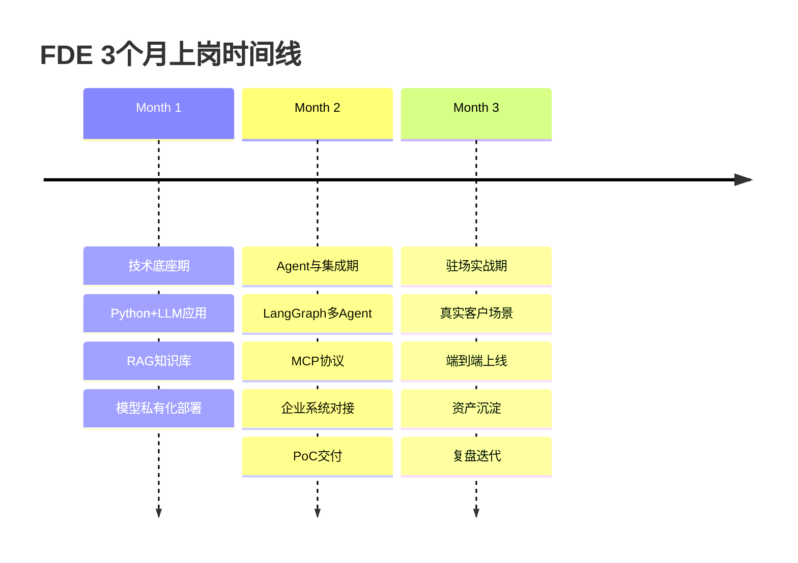
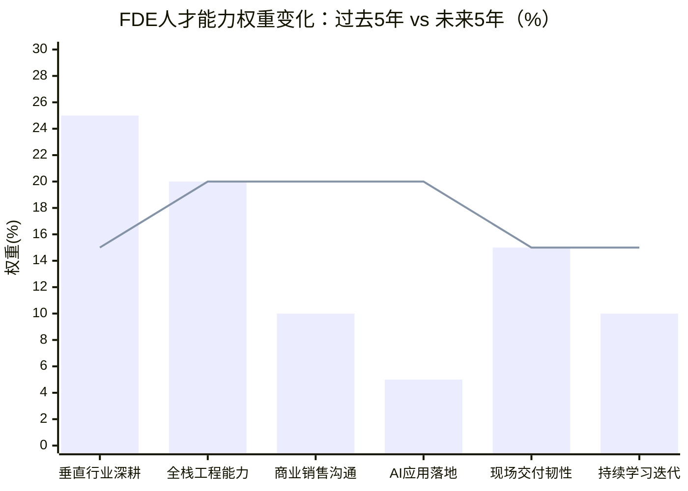

# FDE岗位全景拆解 + 3个月上岗实战计划

## 一、第一性原理：FDE是什么、为什么出现、为什么需求激增

**FDE（Forward Deployed Engineer，前线部署工程师）是AI落地"最后一公里"的现场交付责任人——驻扎客户业务现场，亲手写代码把大模型/Agent嵌进企业的真实生产系统，并对业务结果负责。** 该角色最早由Palantir在2000年代首创，当时它服务CIA、NSA等情报机构，客户需求藏在保密文件里、远程交付根本传不回反馈，于是直接把工程师派进客户现场，边看业务边改系统，内部代号"Delta"（三角洲）【turn0search3】【turn0search9】【turn0search12】。

它不是前端工程师（FE），也不是"高级外包"。FDE处在三个传统岗位的交叉点，但与三者都不同【turn0search0】【turn3search17】：

| 角色 | 主要交付物 | 与FDE的本质差异 |
|---|---|---|
| 咨询顾问 | PPT、战略方案 | FDE直接交付能跑的生产级代码 |
| 解决方案架构师 | 架构图、PoC | FDE还要亲自调接口、debug、上线 |
| 普通SWE | 仓库里的功能模块 | FDE写的代码直接落到客户业务里 |
| 外包/驻场开发 | 按合同交付工时 | 外包只对明确交付物负责，FDE先穿透表层找到真正值得解决的问题 |

需求激增的核心归因可以拆成三层因果链【turn0search12】【turn0search23】【turn1search1】：

1. **模型能力趋同，差异化下移**——2026年头部大模型跑分差距收窄，"谁参数多"不再是胜负手，胜负手变成"能不能把模型嵌进企业生产系统"。
2. **95%的企业AI试点无ROI**——MIT NANDA研究调研300+企业AI项目，95%没有产生可量化的利润影响。模型在Demo里跑分优秀，一进真实业务流程就失效，行业瓶颈从"模型够不够强"转向"能不能落地"。
3. **结构性人才缺口**——传统实施顾问不懂代码、后台工程师离客户太远、算法工程师不做集成，"懂AI+懂业务+能驻场+对结果负责"的复合型人才近乎不存在。LinkedIn 2023→2025数据显示FDE岗位增长42倍（同期AI工程师仅13倍），Indeed美国FDE岗位从643个涨到5330个，同比+729%【turn0search12】【turn0search24】。

海外OpenAI成立Deployment Company、Anthropic联手黑石高盛组建企业AI服务公司、微软派6000名FDE、AWS投10亿美元组建FDE组织；国内上海市政府已将FDE人才培养纳入"AI+制造"三年行动规划，实施"百千万"工程并与人社部门中级职称评定挂钩【turn0search21】【turn1search25】【turn1search26】【turn0search32】。

---

## 二、Boss直聘/猎聘 FDE 20K+岗位多维度调研汇总

以下是综合Boss直聘、猎聘、前程无忧等平台公开JD梳理的真实在招FDE岗位（仅收录"客户嵌入型"FDE，剔除单纯做推理性能优化的"模型部署工程师"）【turn0search12】【turn1search10】【turn1search28】【turn3search2】【turn3search10】：

| 公司 | 岗位名称 | 城市 | 薪资范围 | 经验/学历 | 核心职责 | 所属产业 |
|---|---|---|---|---|---|---|
| 字节跳动 | 豆包AI大模型FDE | 北京 | 35-70K·15薪 | 5-10年/本科 | 豆包大模型客户现场落地、Agent定制、ROI闭环 | 大模型厂 |
| 蚂蚁数科 | B端FDE前沿部署工程师 | 北京海淀 | 40-60K·15薪 | 5-10年/本科 | AI模型与企业场景结合、金融B端交付 | 大模型厂/金融科技 |
| 智谱华章 | FDE负责人 | 北京 | 60-80K | 资深/本科 | GLM大模型客户落地、团队搭建 | 大模型厂 |
| 腾讯 | AI前线部署工程师FDE | 北京/上海/深圳 | 80-120万·15薪（10-11级） | 8-10年/本科 | WorkBuddy/CodeBuddy落地、Skills定制、MCP打通CRM/ERP/OA | 云厂商 |
| 阿里云 | FDE/企业客户解决方案架构师 | 杭州/北京 | 35-55K·16薪（20-50K·16薪） | 5-10年/本科 | 通义大模型政企落地、行业方案沉淀 | 云厂商 |
| 中关村科金 | 前沿部署工程师 | 北京 | 面议（行业紧缺岗） | 资深 | 有色金属垂类模型训练+赋予一线工人 | 行业AI |
| 软通动力 | FDE工程师 | 北京/多地 | 面议（基础+项目奖励+客户成功激励） | 3年+/本科 | 嵌入客户系统构建生产级AI应用、MCP服务器/子代理/Agent技能交付 | IT服务 |
| 深演智能 | FDE | 北京 | 25-50K | 3年+/本科 | 智能体业务流程拆解、驻场交付 | 营销AI |
| 半导体设备厂商 | FDE（半导体方向） | 上海长宁 | 40-50K | 3年+/本科 | FAB客户驻场、APC/PHM/Yield场景AI落地、Vibe Coding快速搭Demo | 半导体/制造 |
| 京津冀大数据中心 | AI前线部署工程师FDE | 北京朝阳 | 40-70K | 5-10年/本科 | 客户现场技术C位、端到端交付 | 数据中心/政企 |
| Deloitte（德勤） | FDE | 一线城市 | 30-60K | 3年+/本科 | GenAI用例识别、Agent平台构建、全栈交付 | 咨询 |
| 某机器人/具身智能厂商 | 工业AI FDE | 上海/深圳 | 30-60K | 3-5年/本科 | 产线现场AI落地、Sim2Real、业务结果负责 | 具身智能 |

**城市分布**：北京（大模型厂+云厂商总部聚集，岗位最多）> 上海（半导体/制造/政企FDE政策高地）> 深圳（腾讯+硬件/机器人）> 杭州（阿里云+具身智能整机中试）【turn1search26】【turn2search23】。

**产业分类**：①大模型厂（字节/蚂蚁/智谱/MiniMax/百度）；②云厂商（阿里云/腾讯云/华为云）；③具身智能/机器人（宇树/智元/优必选/佳安智能）；④半导体/智能制造（FAB/设备厂商）；⑤咨询与企业服务（Deloitte/软通动力/深演智能）；⑥自动驾驶（小鹏/黑芝麻/小米汽车）【turn1search0】【turn1search10】【turn3search10】。

---

## 三、核心职责、技术栈与招聘要求的归纳总结

### 3.1 核心职责（高频出现的5类工作）

1. **客户现场需求穿透**——驻场浸入业务，把"我想用AI降本增效"这类模糊诉求，拆解成可量化、可迭代、可落地的智能体业务流程；典型动作是访谈提纲、干系人地图、痛点穿透（如发现"客服效率低"的真因是多个业务系统客户数据不通）【turn0search1】【turn3search11】。
2. **方案设计与PoC快速搭建**——用Cursor/Claude Code/Windsurf等Vibe Coding工具，在天级周期内独立搭建可运行Demo，基于RAG/多Agent/工具调用构建智能应用【turn3search10】。
3. **系统集成与生产级开发**——亲手写Python/TypeScript生产代码，通过MCP协议打通客户CRM/ERP/OA/飞书/企微，做数据管道、接口适配、权限管控【turn1search10】【turn1search14】。
4. **私有化部署与效果调优**——Docker/K8s容器化、vLLM/TGI推理服务、向量数据库部署、RAG全链路调优（切分策略/混合检索/相似度阈值）、模型幻觉治理、信创适配【turn1search12】【turn1search17】。
5. **业务指标闭环与资产沉淀**——跟踪交付周期缩短率、代码采纳率、办公效率提升等业务指标，把一线经验沉淀为可复用Skill/行业方案模板/部署模式，反哺产品路线图【turn0search8】【turn3search9】。

### 3.2 通用技术栈（四层架构）

| 层级 | 技术/工具 | 掌握程度 |
|---|---|---|
| 基础层 | Python（必备）、TypeScript/Java/Go（加分）、Linux、SQL、Git | 精通，能写生产级代码 |
| LLM应用层 | LangChain、LangGraph、LlamaIndex、Prompt工程、上下文工程 | 精通，能独立编排多Agent工作流 |
| RAG/数据层 | 向量库（Milvus/Qdrant/PGVector/Chroma）、Embedding模型、Redis、文档切分/混合检索/RAG-Fusion | 精通，能解决千万级文档库响应超时 |
| 部署/基建层 | Docker、K8s、vLLM/TGI/TensorRT-LLM、FastAPI、CI/CD、云平台（腾讯云/阿里云/AWS） | 熟练，能做内网私有化部署与信创适配 |
| 协议与Agent | MCP（Model Context Protocol）、A2A、工具调用、ReAct模式、LoRA轻量化微调 | 熟练，能交付MCP Server与子代理 |
| 客户系统对接 | 飞书开放平台、企微、钉钉、CRM/ERP/OA、IDE插件、CI/CD流水线 | 熟练，能打通办公链路与研发流程 |

### 3.3 招聘要求共性

- **硬性门槛**：本科及以上，3-5年起步（资深岗5-10年），计算机/软件/人工智能相关专业；至少精通Python+一门后端语言；有大模型应用/RAG/Agent实战项目经验【turn1search10】【turn1search17】。
- **能力矩阵**（按JD出现频率权重）：客户沟通与需求拆解≈35%、全栈工程与系统集成≈30%、AI技术栈深度≈25%、业务洞察与行业理解≈10%【turn1search16】。
- **软性要求**：接受出差驻场、能与非技术人员高管沟通、能从业务语言提炼技术需求、抗压、独立闭环【turn1search10】。
- **加分项**：云厂商认证（腾讯云TCA/TCP）、AI开源项目贡献、技术博客、生产级LLM产品上线经验、重点行业标杆案例【turn1search10】。

### 3.4 第一性原理归类：FDE岗位的四个子型

不同公司的FDE实质是同一岗位在"技术深度×业务广度"坐标系下的不同投影【turn1search7】【turn3search17】：

| 子型 | 代表公司 | 核心矛盾 | 能力侧重 |
|---|---|---|---|
| 大模型厂FDE | 字节/智谱/蚂蚁/MiniMax | 把自家大模型能力卖进客户业务 | 模型能力理解+场景适配+ROI证明 |
| 云厂商FDE | 阿里云/腾讯云/华为云 | 把云上AI产品栈卖给政企客户 | 云原生全栈+行业方案+生态集成 |
| 具身智能/工业FDE | 机器人厂/半导体FAB | 把AI嵌进物理产线与硬件 | Sim2Real+边缘部署+业务现场浸入 |
| 咨询/IT服务FDE | Deloitte/软通动力 | 帮客户做AI转型咨询+落地 | 行业洞察+方法论沉淀+交付管理 |

---

## 四、3个月高强度任职计划

该计划以"上岗即能独立交付一个客户场景"为终点目标，按"技术底座→Agent与集成→驻场实战"三阶段递进，每周有明确交付物，每阶段有可量化的能力验收标准。

### 第1个月｜技术底座期：从"会用AI"到"能部署AI"

**目标**：跑通"模型调用→RAG知识库→私有化部署"全链路，能独立交付一个企业知识库问答系统。

| 周次 | 学什么 | 学到什么程度 | 解决什么场景问题 | 交付物 |
|---|---|---|---|---|
| W1 | Python生产级开发（异步、性能优化、类型注解）+ OpenAI兼容API（通义/DeepSeek/智谱/Ollama）+ Prompt工程 | 能用FastAPI封装一个流式Chat API，切换不同base_url无缝兼容国产模型 | 客户问"能不能先做个内部问答Demo看看效果" | 一个可调用的Chat API服务+Prompt模板库 |
| W2 | RAG全链路：文档切分（chunk size/overlap）、Embedding模型、向量库（Chroma学习→Milvus/PGVector生产）、混合检索、相似度阈值 | 能独立搭一个PDF/网页知识库问答，答案可溯源到原文档，千万级文档库不超时 | 客户问"我们公司的年假政策是什么"能精准回答 | 企业知识库问答API+切分策略对比报告 |
| W3 | 私有化部署：Docker、K8s、vLLM/TGI推理服务、Ollama本地部署、模型量化 | 能在内网无外网环境部署一个开源大模型推理服务，做信创适配 | 客户说"数据不能出内网，模型必须本地部署" | Docker Compose一键部署脚本+性能压测报告 |
| W4 | LoRA轻量化微调+RAG调优（幻觉治理、检索精度优化）+ 月度复盘 | 能用业务数据做LoRA微调让模型更懂垂直领域，RAG准确率达标 | 客户说"模型不懂我们行业黑话" | 微调后的垂直模型+RAG优化方案文档 |

**阶段验收标准**：能独立交付一个部署在内网的企业知识库问答系统，RAG回答准确率≥85%，推理P95延迟≤2秒，有完整的部署文档与压测报告。

### 第2个月｜Agent与集成期：从"问答系统"到"业务系统打通"

**目标**：掌握LangGraph多Agent编排、MCP协议、企业系统对接，能独立交付一个打通客户业务系统的PoC。

| 周次 | 学什么 | 学到什么程度 | 解决什么场景问题 | 交付物 |
|---|---|---|---|---|
| W5 | LangGraph状态机/工作流（Node、Edge、Conditional Edge、Memory）+ ReAct模式 + 工具调用 | 能用LangGraph搭一个有状态、能回溯、能做条件判断的多步骤Agent | 客户要"自动判断用户问的是报销还是IT报修，分别调用不同接口" | 一个多步骤Agent工作流+Mermaid可视化图 |
| W6 | MCP协议（Host/Client/Server、Resources/Prompts/Sampling/Roots）+ 自定义MCP Server | 能开发一个企业级MCP Server，暴露CRM/ERP/OA工具给Agent调用，支持服务注册与动态发现 | 客户要"Agent能直接查我们CRM的订单状态、ERP的库存" | 一个MCP Server+工具调用治理方案 |
| W7 | 多Agent协同编排（门面模式、异步任务队列、A2A）+ 飞书/企微/钉钉开放平台对接 + IDE插件/CI-CD集成 | 能搭一个"客服Agent+数据分析Agent+工单Agent"协同系统，接入飞书机器人 | 客户要"一个智能体团队协作完成复杂任务，并在飞书里用" | 多Agent系统+办公链路打通Demo |
| W8 | 安全合规（数据脱敏、权限管控、审计日志）+ 成本监控（token消耗、API调用成本）+ 月度复盘 | 能做生产级安全检查（数据脱敏、越权防护、敏感词过滤），能算清每次调用的成本与ROI | 客户合规部门问"数据安全怎么保证、上线后成本多少" | 安全检查表+成本测算模型+合规方案文档 |

**阶段验收标准**：能独立交付一个打通客户CRM/ERP/OA+飞书的多Agent PoC，有完整的安全审计与成本测算，能在客户现场天级迭代。

### 第3个月｜驻场实战期：从"PoC"到"上线+沉淀"

**目标**：在真实（或模拟真实）客户场景中完成端到端交付，产出可复用的交付资产，形成个人作品集与方法论。

| 周次 | 做什么 | 到什么程度 | 解决什么场景问题 | 沉淀物 |
|---|---|---|---|---|
| W9 | 选定一个真实行业场景（金融风控/工业质检/政务办公/电商运营任选一），做客户访谈、痛点穿透、干系人地图 | 输出可被技术实现的需求文档+解决方案架构+PoC计划 | 客户说"我想用AI降本增效"但说不清具体要什么 | 访谈提纲+干系人地图+需求文档+方案架构图 |
| W10 | 现场开发：基于W1-W8的技术栈，在3-5天内用Vibe Coding搭出可运行Demo，与客户共创迭代 | Demo能在客户真实数据上跑通，业务方认可"这就是我要的" | 客户要"这周就能看到东西" | 可运行Demo+迭代记录+客户反馈日志 |
| W11 | 上线护航：生产环境部署、效果调优、业务指标跟踪（采纳率/准确率/效率提升）、异常处理与降级策略 | 系统在生产环境稳定运行，业务指标可量化提升（如客服效率提升30%） | 客户问"上线后效果到底怎么样、出问题怎么办" | 上线检查表+业务指标看板+故障应急预案 |
| W12 | 资产沉淀：把交付经验抽象成可复用Skill/行业方案模板/部署模式，反哺产品；写技术博客/复盘文档 | 产出一套可复制的方法论，下一个类似客户能复用80% | 公司问"这次踩的坑下次怎么避免、能不能产品化" | Skill资产库+行业方案模板+复盘报告+技术博客3篇 |

**阶段验收标准**：完成一个端到端客户场景交付，有可量化的业务结果，沉淀出可复用的交付资产与方法论，形成可投递求职的作品集。

### 关键交付物清单（求职作品集）

- 1个企业知识库问答系统（RAG+私有化部署）
- 1个多Agent系统（LangGraph+MCP+企业系统对接）
- 1个端到端客户场景交付案例（含需求文档/Demo/上线/复盘全流程）
- 1套可复用Skill资产库+行业方案模板
- 3篇技术博客（RAG调优/MCP实战/驻场方法论）

### 执行落地建议

- **每日节奏**：白天8小时拆成"学（2h）+练（4h）+输出（2h）"，晚上整理文档发博客——不只是学，还在输出【turn2search5】。
- **每周复盘**：固定周末2小时做周复盘，对照验收标准检查差距，动态调整下周计划。
- **避坑提示**：不要等"准备好了"再行动，FDE的核心能力就是在不确定现场快速交付确定性结果；优先做真实业务数据项目而非玩具Demo，招聘方看的是"能不能搞定生产环境问题"【turn1search12】【turn3search11】。
- **求职衔接**：第3个月开始同步投递Boss直聘/猎聘上的FDE岗位，用作品集直接对接面试官，JD里要求的"3年以上企业级交付经验"可以用"端到端真实场景交付案例"对冲【turn3search2】。

# FDE人才画像变迁与未来5年优秀人才模型

## 核心结论

**未来5年优秀FDE人才画像 = 技术底座 × 商业嗅觉 × 现场交付 × 持续学习的四维交集，单一长板型人才正被复合交叉型人才系统性替代。** 这个变迁的底层驱动力不是"FDE岗位本身火了"，而是AI落地让"价值创造的位置"从实验室/办公室迁移到了客户现场——谁离现场最近、谁能把模糊诉求翻译成可跑代码、谁对业务结果负责，谁就被市场重新定价。Palantir的FDE之所以被业界公认为"创业预备役"（前员工累计创办350+家科技公司、融资116亿美元），正因为这个岗位训练的就是"创始人的全部技能"：诊断真问题、在模糊中执行、跨行业快速浸入、端到端扛结果【turn2search23】【turn5search14】。

## 人才需求权重变化趋势

图中柱状为5年前传统技术岗的权重分布（垂直行业深耕一家独大），折线为未来5年FDE画像的权重分布（商业沟通、AI落地、持续学习三块显著抬升，垂直深耕权重下降但未消失）。

## 旧画像 vs 新画像：六维对比

| 维度 | 5年前传统技术人才画像 | 未来5年优秀FDE画像 |
|---|---|---|
| **能力结构** | I型：单一纵深（如Java后端10年） | π型：技术+商业双深，可跨域迁移 |
| **行业经验** | 10年+垂直深耕，换行业即归零 | 2-3行业快速浸入，现场3个月形成判断 |
| **技术要求** | 算法/架构的纵深 perfectionism | 全栈工程+AI应用落地，"差不多跑通"是美德 |
| **沟通对象** | 同技术栈团队、产品经理 | 客户CEO到一线工人全层级，50%时间不在写代码 |
| **价值证明** | 职称、论文、工龄、大厂背书 | 可量化ROI+可复用Skill资产+端到端案例 |
| **履历背景** | 纯技术路径（校招→高级工程师→架构师） | 技术+商业+销售的交叉轨迹（如Palantir招FDE不强制CS学历，哲学/经济学背景同样欢迎） |

## 一、为什么画像发生这种变化：三个底层变量的第一性拆解

这个变迁不是招聘方"口味变了"，而是三个底层变量同时位移，把"什么样的人能创造价值"的答案改写了。

**变量一：模型能力趋同，差异化下移到"落地"。** 2026年头部大模型跑分差距收窄，MIT NANDA研究显示95%的企业AI试点无ROI——模型在Demo里优秀，进真实业务就失效。当"模型够不够强"不再是胜负手，"谁能把模型嵌进企业生产系统"就成了新的稀缺点。这直接把价值创造的位置从"训练模型的算法工程师"推移到"现场落地的FDE"【turn0search8】【turn1search28】。

**变量二：AI的不确定性，让"现场判断"比"办公室设计"更值钱。** 生成式AI的不确定性远高于传统规则系统：同一个模型在不同数据、提示、工具、权限下表现完全不同。这意味着无法在办公室提前设计好完美方案，必须在现场快速试错、用真实数据和评测结果决定下一步。这要求一种"能在信息不完整时行动"的人——Palantir招FDE的核心筛选标准正是这一条，而非CS学历【turn0search11】【turn2search17】。

**变量三：交付物从"功能"变成"业务结果"，倒逼对结果负责的复合人。** 传统软件交付的是"按合同完成的功能模块"，FDE交付的是"客户某项业务指标的可衡量变化"。前者可以把责任切给产品/研发/测试，后者必须一个人扛端到端。Palantir内部有句概括——FDE对一个人提出三种"在正常人群里几乎不可能同时出现"的要求：顶级工程师+业务顾问+销售。能同时满足这三项的人本就稀缺，所以市场用薪资溢价重新定价：资深FDE年总薪酬中位数48.5万美元，已与顶尖AI科学家重叠【turn0search26】【turn1search1】。

## 二、如何感知、检测、利用这种变化：数据收集→信号识别→推理验证闭环

普渡大学Fangyan Wang等学者做了一件事值得借鉴：从Lightcast拿到1.88亿条美国全行业招聘数据，按"职业×行业×职级"切成25349个格子，用两级大模型流水线逐条拆解JD任务，标注AI替代等级。他们发现——岗位名字没变（如"产品经理"），但JD里的任务被悄悄替换了（"数据清洗"变成"AI工具输出结果的验证和优化"）。**JD是骗不了人的，每一行任务都对应一笔要支付的工资，是企业的心里话**【turn1search17】【turn5search10】。

这套方法论可以迁移到FDE人才画像的感知上，形成一个可落地的个人雷达系统：

**第一步：数据收集（多源、持续、结构化）。** 锁定四类数据源——①招聘平台JD（Boss直聘/猎聘/LinkedIn/Indeed，每周抓取20-30条FDE相关岗位，记录岗位名/公司/薪资/城市/JD全文）；②从业者轨迹（头部FDE的LinkedIn履历变化、脉脉职言、技术博客）；③资本与政策信号（VC投资流向、政府人才规划如上海"百千万"工程、高校专业设置如Pre-FDE试点班）；④企业财报电话会议（AlphaSense统计2025年提及FDE的上市公司从8家跃升到50家）【turn1search7】【turn1search30】。

**第二步：信号识别（关键词频次+职能漂移+薪资带宽）。** 对抓取的JD做NLP处理——关键词词频统计（Python/SQL/RAG/Agent/MCP/驻场/ROI出现率）、技能聚类、时间序列对比。重点监测三类信号：①新技能关键词的涌现速度（如"MCP"在2025下半年JD出现率从0飙升）；②同一岗位名的职能漂移（"解决方案架构师"的JD里越来越多出现"写代码/调Agent"）；③薪资带宽上移（脉脉数据显示FDE平均薪资同比涨27%，平均4.5-7.8万/月）【turn3search0】【turn3search4】。

**第三步：推理验证（跨源交叉+供需缺口+趋势外推）。** 单一信号可能是噪音，需要跨源交叉验证——若JD频次上升、薪资带宽上移、VC投资涌入、政府纳入规划、高校开设专业五条信号同向，则趋势成立。进一步测算供需缺口：猎头Adecco指出FDE需求年增速约800%、供给增速仅50%，缺口短期内无法填平，这决定了溢价还会持续【turn2search17】。

**个人可立即落地的感知动作清单**：①建立FDE岗位JD周报（Excel记录岗位名/公司/薪资/城市/JD关键词/发布时间，每周复盘）；②订阅5个头部FDE从业者的LinkedIn/技术博客，观察其能力栈更新轨迹；③每季度抓取一次同公司同岗位的JD变化，对比职能漂移；④跟踪VC投资流向（哪些AI应用公司融资了，他们必然要招FDE）。

## 三、未来5年优秀FDE人才画像：四维能力模型

**技术底座（权重约20%）**：Python生产级编码 + LLM应用框架 + 私有化部署 + RAG/Agent/MCP全链路。注意不是算法深度，而是"能写出在客户生产环境跑得稳的代码"。这是入场券，不是差异化——JD里几乎都要求，但拉开绩效差距的不是这块【turn1search7】。

**商业嗅觉（权重约20%，上升最快）**：ROI测算 + 客户高管对话 + 需求穿透 + 行业快速浸入。顶尖FDE在结构化客户调研上投入的时间是末流者的2.4倍，这一差异比工程经验更能拉开绩效差距。能听懂将军说的"20秒内锁定目标"、能听懂BP工程师说的"振动频率异常"，并翻译成数据模型——这种"双语能力"是稀缺护城河【turn0search7】【turn0search26】。

**现场交付（权重约15%）**：驻场韧性 + 模糊地带决策 + 异构系统打通 + 情绪与冲突处理。面对客户内部组织博弈、推诿、质疑，保持情绪耐力，不靠话术忽悠、靠可落地原型建立信任。这是培训不出来的部分，招聘方最看重"学习能力"和"洞察事物本质的能力"两项【turn0search5】【turn0search20】。

**持续学习（权重约15%，上升最快）**：模型边界敏感 + 新工具快速上手 + 行业模板沉淀。AI以周为单位进化，FDE要能判断"这个任务AI能不能做、模型边界在哪、失败兜底怎么设计"。未来FDE还会向3.0演化——"研究仪器"角色：设计评估体系、把生产摩擦转化为训练信号【turn5search0】。

### 不同背景人群的FDE适配度

| 背景类型 | 可迁移资产 | 核心缺口 | 适配度 | 转型优先动作 |
|---|---|---|---|---|
| 纯技术老兵（10年+单一栈） | 工程深度、系统稳定性直觉 | 商业沟通、模糊地带决策、客户现场 | ★★★☆☆ | 刻意练习客户对话、补1个真实交付案例 |
| 售前/解决方案顾问 | 行业流程、客户沟通、项目全流程、ROI | 工程动手能力、生产级代码、AI底层判断 | ★★★★☆ | 补Python+RAG+Agent动手，先做1个可投产原型 |
| 产品经理（技术背景） | 需求拆解、用户视角、跨部门协调 | 生产级编码、部署运维、现场兜底 | ★★★★☆ | 补全栈工程+私有化部署，积累驻场案例 |
| 实施/交付顾问 | 现场经验、客户关系、交付韧性 | 生产级编码、AI评测体系、产品化意识 | ★★★★★ | 补API/SQL/原型能力，路径最短 |
| 销售/BD | 客户关系、商业谈判、机会挖掘 | 技术底座、工程动手、模型判断 | ★★☆☆☆ | 先切入FDE Consultant过渡岗，补技术栈 |
| 算法工程师 | 模型深度、评测能力 | 客户沟通、商业语言、现场模糊性 | ★★★☆☆ | 补ToB交付经验、刻意练客户高管对话 |

一个关键判断：**适合FDE的人不是"技术最强的人"，而是"技术及格+商业嗅觉+现场韧性+享受模糊"的组合体**。如果你是只想躲在代码背后的纯技术控，FDE会让你长期精神耗竭；如果你是享受"从一团乱麻里理出线头"的人，这个岗位会把你过去所有看似散落的积累（技术、行业、沟通、甚至创业经历）全部兑现【turn0search5】【turn3search4】。

## 四、个人定位与行动建议

基于上述画像变迁和四维模型，给自己做定位时可执行三件事：

**第一，做一次诚实的"可迁移资产盘点"。** 按四维（技术底座/商业嗅觉/现场交付/持续学习）给自己打分，找出最高分的那维作为"切入锚点"，最低分的那维作为"3个月补齐目标"。不要试图四维同时拉满——FDE的转型不是从零开始，是把已有优势的某一维做到前20%、其余三维做到及格线以上。售前顾问从商业嗅觉切入、补技术动手；实施顾问从现场交付切入、补AI工程；产品经理从需求拆解切入、补生产级代码——每类人都有最短路径【turn0search11】【turn4search6】。

**第二，建立个人的人才需求感知系统。** 把第二部分的"数据收集→信号识别→推理验证"闭环跑起来，每周2小时维护。这不只是为了求职，更是为了在FDE这个以周为单位进化的赛道里持续校准自己的能力栈方向。FDE研究院2026年报告已明确指出：只会调Prompt不懂工程落地的"泛AI顾问"、无专精定位的通才型独立咨询、拒绝学习治理/评估工具的传统实施顾问将承压；而懂治理与合规的复合型人才、能证明ROI的垂直专精独立顾问将受益【turn3search16】。

**第三，用"可验证交付物"而非"履历描述"重塑个人信号。** 2026年78%的头部企业部署了ATS 7.0系统，0.2秒内完成关键词/技能栈/项目深度/文化匹配度四维打分；JD中带"量化""指标""增长"字样的职位同比增长42%。FDE岗位的招聘方对"可验证成果"的渴望达到历史高点——一个端到端真实客户场景交付案例（含需求文档/Demo/上线/复盘），比10年工龄的简历描述更有说服力【turn1search11】。把过去所有经验沉淀成1个知识库问答系统+1个多Agent系统+1个行业方案模板+3篇技术博客，这就是新画像下的"硬通货"。