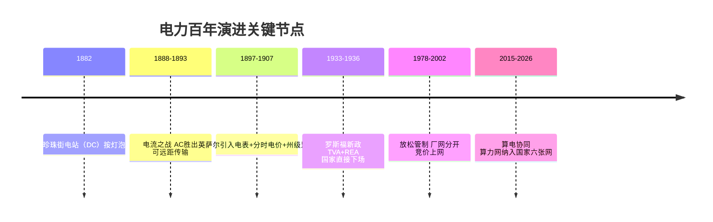
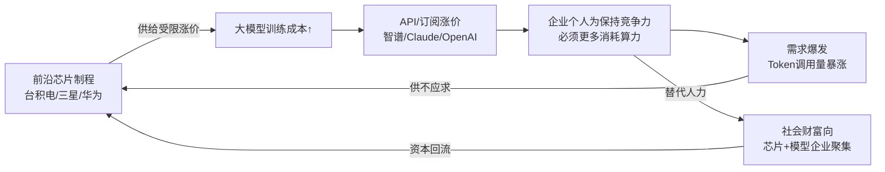
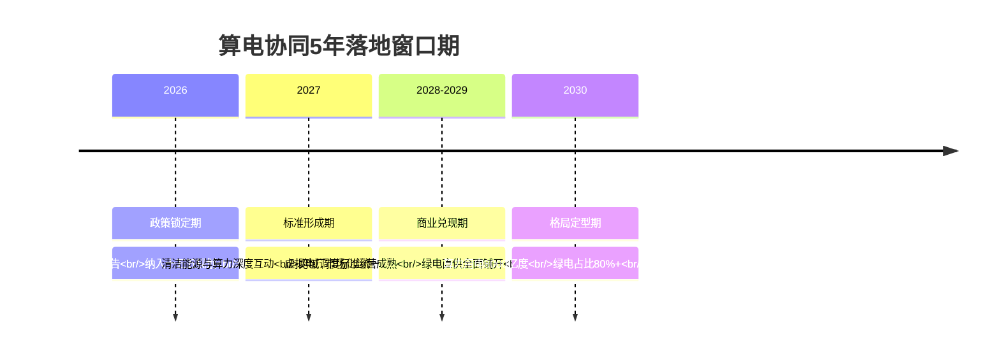
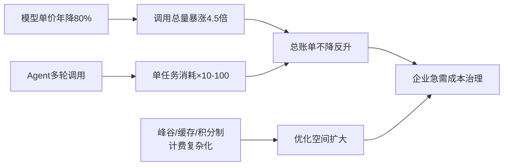
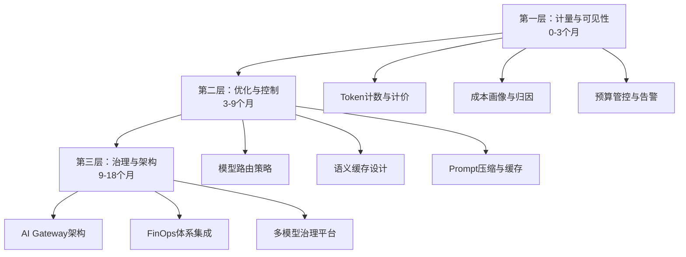
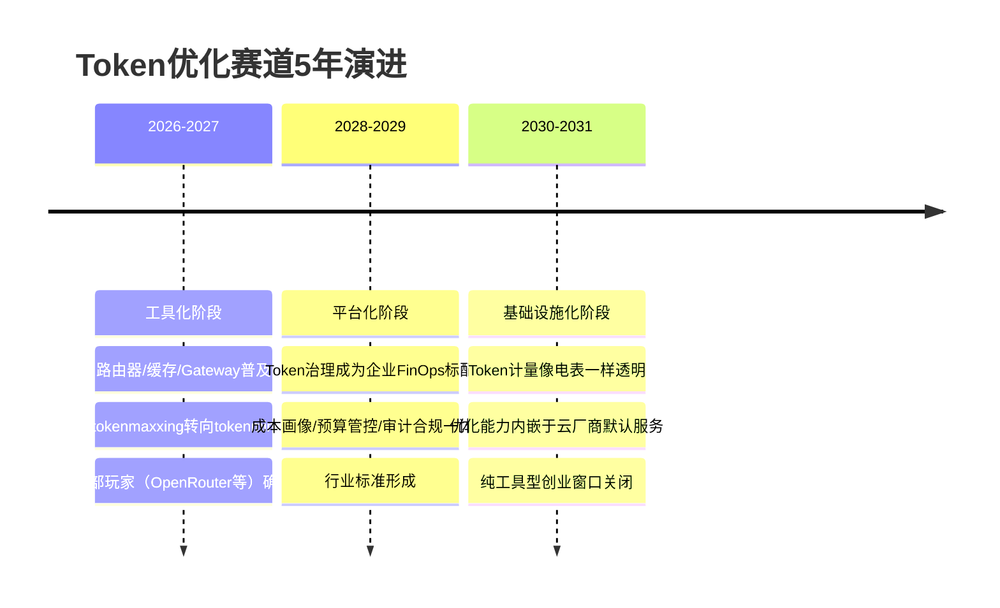
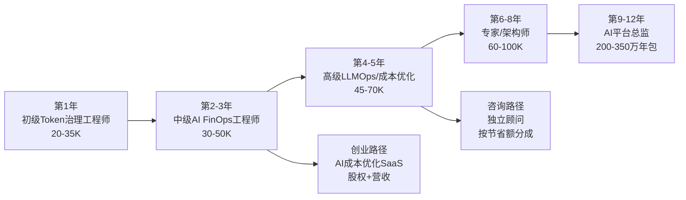

先给出核心判断：**Token 之于 AI 时代，确与电力之于工业时代高度同构——但有一个根本性的不同会改变历史走向：电力是物理学基础设施，可被国家以物理手段垄断管制；而前沿大模型的"智能"是算法与数据的产物，可被复制、可被开源、可跨境流动，这使得"国家掌管算力"的难度远高于掌管电力。** 未来更可能出现的不是简单的"国家接管算力"，而是一种**"前沿实验室—芯片寡头—主权国家—公民"四方的动态制衡格局**，财富会以前所未有的速度向前沿节点聚集，但国家会以"电力—算力—数据"三重基础设施的形式介入，形成一种新的"受管制的智能公用事业"模式。

下面从电力史的完整脉络出发，用第一性原理推演这条路径。

## 一、电力发展史：技术、企业、国家、定价四条线的交织

电力用大约 130 年走完了从"实验室奇观"到"受监管公用事业"的全过程，关键节点可清晰分为五个阶段：

**技术路线之争的底层逻辑是"传输效率决定网络形态"**。1882 年爱迪生在纽约珍珠街建第一座中央电站时用直流电（DC），但 DC 无法升压远距离传输，发电厂必须建在用户 1 英里内，导致每个城市需要几十个小电站重复建设【turn0search30】【turn0search33】。特斯拉与威斯汀豪斯推动的交流电（AC）可通过变压器升压远距传输，最终在"电流之战"中胜出——**不是技术更优雅，而是 AC 让"大电站+广电网"的规模经济成为可能，单位成本随网络扩大而下降**【turn0search35】【turn0search39】。这个逻辑今天在算力上重演：是"边缘小模型+本地推理"还是"超大规模训练中心+广域算力网"，本质上也是传输（带宽/延迟）与规模经济的权衡。

**收费模式的演变是一部"从固定收费到精细计量的经济史"**：

| 阶段 | 时期 | 定价模式 | 主导逻辑 | 对应今天的算力 |
|---|---|---|---|---|
| 包灯制 | 1882-1890s | 按灯泡数量固定收费 | 无法计量，按设备收 | 按订阅席位收费（如SaaS按人头） |
| 表计制 | 1890s-1930s | 按用电量（kWh）计费 | 电表发明，可计量 | 按token计费（API调用） |
| 两部制 | 1930s- | 基本容量费+电量费 | 区分容量与使用 | Coding Plan积分制（5h额度+周额度） |
| 分时电价 | 1930s- | 峰谷差异化定价 | 削峰填谷，平衡供需 | DeepSeek/智谱的高峰时段双倍计费 |
| 目录电价管制 | 1949-1985(中) | 政府统一目录电价 | 计划经济，保障民生 | 尚未出现的"国家算力目录价" |
| 还本付息电价 | 1985-1997(中) | 覆盖融资成本+协议利润 | 鼓励社会资本办电 | 算力补贴/产业基金模式 |
| 标杆电价 | 1997-2015(中) | 政府核定标杆+煤电联动 | 成本加成+传导 | 国产算力的政府指导价 |
| 基准价+浮动 | 2020(中) | 基准价+上下浮动 | 市场化定价 | 尚未出现 |
| 竞价上网 | 2015-(中) | "管住中间放开两头" | 输配电管制，发电售电竞争 | 未来"训练侧竞争+调度侧管制" |

【turn0search1】【turn0search11】【turn0search13】【turn0search17】【turn0search19】

**这里有一个被低估的关键人物：塞缪尔·英萨尔（Samuel Insull）**。他是爱迪生的秘书，1892 年负气出走芝加哥，做了三件决定电力行业百年形态的事：第一，1894 年从英国布莱顿引入分时电表和分时电价，让店铺夜间灯一直亮着也负担得起，公司同时扭亏为盈【turn0search1】；第二，通过合并小电站实现规模经济，到 1920 年他的公司用 200 万吨煤为 50 万用户供电，年收 4000 万美元【turn0search1】；第三，1898 年在 NELA（国家电灯协会）年会上提出电力是"自然垄断"，**主动要求以州级监管换取排他性特许经营权**——"竞争是不经济的市场调节器"，垄断+管制比恶性竞争更有效率【turn0search3】【turn0search7】【turn0search22】。1907 年威斯康星州和纽约州据此通过州级公用事业监管法，到 1920 年代全美各州都建立了类似制度【turn0search3】【turn0search22】。

英萨尔的故事本质上是**"企业主动让渡定价权以换取垄断地位"**——这恰恰是今天前沿大模型公司还没走到、但很可能走向的拐点。

## 二、企业 vs 国家：电力史中的四阶段角色演变

电力史不是"企业主导"或"国家主导"的单线叙事，而是**四个阶段的角色切换**，每一阶段由当时的主要矛盾驱动：

**阶段一（1880-1900）：企业主导，技术路线竞争期**。爱迪生、特斯拉、威斯汀豪斯等发明家-企业家主导，核心矛盾是"哪种技术胜出"。国家几乎不介入，只在市政层面发特许经营许可。芝加哥一度有 24 家中央电站公司重复敷设线路，恶性竞争导致成本高企【turn0search7】。**对应算力：2022-2025 年，OpenAI、Anthropic、智谱、DeepSeek 等实验室主导，核心矛盾是"哪种架构胜出"（Dense vs MoE，闭源 vs 开源），国家基本在观望。**

**阶段二（1900-1930）：企业主导+国家监管介入期**。英萨尔式"自然垄断+州级监管"模式确立，企业仍主导投资与运营，但定价权上交监管委员会。核心矛盾从"技术路线"转为"垄断效率 vs 公众利益"。**对应算力：2025-2028 年前后，可能出现"前沿实验室自愿接受算法审计与定价透明度，换取排他性市场地位"的英萨尔时刻。**

**阶段三（1930-1980）：国家直接下场期**。大萧条暴露私人资本无法覆盖农村和落后地区——1930 年代美国农村电气化率不足 10%，私人电力公司认为给农户拉线亏本。罗斯福 1933 年成立 TVA（田纳西河流域管理局），这是**一个既享政府权力、又有企业灵活性的联邦机构**，直接建坝发电，推动农村电气化【turn0search2】【turn0search3】【turn0search5】。1935/1936 年成立 REA（农村电气化管理局）提供低息贷款给农村电力合作社。到 1950 年代美国农村电气化率从 10% 升至 90%+。**核心矛盾：市场失灵的边缘地区需要国家作为"最后供给者"。**

**阶段四（1980-至今）：放松管制+市场化期**。1978 年美国 PURPA 法案开启独立发电商准入，1990 年代多州引入零售竞争，中国 2002 年厂网分开、2015 年"管住中间放开两头"。核心矛盾：垄断僵化导致效率低下，引入竞争降本。**但输配电环节始终保留管制——自然垄断环节不可竞争。**

**电力史给算力的核心启示是：技术成熟度决定主导者，而非反过来**。技术路线未定时，企业主导（试错成本低）；规模经济显现后，自然垄断属性浮现，国家监管介入以防止垄断暴利；当市场失灵（农村/偏远/低收入群体）时，国家直接下场；当市场成熟、多元供给可行时，再放松管制引入竞争。**算力当前正处于阶段一向阶段二过渡的临界点**——MoE 架构让规模经济已经显现（DeepSeek V4-Flash 13B 激活能做到接近旗舰效果，规模红利明显），但尚未出现英萨尔式的"主动求监管"事件。

## 三、算力飞轮与电力飞轮的第一性原理类比

您描述的飞轮——"上游涨价→下游涨价→企业强化竞争力→更多消耗→上游再涨价"——在第一性原理上成立，但需要拆解其运转条件。

**这个飞轮能持续运转的三个必要条件**：
1. **算力供给有硬约束**（先进制程产能、HBM、电力）——目前成立，台积电 3nm/2nm 产能受限，H100/H200 一机难求
2. **算力消费有正反馈**（用得越多竞争力越强，不用就被淘汰）——目前成立，AI 编码效率已是人工 5-10 倍，不用 AI 的开发者被快速淘汰
3. **替代人的边际收益大于边际成本**——目前成立但正在收窄，DeepSeek V4-Flash 把单任务成本压到 GLM 的 1/6、Claude 的 1/48，说明**算力的边际成本曲线在快速下行，飞轮的"涨价"环节会率先被打破**

**电力飞轮当年如何被打破？** 关键在两件事：一是规模经济到极限后单位成本坍塌（英萨尔把芝加哥电价降了 32%）；二是国家介入打破垄断溢价（TVA 以成本价供电倒逼私人公司降价）。**算力的"英萨尔时刻"和"TVA 时刻"都会到来，只是时间问题**。

值得注意的数据拐点：2024 年初日均 Token 调用量 1000 亿，2026 年 3 月飙到 140 万亿，两年增长千倍【turn0search35】。这种增速在电力史上从未出现过——电力从 1882 年到 1920 年代普及用了 40 年，算力的渗透速度快一个数量级。**这意味着电力 130 年的历史压缩，可能在算力上 15-20 年就走完**。

## 四、核心异同：算力与电力的根本不同会改变历史路径

先把要回答的问题界定清楚：**算力与电力是否存在"根本性不同"，以至于会改变历史路径——即国家能否像掌管电力那样掌管算力？** 我原来给出的答案是"存在三个根本不同，国家难以掌管"。重新核查文献后，这个答案的两个核心论据都站不住脚，需要推翻重写。下面逐点对照原始判断与修正判断，每一条都附上文献依据，最后给出修正后的结论。

## 原始判断与修正判断对照

| 原始判断（错误） | 修正判断 | 修正依据 |
|---|---|---|
| 电力是物理资源不可复制，算力核心是算法权重可无限复制，国家难垄断 | 算力的核心仍是物理算力（芯片+电力+数据中心），权重只是"发电机图纸"而非"电力"本身；权重本身已被纳入出口管制 | DeepSeek V4 训练仍需 2048 块 H800【turn0search6】；美国 BIS 已将模型权重纳入出口管制【turn0search38】；a16z 判断"推理是智能的销售成本"【turn0search1】 |
| 电力边际成本不可趋零，算力边际成本正在趋零 | 完全反了：可再生能源时代电力边际成本已可趋零（甚至负电价）；算力边际成本并未趋零，受物理下限约束且杰文斯悖论下总支出持续上升 | 德国 2024 年负电价 468 小时【turn1search18】；GPT-3.5 推理成本降 280 倍但 OpenAI 推理总支出反增 2.4 倍【turn0search13】；test-time compute 使单次推理成本线性上升 |
| 电力替代体力，算力替代脑力，算力财富分配更隐蔽集中 | 这一点本身成立，但方向性判断反了：替代脑力使算力战略价值更高，国家管制动机更强而非更弱 | 算力已被中美纳入国家安全关键基础设施【turn0search32】；算力主权成为政策核心议题 |

## 逐点重新审视

### 第一点：算力的核心不是权重，而是物理算力

我原来的错误在于**把"权重可复制"等同于"算力可复制"**。这是两个不同的东西。

权重文件确实可以近乎零成本复制分发——这一点没错。但权重本身不产生任何智能输出，它必须被加载到 GPU/TPU 上运行，而每一次推理都消耗真实的电力、产生真实的硬件折旧。DeepSeek V4 即便把单 token 推理 FLOPs 压到 V3.2 的 10%、KV 缓存压到 7%，训练仍然需要 2048 块 H800 GPU 组成的集群【turn0search6】【turn0search9】。a16z 在 2026 年 7 月的判断更直接："**Inference is the COGS of intelligence**"——推理是智能的销售成本，不是可摊薄的一次性投入【turn0search1】。

更关键的是，**国家已经开始把权重本身纳入管制**。美国 BIS 2025 年的 AI 管控新规已将"AI 模型权重"纳入出口管制范围【turn0search38】。这意味着"权重可跨境流动从而削弱国家管控"的假设正在被现实证伪——国家完全可以通过管制权重分发、芯片供给、电力接入三个环节来掌管辖力，正如管制电力时通过管制电站、电网、燃料三个环节一样。

Toby Ord 等学者还指出一个趋势：随着 test-time compute scaling 兴起，推理算力（而非训练算力）成为智能产出的主要变量，**权重的相对重要性在下降，算力的相对重要性在上升**——这进一步强化了算力的物理属性。

> 权重是发电机图纸，不是电力本身。图纸可以共享，但发电机和电网无法跨境搬迁。算力的核心是物理基础设施，这一点与电力高度同构。

### 第二点：方向完全反了——是电力的边际成本可以趋零，而非算力

这是我最严重的错误。重新核查数据后发现，**两个方向的判断都反了**。

**电力边际成本在可再生能源时代已经可以趋零，甚至为负**。光伏和风电的燃料成本为零——阳光和风力的边际成本确实是零。2024 年欧洲电力市场出现创纪录的负电价：德国全年负电价 468 小时（同比增 60%），法国 356 小时（翻倍），西班牙首次出现 247 小时负电价【turn1search18】。学术研究明确指出"可再生能源的边际发电成本为零"已是电力市场设计的基础假设【turn1search1】【turn1search6】【turn1search12】。我原来认为"电力边际成本不可趋零"是基于火电时代的认知，在新能源时代已经过时。

**而算力的边际成本并未趋零，反而在杰文斯悖论下持续推高总账单**。这里的误区在于混淆了三个不同的成本概念：

| 成本类型 | 是否趋零 | 实际情况 |
|---|---|---|
| 权重复制成本 | 趋近零 | 训练完成后，复制权重的成本几乎为零 |
| 单位 token 推理成本 | 在下降但非趋零 | GPT-3.5 到 2026 年降 280 倍，但受物理算力/电力/显存带宽下限约束 |
| 服务总成本 | 不降反升 | 杰文斯悖论：单位成本下降触发需求爆炸，总支出上升 |

关键数据：GPT-3.5 推理成本降幅 280 倍，但 OpenAI 推理总支出反增 2.4 倍【turn0search13】；2024 年初日均 Token 调用量 1000 亿，2026 年 3 月飙到 140 万亿（两年千倍）【turn0search22】；2026 年全球 AI 算力投入 4500 亿美元中推理占比突破 70%【turn0search13】。

更根本的是，**test-time compute scaling 这条新路线正在让单次推理的边际成本上升而非下降**。o1/o3 模型对单个复杂问题消耗分钟级算力（而非毫秒级），每多"想"一步就多消耗 token、多花钱【turn0search11】。GPT-5.2 pro 的推理输出价格是 $168/百万 token，而 DeepSeek R1 是 $2.50——差距 67 倍，说明前沿智能的边际成本不仅不趋零，还在被 test-time compute 主动推高。

> 权重复制成本趋零，不等于服务成本趋零。一首歌录制完成后复制成本趋零，但 Spotify 每次播放都要付版权费和带宽费；一个模型训练完成后权重复制成本趋零，但每次推理都要消耗真实的 GPU 折旧和电力。

### 第三点：替代脑力使国家管制动机更强而非更弱

这一点本身成立——算力替代的是认知劳动，电力替代的是体力劳动。但我原来的推论方向反了。

我原来认为"算力替代脑力，财富分配更隐蔽集中，国家更难管"。实际上，**替代脑力使算力的战略价值远高于电力**——它直接决定一个国家的认知劳动生产力、军事决策能力、情报分析能力。这恰恰使国家有更强的动机去管制算力，而非更弱。

证据已经很明确：中国 2026 年将算力网纳入"六张网"（与水网、电网并列），投资 7 万亿中算力网直接投资约 4500 亿【turn0search32】；美国 Anthropic 已建议动用《国防生产法》强制电网互联以支持前沿 AI 训练；世界经济论坛 2026 年报告指出只有中美两国具备"全栈主权算力"能力【turn0search18】。CNAS 的主权 AI 指数报告指出美中两国控制了 90% 的前沿 AI 算力【turn0search19】。

> 替代脑力不是削弱国家管制力的因素，而是加强因素。战略价值越高，国家介入越深越快。

## 修正后的结论

**算力与电力不存在"会改变历史路径的根本性不同"。** 我原来提出的三个不同点中，前两个是事实性错误（方向反了），第三个虽然事实成立但推论方向反了。修正后的判断是：

**算力与电力在物理属性、成本结构、战略价值三个维度上高度同构**。两者都是重资产物理基础设施，都依赖稀缺上游供给（燃料↔芯片），都存在规模经济与自然垄断属性，都已被国家纳入关键基础设施管制范畴。电力边际成本在可再生能源时代可以趋零，算力边际成本受物理约束不会趋零——这意味着**算力比电力更有理由被当作公用事业管制，而非更少**。

国家以"电力式公用事业管制"模式介入算力不仅可行，而且已经在发生，速度快于电力史。电力从 1882 年珍珠街电站到 1933 年 TVA 用了 51 年；算力从 2022 年 ChatGPT 到 2026 年算力网纳入国家"六张网"只用了 4 年。原因是算力的战略显性远高于早期电力——电力最初只替代照明和动力，算力直接替代认知劳动，触及国家竞争力的核心。国家不会容忍"前沿实验室+芯片寡头"形成超越主权的权力中心，介入会比电力史更早、更深、更快。

## 五、未来 20 年走向的四阶段预测

基于电力史的类比和算力的根本不同，推演未来 20 年的演进路径：

**阶段一（2025-2028）：企业主导，"前沿实验室"崛起为超主权实体**。OpenAI、Anthropic、智谱、DeepSeek 等前沿实验室成为类似爱迪生通用电气、威斯汀豪斯的角色，但权力更大——它们掌握的不只是生产能力，而是"智能供给"本身。财富快速向前沿节点聚集：台积电（先进制程）、英伟达（GPU）、前沿实验室（模型权重）形成"芯片-算力-模型"三角，**这个三角的利润瓜分比例可能达到 7:2:1**（芯片吃大头，因为供给最硬约束）。国家开始警觉但尚未有效介入，美国用《国防生产法》强制电网互联以支持 AI 训练（Anthropic 已建议此路径）【turn0search15】，中国把算力网纳入"六张网"并推进算电协同【turn0search29】【turn0search31】。Token 定价仍由企业自主，但峰谷分时计费已全面普及（智谱、DeepSeek 都已实施）。

**阶段二（2028-2032）：英萨尔时刻——前沿实验室主动求监管**。随着 MoE 规模经济到极限、开源模型（DeepSeek 系）逼近闭源能力，前沿实验室的"溢价"被压缩。为保住垄断地位，头部实验室会**主动接受算法审计、安全披露、定价透明度，换取排他性市场地位和监管护城河**——正如英萨尔 1898 年主动要求州级监管。这会形成"受监管的智能公用事业"模式：3-5 家头部实验室成为类似电网公司的"智能供应商"，接受类似公用事业委员会的监管，定价受政府指导。中国会更早走到这一步（国企体制+算力网国家统筹），美国会因为反监管传统而滞后但最终跟进。Token 定价从企业自主转向"基准价+浮动"的政府指导模式。

**阶段三（2032-2038）：TVA 时刻——国家作为"最后算力供给者"**。市场失灵的领域会出现：中小企业用不起前沿模型、农村/偏远地区算力基础设施不足、低收入群体被排除在 AI 红利外。国家会成立类似 TVA/REA 的"国家算力局"或"公共算力平台"，以成本价提供基础算力（相当于"算力的农村电气化"）。中国已布局——全国一体化算力网、东数西算、8 大枢纽节点就是"算力版的 TVA 大坝+电网"【turn0search24】【turn0search25】【turn0search29】。美国会通过 DOE（能源部）或新设机构介入。此时 token 的基础层价格被国家锚定，前沿实验室只能在高端市场维持溢价。

**阶段四（2038-2045）：放松管制+开源生态成熟**。当开源模型能力追平闭源（DeepSeek 已在 Agent 能力上反超闭源旗舰）、算力供给充裕（国产算力+新能源电力+规模经济），管制理由消失，行业进入"管住调度、放开训练"阶段。算力调度网（类似电网）受管制，模型训练和 API 服务完全市场化。此时 token 价格趋近于边际成本（电力+折旧），智能像电力一样成为廉价公共品。

**关于您担心的"财富绕过国家向前沿节点聚集"**：这个过程在阶段一-二会非常剧烈，但阶段三-四会被国家介入部分扭转。电力史上，英萨尔帝国巅峰时控制 32 州 400 万用户，但 1932 年因财务丑闻崩溃，其资产被分散，国家借机介入。**前沿实验室大概率也会经历"崛起-巅峰-被监管/拆分"的类似轨迹**，只是时间窗口更短。

## 六、四方制衡格局：前沿实验室—芯片寡头—主权国家—公民

未来 20 年的核心博弈不是"国家 vs 企业"的二元结构，而是四方动态制衡：

| 角色 | 核心资源 | 权力来源 | 制约力量 |
|---|---|---|---|
| 前沿实验室 | 模型权重、训练数据、算法人才 | 智能供给的稀缺性 | 芯片供给依赖、国家监管、开源竞争 |
| 芯片寡头（台积电/英伟达/华为） | 先进制程、GPU 设计、HBM | 硬供给约束 | 国家安全审查、反垄断、国产替代 |
| 主权国家 | 电力、土地、监管权、军事 | 物理基础设施垄断 | 实验室可跨境迁移、芯片产能全球分布 |
| 公民/企业 | 数据、消费力、政治选票 | 需求侧、政治合法性 | 算力供给被垄断时议价能力弱 |

**这个格局的关键不稳定点在于"前沿实验室可跨境迁移"**——如果美国监管过严，OpenAI/Anthropic 可能迁往中东（沙特已大量投资）、新加坡或瑞士。这会形成类似"离岸金融中心"的"离岸智能中心"，国家管制效力被削弱。电力史上没有这个问题（电站无法搬迁），但算力史上这会是持续博弈点。**最终可能形成类似"巴塞尔协议"的国际算力监管协调机制**，但达成难度高于金融监管。

## 七、个人如何把握时代机会：基于电力史的四个行动原则

从第一性原理推演，个人在这次财富再分配中的最优策略不是"站队某家模型公司"，而是**成为"算力时代的电气工程师"——掌握连接智能供给与真实需求的中间层能力**。

**原则一：押注"调度层"而非"生产层"**。电力史上最持久的赢家不是发电公司（竞争激烈、利润被管制），而是调度输配环节（自然垄断、稳定收益）和应用层（通用电气造电器）。算力时代的"调度层"是：Agent 编排、算力路由、模型路由、Prompt 工程、RAG 系统——这些能力让前沿模型的能力落地到具体业务。DeepSeek V4-Flash 能力再强，如果没有人编排 Agent 把它接入企业工作流，价值就是零。**个人应重点构建"把模型能力转化为业务流程"的工程能力，而非追逐某家模型的最前沿**。

**原则二：掌握"算力计量与成本优化"技能**。电力史上电表工程师、能源审计师是稳定需求岗位。算力时代对应的是：token 成本优化、缓存策略设计、模型路由（简单任务用 Flash、复杂任务用 Pro）、算力预算管理。智谱的积分制、DeepSeek 的峰谷定价已经让"算力账单"复杂化，**能帮企业把算力成本降 50% 的人，价值不亚于能帮企业省电的能源管理师**。

**原则三：布局"算电协同"的交叉地带**。中国已把算电协同写入政府工作报告和"十五五"规划，2025 年算力中心用电量 1960 亿千瓦时（增速 18.1%），2030 年预计 7000 亿千瓦时【turn0search30】。这个交叉地带（数据中心选址、绿电直供、算力负荷调度、液冷节能）是未来 10 年确定性最高的增长方向之一，且**需要同时懂电力系统和算力系统的复合人才极度稀缺**。

**原则四：对"前沿实验室"保持"既合作又独立"的姿态**。电力史上，过度依赖单一电力公司的城市（如芝加哥依赖英萨尔帝国）在公司崩溃时陷入危机。算力时代同理——把所有业务押在单一模型（无论是 Claude、GPT 还是 GLM）上，都存在供应商风险。**最优策略是"模型组合"：前沿任务用闭源旗舰、日常任务用开源模型、关键数据用本地部署**，保持对多家模型的切换能力。这也正是 DeepSeek V4-Flash 0731 通过原生支持 Responses API 和 Codex 适配来降低迁移成本的原因——**生态开放度会成为选型的关键维度**。

---

回到您最初的判断：Token 确实是新时代的电力，飞轮确实在加速运转，财富确实在向前沿节点聚集。但电力史告诉我们一个关键规律：**任何基础设施在"规模经济+自然垄断+社会必需"三重属性叠加后，都会经历从企业垄断到国家监管的拐点**。算力的这个拐点会比电力来得更快（因为渗透速度快一个数量级），但形态会更复杂（因为算法可开源、可跨境）。国家介入不是"会不会"的问题，而是"何时介入、以何种深度介入"的问题——中国的算力网+算电协同、美国的《国防生产法》选项，都已经是介入的前奏。

对个人而言，最大的机会不在"成为前沿实验室的一员"（那类似成为爱迪生公司的员工，荣耀但被绑定），而在**成为"把智能基础设施转化为社会生产力的中间人"**——正如电气工程师、能源管理师、电网调度员在电力时代的角色。这个中间层的价值，会随着算力供给的充裕化而持续上升，因为**当智能本身变得廉价，唯一稀缺的是"把智能接到正确问题上的能力"**。

算电协同交叉地带未来5年的确定性已由国家战略锁定——2026年写入政府工作报告、纳入"十五五"规划，中信证券测算对应总投资约2万亿元、"十五五"期间年复合增长率约42%【turn0search3】。但这个赛道的真正机会不在"造数据中心"或"建发电站"这两个重资产端，而在两者之间的**调度层与集成层**——即把电力系统的柔性负荷能力与算力系统的任务编排能力打通的软件、标准、人才和服务。这个中间层技术壁垒适中、轻资产可规模化、且当前处于"政策已落地、标准未统一、人才极度稀缺"的窗口期。

## 一、为什么是未来5年：窗口期的三重确定性

三重确定性构成窗口期基础：**政策确定性**（2026年5月四部委联合行动方案、6月多用户绿电直连制度确立，目标2030年算力设施绿电供给能力达国际领先）【turn0search2】【turn0search3】；**需求确定性**（算力用电从2025年1700亿度增至2030年8000亿度，枢纽节点用电近3年平均增速39.5%）【turn0search5】【turn0search3】；**供给确定性**（西部绿电富集但消纳困难，2025年全国风电利用率94.3%、光伏94.8%，部分西部省份更低）【turn0search9】。东南大学教授高赐威判断"复合型人才培养周期需要3-5年磨合"【turn0search7】——这意味着现在入场，正好在标准形成期卡位、商业兑现期收割。

## 二、四象限机会矩阵：定位你的切入点

按"技术壁垒"和"资产轻重"两个维度，算电协同的机会可划分为四个象限。不同背景的人应切入不同象限：

| 象限 | 机会方向 | 资产属性 | 技术壁垒 | 适合人群 | 5年市场规模 |
|---|---|---|---|---|---|
| **Ⅰ 重资产高壁垒** | 绿电直供项目开发运营、源网荷储一体化园区 | 重资产（数十亿级） | 高（需电力牌照+土地+电网接入） | 能源央企、发电集团、地方政府 | 万亿级（全产业链配套） |
| **Ⅱ 轻资产高壁垒** | 算力柔性调度软件、虚拟电厂聚合平台、跨域算力迁移引擎 | 轻资产（千万级起） | 高（需同时懂电力调度+算力编排） | 技术创业者、AI基础设施团队 | 1800-2800亿（核心赛道） |
| **Ⅲ 重资产低壁垒** | 模块化数据中心预制交付、液冷系统集成 | 中重资产（亿级） | 中（工程化能力为主） | 设备厂商、工程总包、IDC运营商 | 数千亿级 |
| **Ⅳ 轻资产低壁垒** | 算电协同咨询规划、绿电交易代理、碳足迹认证、人才培训 | 轻资产（百万级起） | 低（信息差+资质为主） | 咨询机构、行业媒体、培训机构 | 百亿级 |

**对个人职业选择而言，象限Ⅱ是杠杆率最高的方向**——它需要的复合技能（电力市场交易+算力任务编排+异构资源调度）目前市场存量极少，教育部2026年7月才刚增补"算网融合工程技术"等6个数字领域新专业【turn0search9】，存量人才供给远跟不上需求。象限Ⅳ门槛低但易被替代，适合作为切入跳板而非终局。

## 三、分角色的5年落地路线图

### 路线图1：技术创业者——切入调度软件与虚拟电厂平台

这是杠杆率最高、但也最需要技术深度的路径。核心逻辑是：算力柔性调度软件是算电协同的"操作系统"，谁掌握了调度标准，谁就掌握了产业链话语权。

| 阶段 | 时间 | 目标 | 关键动作 | 里程碑指标 |
|---|---|---|---|---|
| **Phase 1：卡位** | 0-12个月 | 打通技术原型+拿到试点资质 | ① 搭建跨域算力调度引擎原型（支持NVIDIA/昇腾/寒武纪异构算力统一纳管）② 对接一个省级电网负荷管理中心或虚拟电厂平台 ③ 申报地方算电协同试点资质 | 跨域迁移成功率≥95%、调度响应≤300秒、接入1个枢纽节点 |
| **Phase 2：验证** | 12-24个月 | 在真实需求响应中跑通商业闭环 | ① 参与2-3次电网削峰填谷邀约，验证柔性负荷调节能力 ② 对接绿电交易平台，实现"算力跟着绿电走"的动态调度 ③ 申请软著/专利，参与行业标准制定 | 响应补贴收入覆盖运营成本、功率预测精准率≥95%、服务3-5个数据中心 |
| **Phase 3：复制** | 24-36个月 | 从单点验证走向多节点网络 | ① 将调度能力产品化为SaaS平台，支持多租户 ② 拓展至3个以上枢纽节点，形成跨域调度网络 ③ 引入战略投资（电网公司/云厂商/发电集团） | 接入算力规模≥100PFLOPS、调度收入占比≥50%、估值进入独角兽区间 |
| **Phase 4：生态** | 36-60个月 | 成为算力网调度层的标准制定者 | ① 推动调度接口标准化，向行业开放API ② 与国家一体化算力网监测调度平台对接 ③ 向虚拟电厂、需求响应、绿电交易多场景延伸 | 平台接入全国20%+智能算力、成为国家算力网核心调度节点 |

**技术栈与技能清单**：
- **核心层**：异构算力统一纳管（Kubernetes+Volcano/YuniKorn改良）、算力任务编排（Argo Workflows/Tekton）、跨域热迁移（基于CRIU+RDMA）
- **电力层**：电力市场交易API对接（中长期+现货+辅助服务）、需求响应邀约引擎、虚拟电厂聚合算法（可调容量评估、负荷响应潜力测算）
- **优化层**：电价预测模型（LSTM/Transformer）、绿电出力预测、算力任务-电力负荷联合优化（两阶段随机优化+蒙特卡洛模拟）
- **数据层**：功率预测精准率≥98%的实时数据管道、碳排放全生命周期追溯、绿电物理溯源

**商业模式**：三段式收入结构——①调度平台订阅费（SaaS，按接入算力规模收费）②电力交易分成（峰谷套利+需求响应补贴+辅助服务，按节省电费的20-30%分成）③绿电交易佣金（按交易电量收费）。参考国内虚拟电厂头部企业，市场化交易收入占比已接近60%【turn0search11】。

### 路线图2：传统能源/电力从业者——向"算力负荷聚合商"转型

发电集团、电网公司、售电公司拥有电力牌照、客户关系和调度权限，但缺乏算力理解。其最优路径不是自建算力，而是成为"算力负荷聚合商"——把分散的数据中心算力负荷聚合起来，作为柔性资源参与电力市场。

| 阶段 | 时间 | 目标 | 关键动作 |
|---|---|---|---|
| **Phase 1** | 0-12个月 | 盘点辖区内可调算力负荷 | ① 摸排本省数据中心算力规模、用电结构、可调潜力 ② 建立算力负荷档案，区分刚性负荷与柔性负荷 ③ 与3-5个数据中心签订负荷聚合协议 |
| **Phase 2** | 12-24个月 | 接入虚拟电厂平台参与电力市场 | ① 搭建或对接虚拟电厂聚合平台 ② 参与需求响应邀约（削峰补贴0-24元/千瓦·次、填谷0-7元/千瓦·次）③ 探索电力现货市场套利 |
| **Phase 3** | 24-36个月 | 从补贴驱动转向市场化运营 | ① 电力交易+辅助服务+需求响应三重收入结构成熟 ② 拓展跨省算力调度（青海-江苏模式，节省电费66%）③ 向绿电直供项目开发延伸 |
| **Phase 4** | 36-60个月 | 成为区域能源-算力协同运营商 | ① 运营百万千瓦级算电协同园区 ② 提供绿电+算力+碳足迹一体化解决方案 ③ 服务出口型企业碳合规需求 |

### 路线图3：AI/云从业者——向"算电协同架构师"转型

云计算、AI基础设施工程师懂算力调度但不懂电力系统，需要补齐电力市场、需求响应、绿电交易的认知。

| 阶段 | 时间 | 目标 | 关键动作 |
|---|---|---|---|
| **Phase 1** | 0-6个月 | 补齐电力系统基础认知 | ① 学习电力市场基础（中长期/现货/辅助服务/需求响应）② 考取电力交易员或需求响应管理师资质 ③ 跟踪1-2个算电协同试点项目 |
| **Phase 2** | 6-18个月 | 在算力调度中嵌入电力感知 | ① 在现有算力调度系统中增加电价感知模块（峰谷时段任务编排）② 实现算力任务的"时间平移"（非实时任务挪到谷电时段）③ 量化降本效果（目标单位用电成本降20-30%） |
| **Phase 3** | 18-36个月 | 主导算电协同系统设计 | ① 设计跨域算力迁移方案（东部高电价→西部低电价绿电）② 对接虚拟电厂平台，让算力负荷参与电网调度 ③ 输出算电协同架构方法论 |
| **Phase 4** | 36-60个月 | 成为算电协同解决方案专家 | ① 为多个智算中心提供算电协同咨询服务 ② 参与行业标准制定 ③ 培训下一代复合人才 |

### 路线图4：传统IDC运营商——向"零碳智算中心"转型

存量IDC面临PUE硬约束（国家枢纽节点新建数据中心PUE≤1.1-1.2）和绿电占比要求（≥80%），不改造将被淘汰。

| 阶段 | 时间 | 目标 | 关键动作 |
|---|---|---|---|
| **Phase 1** | 0-12个月 | 完成液冷改造+绿电接入 | ① 部署冷板式液冷（PUE降至1.1-1.25，改造成本适中）或浸没式液冷（PUE降至1.04-1.05，新建首选）② 申报算电协同试点资质，对接绿电交易账户 ③ 申报需求响应账户 |
| **Phase 2** | 12-24个月 | 部署算力调度模块 | ① 对托管服务器算力需求分级标签设置（实时型/非实时型）② 非实时算力安排在谷电时段运行 ③ 实时算力优先匹配低价绿电供给 |
| **Phase 3** | 24-36个月 | 参与虚拟电厂+跨域调度 | ① 接入省级虚拟电厂平台，参与现货交易 ② 与西部算力中心建立跨域迁移通道 ③ 降本空间分层传导给终端用户 |
| **Phase 4** | 36-60个月 | 输出零碳算力服务 | ① 提供带碳足迹认证的算力服务（满足出口企业碳合规）② PUE≤1.1、绿电占比≥80%成为标配 ③ 从"卖机柜"转向"卖绿色算力" |

## 四、核心技术栈与技能清单详解

算电协同的复合技能可分为三层，每层都有明确的学习路径和资源：

### 第一层：电力系统认知（算力从业者需补齐）

| 技能模块 | 具体内容 | 学习资源 | 验证标准 |
|---|---|---|---|
| 电力市场基础 | 中长期/现货/辅助服务/需求响应四类市场 | 国家能源局政策文件、各省电力交易中心规则 | 能独立完成一笔绿电交易或需求响应申报 |
| 分时电价机制 | 峰谷电价、尖峰电价、深谷电价、峰谷套利逻辑 | 发改委发改能源〔2025〕650号文、各省分时电价政策 | 能算出某数据中心错峰运行的年节省电费 |
| 虚拟电厂运营 | 负荷聚合、可调容量评估、响应邀约执行 | 国网/南网虚拟电厂平台操作手册、行业白皮书 | 能将一个数据中心接入虚拟电厂平台并完成响应 |
| 绿电交易与碳足迹 | 绿证交易、市场化购电、绿电直连、碳核算 | 绿电直连政策（2025年650号文、2026年688号文）、ISO 14064 | 能完成算力项目的全生命周期碳足迹核算 |

### 第二层：算力调度能力（电力从业者需补齐）

| 技能模块 | 具体内容 | 学习资源 | 验证标准 |
|---|---|---|---|
| 异构算力纳管 | GPU（NVIDIA/AMD/昇腾）统一管理、vGPU、碎片调度 | Kubernetes+Volcano、Slurm、OpenStack文档 | 能统一管理3种以上异构芯片 |
| 算力任务编排 | 分布式训练调度、推理任务编排、任务优先级管理 | Argo Workflows、Kubeflow、Ray | 能实现训练任务的跨集群调度 |
| 跨域热迁移 | 基于CRIU的容器检查点、RDMA远程直接内存访问 | CRIU文档、NVIDIA GPUDirect RDMA | 能在不中断业务的前提下迁移推理任务 |
| 算力网络 | 算力网架构、全光网络、低时延传输 | "东数西算"技术白皮书、CENI国家未来网络 | 理解算力网"八枢纽+十集群"架构 |

### 第三层：算电协同优化（双方都需补齐的核心层）

| 技能模块 | 具体内容 | 学习资源 | 验证标准 |
|---|---|---|---|
| 柔性负荷建模 | 刚性/柔性负荷识别、可调容量评估、响应潜力测算 | 两阶段随机优化、蒙特卡洛模拟、Copula函数 | 能评估一个数据中心的可调负荷潜力 |
| 算力-电力联合优化 | 基于电价预测的算力任务时空调度、绿电出力匹配 | 强化学习（PPO/SAC）、混合整数规划 | 能实现"算力跟着绿电走"的动态调度 |
| 虚拟电厂聚合算法 | 多资源聚合（光伏+储能+充电桩+算力）、出清策略 | 虚拟电厂平台算法文档、电力市场出清模型 | 能运营一个多资源聚合的虚拟电厂 |
| 碳足迹与绿电溯源 | 全生命周期碳排放核算、绿电物理直供溯源 | ISO 14064、GHG Protocol、绿电直连政策 | 能出具算力项目的碳足迹认证报告 |

## 五、进入策略与商业模式

### 策略一：从"咨询+培训"切入，向"软件平台"升级

适合个人创业者或小团队。先用咨询和培训建立行业认知与客户关系，再用软件产品沉淀方法论。具体路径：
1. **0-6个月**：以算电协同咨询顾问身份，为3-5个数据中心或园区提供选址评估、绿电接入方案、PUE改造规划服务，建立案例库
2. **6-18个月**：将咨询方法论产品化为轻量SaaS工具（电价感知算力调度模块、绿电交易代理工具），以年费形式向中小IDC出售
3. **18-36个月**：引入战略投资，向完整算力调度平台升级，参与行业标准制定

### 策略二：从"虚拟电厂聚合"切入，向"算力负荷运营商"升级

适合有电力行业背景的团队。先用虚拟电厂模式聚合算力负荷参与电力市场，再向算力运营延伸：
1. **0-12个月**：在算力密集区域（如广东韶关、贵州贵安）聚合5-10个数据中心的可调负荷，接入省级虚拟电厂平台，参与需求响应获取补贴
2. **12-24个月**：拓展电力现货市场套利和辅助服务收入，将补贴收入占比从50-60%降至30%以下
3. **24-36个月**：向上游延伸，参与绿电直供项目开发；向下游延伸，为算力用户提供"绿电+算力"一体化服务

### 策略三：从"液冷+预制化"切入，向"零碳智算中心集成商"升级

适合有工程总包或设备集成能力的团队：
1. **0-12个月**：与液冷厂商（曙光数创、英维克、新华三）合作，承接2-3个数据中心液冷改造项目
2. **12-24个月**：整合预制化模块+液冷+绿电接入，提供"交钥匙"零碳智算中心建设服务（建设周期压缩至4-6个月）
3. **24-36个月**：从建设端向运营端延伸，提供带碳足迹认证的绿色算力租赁服务

## 六、风险与避坑指南

算电协同赛道存在三道坎，东南大学教授高赐威明确指出"每一项都需要3-5年磨合"【turn0search7】：

**坎一：规划错位——电网与算力网两套调度体系不协同**。电网按变电站监测数据运行，算力企业按软件估算功耗，两者数据口径不一致。国网冀北电科院副所长王泽森指出"数据中心报装时只提供总量需求，实际负荷的阶段性增长更多取决于运营商业务，电网难以准确预判"【turn0search33】。**避坑**：必须同时对接电网调度系统和算力调度系统，建立统一的数据接口标准，不能只做一端。

**坎二：经济性不足——改造成本高于收益**。高赐威测算"企业参与电网调峰需要额外投入储能设备和算力调度系统的改造成本，但目前峰谷电价差带来的电费收益根本覆盖不了这些隐性成本"【turn0search7】。广东现货市场年度价差已压缩到每度0.0012元【turn0search17】。**避坑**：不能只靠峰谷套利，必须构建"电力交易+辅助服务+需求响应+绿电交易"四重收入结构，且初始投入要从轻资产切入（软件平台先行，重资产后置）。

**坎三：人才断层——复合型人才培养周期长**。教育部2026年7月才刚增补"算网融合工程技术"等6个新专业，存量人才供给远跟不上需求【turn0search9】。海南州数据局副局长马咸萍表示"为补齐复合型人才缺口，成立绿色算力产业专家咨询委员会"【turn0search5】。**避坑**：不能指望招聘现成的复合人才，必须内部培养+外部借智并行——送核心团队参加算电协同培训（中国能源报等机构已开展系列培训【turn0search0】），同时聘请电力和算力两个领域的专家作为顾问。

**其他需警惕的风险**：①政策补贴退坡风险（虚拟电厂收入目前50-60%来自补贴，长期需转向完全市场化【turn0search11】）②技术路线分歧（冷板式vs浸没式液冷，5年内冷板式是主力但浸没式在万卡级智算中心占比更高）③地方保护主义（各省算电协同政策细则不一，跨省交易规则尚未统一）④数据安全与主权（算力跨域迁移涉及数据跨境合规）。

## 七、5年后的终局判断

到2030年，算电协同赛道将形成三层格局：**底层**（绿电直供项目、源网荷储园区）由能源央企和地方政府主导，格局基本锁定；**中间层**（算力调度软件、虚拟电厂平台、跨域迁移引擎）形成3-5家头部平台型公司，掌握调度标准和算力网核心节点；**应用层**（零碳算力服务、碳足迹认证、绿电交易代理）百花齐放，服务千行百业。

对个人而言，现在入场的最优策略是**在中间层卡位**——成为同时懂电力市场和算力调度的复合型人才或创业者。这个窗口期约3-5年，标准形成期（2026-2027）是卡位最佳时段，商业兑现期（2028-2029）是收获时段，格局定型期（2030年后）新进入者将面临高壁垒。具体行动建议：如果你是技术背景，6个月内补齐电力市场认知，12个月内做出调度软件原型并接入一个试点；如果你是电力背景，6个月内补齐算力调度认知，12个月内聚合3-5个数据中心负荷参与需求响应；如果你是创业者，从咨询培训切入建立认知，12个月内完成第一个付费客户，24个月内产品化为软件平台。

站在5年后（2031年）回看现在，"算力计量与成本优化"这个方向会成为 AI 时代与电力时代"电表工程师+能源审计师"等价的稳定刚需职业——但前提是你能在 2026-2028 年这个窗口期完成从"懂一点 prompt 优化"到"能搭建企业级 Token 治理体系"的能力跃迁。这个判断基于三组硬数据：85% 的企业 AI 成本预测偏差超过 10%、80% 偏差超过 25%，仅 1% 的企业能自信评估 AI 投资 ROI；高盛预测 2030 年 Token 消耗将增长 24 倍；而"路由+缓存+降级"三板斧组合实测可降本 65%、综合成本降幅可达 82.3%。

## 一、第一性原理：为什么 Token 优化是确定性刚需

### 1.1 供需错配的结构性矛盾

贝恩公司调研数据显示：2024年12月至2025年12月，主流模型单价降幅约50%，但同期行业 Token 总调用量暴涨4.5倍——"降价省下的钱，全被用量增长吃回去了"【turn0search22】【turn0search24】。这不是偶然波动，而是杰文斯悖论在 AI 领域的必然重演：单位成本下降触发需求爆炸，总支出反而上升。高盛预测到2030年全球 Token 消耗将增长24倍，到2040年达55倍【turn0search24】。

### 1.2 企业账单失控的真实案例

| 企业 | 失控细节 | 直接损失 |
|---|---|---|
| Uber | 全年AI预算4个月烧光，5000名工程师人均月支出$500-2000 | 被迫设限$1500/人/月 |
| 某匿名巨头 | 未设Claude使用上限 | 单月烧掉5亿美元 |
| 米哈游 | 数十个Agent协作死循环 | 一夜消耗200万元人民币 |
| 沃尔玛 | 全员放开AI工具 | 季度账单超支210%，多支出1200万美元 |
| Meta | "Claudeonomics"排行榜激励消耗 | 30天消耗60.2万亿token |

【turn0search20】【turn0search21】【turn0search23】【turn0search25】

### 1.3 计费复杂化创造的优化空间

主流厂商已全面进入"三段式+峰谷+积分"复杂计费时代，这恰恰是优化价值的来源：

| 厂商/模型 | 计费维度 | 价格差异 | 优化杠杆 |
|---|---|---|---|
| DeepSeek V4-Pro 缓存命中 vs 未命中 | 输入价格 | 0.025元 vs 3元/百万token（120倍） | 提升缓存命中率 |
| DeepSeek V4 峰谷定价 | 高峰 vs 平时 | 价格翻倍（9-12点、14-18点） | 任务错峰调度 |
| 智谱GLM-5.2 积分制 | 输入/缓存/输出抵扣系数 | 6.9/1.7/24（输出是缓存的14倍） | 压缩输出长度 |
| Anthropic Prompt Caching | 缓存读取价 | 标准输入价的10%（1折） | 固定前缀抽取 |
| 最便宜 vs 最贵模型 | 输出价格差 | 857倍（Nova Micro $0.035 vs GPT-5.5 $30） | 模型路由分层 |

【turn0search1】【turn0search10】【turn0search11】【turn0search37】

## 二、岗位与市场地图：5年后的职业/创业全景

### 2.1 五类生态位对比

| 生态位 | 入门门槛 | 月薪范围 | 5年后前景 | 代表雇主/平台 |
|---|---|---|---|---|
| **企业内Token治理工程师** | 中（需懂API+成本分析） | 25-50K | 稳定刚需，类似FinOps | Uber/沃尔玛/大厂内部 |
| **AI成本优化顾问/咨询师** | 中高（需案例积累） | 30-60K（+项目分成） | 高杠杆，按节省额分成 | 独立/咨询机构 |
| **模型路由SaaS创业** | 高（需技术+产品+销售） | 不定（股权为主） | 高风险高回报 | OpenRouter/RouterBrain |
| **AI Gateway开源贡献者** | 高（需深度工程能力） | 35-70K（+开源影响力） | 技术品牌+职业跳板 | LiteLLM/Portkey/Higress |
| **云厂商Token优化产品经理** | 中高（需产品+技术+商业） | 30-55K | 平台型机会 | 阿里云/腾讯云/华为云 |

### 2.2 薪资数据锚点

- 算法优化工程师：81.4%岗位拿20-50K/月，年薪24-60W【turn0search31】
- 算力优化工程师（中国电信AI研究院）：月薪50-80K【turn0search15】
- 大模型算法工程师中位薪酬：24,760元/月【turn0search37】
- AI算力基建高级岗位（芯片/架构/优化）：年包150-300万，供需比1:10【turn0search11】
- DeepSeek应届生年薪最高154万【turn0search36】
- 京东云"AI算力成本优化方案"岗位：P7级，要求Golang/Rust/C/Python【turn0search35】

### 2.3 市场规模与资本动向

- 全球生成式AI网关市场：2025年0.18亿美元→2032年2.43亿美元，CAGR 45.7%【turn0search33】
- OpenRouter：18个月营收增50倍，2026年5月B轮1.13亿美元，估值13亿美元，月处理100万亿Token【turn0search9】
- Concentrate AI：2026年6月从隐身状态亮相，获超500万美元融资【turn0search30】
- Databricks Unity AI Gateway：上线首月接入217家企业客户【turn0search13】
- 1Password入局AI成本管控，推出统一Token监控面板【turn0search7】

## 三、技能栈分层：从入门到专家的递进路径

### 3.1 三层技能体系

### 3.2 各层技能清单与学习资源

**第一层：计量与可见性（0-3个月，入门门槛最低）**

| 技能模块 | 具体内容 | 学习资源 | 验证标准 |
|---|---|---|---|
| Token 计数与计价 | 精确计算各模型Token数、按官方定价换算成本 | tokencost库（开源）、各厂商定价页 | 能在请求前预估成本，误差<5% |
| 成本画像与归因 | 按部门/项目/Agent/场景维度做成本归因 | Dify成本治理插件、Prometheus+Grafana看板 | 能输出"哪个Agent最烧钱"报告 |
| 预算管控与告警 | 部门级Token预算、超限熔断、实时告警 | LiteLLM虚拟密钥与预算、1Password AI面板 | 能设置"单Agent日消耗上限"并自动熔断 |
| 账单分析与诊断 | 识别Token黑洞（输出冗余、上下文膨胀、重复调用） | 企业真实账单审计案例 | 能从一份月账单中找出Top3浪费源 |

**第二层：优化与控制（3-9个月，核心价值层）**

| 技能模块 | 具体内容 | 实测降幅 | 学习资源 |
|---|---|---|---|
| 模型路由 | 按任务复杂度自动选模型（简单→Flash，复杂→Pro） | 42-80% | LiteLLM Router、Portkey、GateRouter |
| 语义缓存 | Embedding+余弦相似度≥0.95，识别语义相似请求 | 40-87% | GPTCache、Redis Stack向量搜索 |
| Prompt Caching | 固定前缀抽取，利用厂商侧前缀缓存 | 60-90%输入成本 | Anthropic/OpenAI/DeepSeek官方文档 |
| Prompt压缩 | LLMLingua等框架压缩长Prompt | 30-50% | LLMLingua、Context-Aware压缩 |
| 输出控制 | 结构化输出约束、max_tokens限制、"Be Concise"指令 | 40-90%输出 | 提示工程实践 |
| 批处理与错峰 | 非实时任务批量提交、避开峰谷时段 | 50-75% | DeepSeek峰谷定价策略、Batch API |

**第三层：治理与架构（9-18个月，专家/创业层）**

| 技能模块 | 具体内容 | 价值定位 | 学习资源 |
|---|---|---|---|
| AI Gateway架构 | 统一接入、路由、缓存、限流、计费一体化 | 企业级底座 | LiteLLM/Portkey/Higress源码 |
| FinOps体系集成 | 将Token支出纳入企业IT采购流程、Showback/Chargeback | 财务合规 | FinOps Foundation框架、云成本优化实践 |
| 多模型治理平台 | 密钥生命周期、权限分级、审计追踪、合规管控 | 平台型产品 | 1Password AI面板、魔芋MAI Gateway |
| 容灾与降级 | 自动故障转移、模型降级链、熔断机制 | 可用性保障 | LiteLLM重试策略、Portkey护栏 |

### 3.3 关键工具链选型（2026年主流）

| 工具类型 | 开源首选 | 托管/SaaS | 适用场景 |
|---|---|---|---|
| AI Gateway | LiteLLM（MIT，100+供应商） | Portkey（1600+模型，治理平台） | 自托管 vs 托管治理 |
| 语义缓存 | GPTCache | Redis Stack内置向量搜索 | 命中率68-92% |
| 模型路由 | LiteLLM Router | OpenRouter（0-10滑块）、RouterBrain | 成本/质量/延迟感知 |
| Token计价 | tokencost库 | 各厂商定价API | 请求前预估 |
| 成本监控 | Prometheus+Grafana | 1Password AI面板、Dify插件 | 全链路可观测 |
| Prompt压缩 | LLMLingua | Cloudflare AI Gateway | 输入侧压缩 |

## 四、12个月落地路线图：从零到付费客户

### Phase 1：技能筑基与案例积累（第1-3个月）

**目标**：掌握第一层全部技能，产出3个可量化的优化案例

**第1个月**：
- 搭建本地 LiteLLM Proxy，接入5家主流模型（DeepSeek/智谱/通义/Claude/OpenAI）
- 用 tokencost 库为每个接入模型建立成本计算器
- 选一个自己的AI应用（如个人编程助手），接入LiteLLM，跑通"请求→计费→看板"全链路
- 产出第一份成本画像报告：哪个模型/哪个场景消耗最多

**第2个月**：
- 在自己的应用上实施 Prompt Caching（固定System Prompt前缀），记录缓存命中率与成本变化
- 实施模型路由：简单任务切Flash，复杂任务留Pro，记录质量是否下降
- 实施语义缓存：用GPTCache接入，调优相似度阈值（0.90-0.95）
- 产出第二份报告：对比优化前后成本，量化降幅

**第3个月**：
- 找2-3个真实企业场景（朋友的公司、开源社区、自由职业客户）免费做优化
- 每个场景产出完整案例：优化前账单→优化方案→优化后账单→降幅量化
- 案例模板：行业场景、模型组合、路由策略、缓存命中率、成本降幅、质量保持率
- 产出3个可展示的案例，形成个人作品集

**可检测里程碑**：
- ✅ 本地LiteLLM跑通，5家模型统一接入
- ✅ 个人应用成本画像报告完成
- ✅ Prompt Caching命中率≥60%，输入成本降50%+
- ✅ 模型路由实施后总成本降40%+
- ✅ 3个真实企业案例完成，降幅量化

### Phase 2：产品化与首批付费客户（第4-8个月）

**目标**：将个人能力产品化为轻量SaaS或咨询服务，获取首批3-5个付费客户

**第4-5个月**：
- 将优化方法论封装为标准化服务包：
  - 服务A：Token账单审计报告（一次性，定价3000-8000元）
  - 服务B：优化方案实施+1个月陪跑（定价1-3万/月）
  - 服务C：轻量SaaS工具（Token监控看板+路由+缓存，按席位收费）
- 在技术社区（掘金/CSDN/V2EX/即刻）发布3-4篇深度案例文章
- 参加AI Meetup、开发者大会，做1-2次分享
- 目标：获取5-10个咨询线索

**第6-8个月**：
- 转化3-5个付费客户，优先选有真实痛点的（月AI支出>1万、账单失控、Agent烧钱）
- 每个客户实施完整"看得见→管得住→省得下"三步法：
  - 看得见：部署统一Gateway，建立成本画像
  - 管得住：设置部门级预算、Agent级熔断、密钥生命周期
  - 省得下：实施路由+缓存+Prompt优化三板斧
- 按节省额分成（如节省金额的20-30%）或固定月费
- 产出客户案例视频/文章，形成口碑传播

**可检测里程碑**：
- ✅ 标准化服务包定义完成
- ✅ 3-5篇深度案例文章发布
- ✅ 3-5个付费客户签约
- ✅ 客户平均降本≥50%
- ✅ 月收入覆盖个人生活成本

### Phase 3：规模化与生态卡位（第9-12个月）

**目标**：从个人服务转向产品化/团队化，建立行业影响力

**第9-12个月**：
- 将服务过程中的通用能力产品化：
  - 开源一个轻量Token优化工具（如token-saver的增强版），建立技术品牌
  - 或开发SaaS产品：企业级Token治理看板，按席位/按节省额收费
- 组建小团队（1-2人），将咨询交付标准化
- 与AI Gateway厂商（LiteLLM/Portkey/国内厂商）建立合作，成为认证服务商
- 申请相关资质（如算电协同试点、FinOps认证）
- 目标：月收入达到3-5万，或完成种子轮融资

**可检测里程碑**：
- ✅ 开源工具Star数>500 或 SaaS产品付费用户>10
- ✅ 团队扩充至2-3人
- ✅ 与1家AI Gateway厂商建立合作
- ✅ 月收入3-5万 或 完成种子轮

## 五、5年演进预测与终局判断

### 5.1 三阶段演进

### 5.2 终局判断

**判断一**：2026-2028年是黄金窗口期。OpenRouter 18个月营收增50倍、估值13亿美元的增速不会持续，但企业端需求才刚爆发——85%企业成本预测偏差>10%意味着市场远未饱和。窗口关闭的标志是：主流云厂商将Token优化能力免费内嵌（类似AWS Cost Explorer），纯工具型创业失去空间。预计这个拐点在2029-2030年。

**判断二**：长期价值在"治理"而非"优化"。单纯降本的技术红利会随模型降价而收窄（模型单价年降80%），但治理需求会随Agent规模化和监管收紧而扩大。5年后，"Token治理工程师"的角色会类似今天的"云成本优化工程师"——稳定刚需，薪资中位数30-50K，资深80K+。

**判断三**：创业最优路径是"咨询→产品→平台"。直接做SaaS产品风险高（OpenRouter/Portkey已卡位），直接做咨询天花板低。最优路径是先用咨询积累案例与客户，再将通用能力产品化，最终向平台演进。这与云成本优化赛道CloudHealth/Spot.io的演进路径一致。

### 5.3 个人定位建议

**如果你偏稳定就业**：瞄准大厂内部的"AI成本优化工程师/MLOps工程师"岗位，JD关键词为"算力成本优化""Token治理""AI Gateway"。优先选Uber/沃尔玛这类已踩坑的企业（他们最痛、最舍得花钱），或阿里云/腾讯云的Token Plan产品团队。

**如果你偏创业**：从咨询切入（第1-3月积累案例），第4-8月产品化，第9-12月融资或团队化。核心壁垒不是技术（路由+缓存门槛不高），而是行业Know-how（哪个场景该用什么模型、缓存阈值怎么调、预算怎么分）和客户关系。

**如果你偏技术深耕**：贡献LiteLLM/Portkey/GPTCache等开源项目，建立技术影响力，成为AI Gateway领域的"认证专家"。这条路薪资天花板最高（150-300万年包），但需要深度工程能力。

无论哪条路径，核心逻辑不变：**在Token单价持续下降、但总账单持续上涨的杰文斯悖论下，谁能让企业"花得更少、用得更好"，谁就掌握这个时代最稳定的职业杠杆。** 现在入场，正好卡在"政策已落地（北京Token经济政策）、标准未统一、人才极度稀缺"的窗口期。

基于对最新行业文献的调研，Token治理工程师（Token Governance Engineer）作为独立岗位的确存在，但它更常以"AI FinOps工程师""LLM成本优化工程师""Token治理（Token Governance）"职能的形式嵌入在MLOps/LLMOps/AI平台工程等岗位中。这个职能正在从"可有可无的优化项"快速演变为"企业AI规模化的硬性刚需"，核心驱动是Uber、Meta、沃尔玛等巨头接连爆发的账单失控事件，以及日均Token调用量两年千倍增长带来的成本治理刚需。

## 一、岗位名称的五种现实形态

"Token治理工程师"目前并非标准化岗位Title，行业里以五种形态存在：

| 形态 | 典型Title | 招聘主体 | 占比 |
|---|---|---|---|
| **独立岗位** | Token治理工程师、Token Optimization Engineer | 少数AI原生企业、咨询机构 | ~10% |
| **AI FinOps工程师** | FinOps for AI Engineer、AI成本优化工程师 | 大厂内部、FinOps平台厂商 | ~30% |
| **LLMOps/MLOps工程师（含成本职能）** | LLMOps Engineer、MLOps Engineer | 互联网大厂、AI基础设施公司 | ~35% |
| **AI平台工程师（含治理职能）** | AI Platform Engineer、AI Infrastructure Engineer | 云厂商、大型企业AI平台团队 | ~20% |
| **咨询顾问** | AI成本优化顾问、Token治理顾问 | 咨询机构、独立顾问 | ~5% |

值得注意的是，Coinbase L2 Base在2025年10月发布的"Token & Governance Research Specialist"是Web3领域的代币治理岗位，与LLM Token治理是完全不同的领域——前者是区块链代币经济学，后者是大模型API成本治理【turn0search1】【turn0search3】【turn0search30】。本报告聚焦后者。

## 二、岗位本质：从"电表工程师"到"Token审计师"

这个岗位的底层逻辑与电力时代的"电表工程师+能源审计师"高度同构。电力时代的企业需要有人能看懂电表、分析用电结构、设计错峰用电方案、管理用电预算；AI时代的企业需要有人能计量Token消耗、分析调用结构、设计模型路由与缓存策略、管理Token预算。差别在于：Token的计量粒度比电表细一万倍（一次API调用vs一台设备），调用入口散落在IDE插件、终端、CI流水线、Agent里，传统成本管理工具连数据都读不到【turn0search9】。

岗位的核心价值可以用一句话概括：**让企业的每一分AI支出都可计量、可归属、可优化、可预算**。这四个"可"对应的就是TokenOps框架要回答的四个问题——今天花了多少Token、谁花的、花在哪个模型上、该不该花【turn0search9】。

## 三、五类雇主与岗位画像

### 1. 大厂内部AI平台团队（最稳定需求）

**典型雇主**：Uber、Meta、沃尔玛、腾讯、阿里、字节、美团

**真实痛点**：Uber 4个月烧光全年AI预算，被迫将员工单工具月支出限至$1500；Meta 6000名员工30天消耗73.7万亿Token，全年成本预计数十亿美元；沃尔玛季度账单超支210%【turn0search23】【turn0search33】【turn0search35】。这些踩坑企业最舍得花钱招人。

**岗位画像**：
- 职责：搭建企业级LLM Gateway，实施统一接入、模型路由、Token计量、预算管控、成本画像
- 薪资：30-60K/月，资深50-80K
- 要求：既懂API集成又懂成本分析，能对接财务与工程团队

**真实案例**：腾讯已将内部员工Token额度从数千元下调至数百元，按需向高价值场景倾斜；Coinbase通过内部LLM网关将默认模型切换为智谱GLM-5.2和Kimi K2.7，整体AI支出压缩50%【turn0search23】。

### 2. AI基础设施/FinOps平台厂商（技术深度最高）

**典型雇主**：Finout、Vantage、CloudHealth、Portkey、LiteLLM、国内FinOps厂商

**岗位画像**：
- 职责：开发AI成本治理产品，集成多厂商API，实现成本可视化、预算管控、智能路由
- 薪资：35-70K/月，资深80K+
- 要求：深度工程能力，理解LLM推理原理、API计费机制、分布式系统

**行业动向**：Finout已推出"FinOps for AI"产品线，集成OpenAI/Anthropic/Cursor等AI服务成本监控；FinOps Foundation在FinOps X 2026大会专门设立AI Token计费用议程【turn0search1】【turn0search6】。

### 3. 云厂商Token Plan产品团队（平台型机会）

**典型雇主**：阿里云百炼、腾讯云、华为云、百度智能云

**岗位画像**：
- 职责：设计Token Plan订阅产品、Credits计费体系、多模型统一计量
- 薪资：30-55K/月
- 要求：产品+技术+商业复合能力，理解多模型定价差异

**行业动向**：阿里云百炼推出Token Plan，以Credits为统一计量单位，整合多模态模型与工具，提供团队版多席位管理、用量分析、预算管控【turn0search35】。

### 4. AI原生创业公司（成长性最高）

**典型雇主**：OpenRouter（估值13亿美元）、Concentrate AI、RouterBrain、魔芋智能（MAI Gateway）

**岗位画像**：
- 职责：开发模型路由器、语义缓存、AI Gateway产品
- 薪资：基础薪资+股权，25-50K/月+期权
- 要求：全栈能力，能从0到1搭建产品

**行业动向**：OpenRouter 18个月营收增50倍，2026年5月B轮1.13亿美元；Concentrate AI 2026年6月从隐身状态亮相获超500万美元融资；魔芋智能推出MAI Gateway企业级大模型API网关【turn0search21】。

### 5. 咨询机构/独立顾问（杠杆率最高）

**典型雇主**：四大、咨询公司、独立AI成本优化顾问

**岗位画像**：
- 职责：为企业提供Token账单审计、优化方案设计、治理体系搭建
- 薪资：30-60K/月+项目分成（按节省额20-30%分成）
- 要求：案例积累、行业Know-how、客户关系

**行业动向**：已有企业级LLM成本治理咨询案例，帮三家企业做LLM成本治理咨询，覆盖Meta失控事件的架构根因分析、5层治理架构模型、Token Gateway参考实现【turn0search33】。

## 四、六项核心职能与KPI

### 职能1：Token计量与成本画像（基础层）

**具体工作**：
- 部署统一AI Gateway（LiteLLM/Portkey/Higress），将所有模型调用汇聚到统一入口
- 按部门/项目/Agent/场景/用户维度做成本归因，实时掌握消耗趋势
- 建立Token消耗看板，按模型、应用、用户追踪用量，与业务指标（客服转人工率、代码通过率、营销转化率）交叉验证

**KPI**：
- 成本可见性覆盖率（统一接入的模型调用占总调用的比例）≥95%
- 成本归因颗粒度（能定位到具体用户/项目/Agent的比例）≥90%
- 成本预测偏差（预测值与实际值差异）从85%企业>10%降至<10%

**真实案例**：魔芋智能MAI Gateway帮企业从"月底才知道花了多少钱"到"每一枚Token都有归属"，CFO季度会上87万API费用能拆解到具体项目和部门【turn0search21】。

### 职能2：模型路由与智能调度（优化层核心）

**具体工作**：
- 设计模型路由策略：按任务复杂度自动选模型（简单→Flash/Mini，复杂→Pro/Opus）
- 实施成本/延迟/质量感知路由：支持成本优先、时延优先、质量优先、高可用四种模式
- 配置模型降级链：GPT-4o → Claude Sonnet → 自托管Llama，故障自动转移

**KPI**：
- 模型路由覆盖率（经过路由层的请求比例）≥80%
- 综合降本幅度（优化后总成本/优化前总成本）≥50%
- 质量保持率（路由后业务指标未下降的比例）≥95%

**真实数据**：微软Model Router可将60-80%流量导向更便宜模型；AWS智能路由节省16-56%成本；Palantir Evolve在案例中降本97%；某加密货币平台91%日常任务切到高性价比模型，AI支出削减近一半【turn0search23】。

### 职能3：缓存策略设计与优化（高频痛点）

**具体工作**：
- 实施Prompt Caching：固定System Prompt前缀，利用厂商侧前缀缓存（Anthropic缓存读取价1折，DeepSeek缓存命中输入0.025元vs未命中3元）
- 搭建语义缓存：用GPTCache/Redis Stack向量搜索，识别语义相似请求直接返回历史结果
- 调优缓存命中率：相似度阈值设0.90-0.95，监控命中率异常

**KPI**：
- 缓存命中率（命中缓存的请求占总请求比例）≥60%
- 输入成本降幅（缓存优化后输入成本/优化前）≥50%
- 响应延迟改善（缓存命中时响应时间vs未命中）从1-3秒降至<100ms

**真实数据**：GPTCache在教育SaaS场景命中率68%，API费用降41%；某人力资源简历筛选系统命中率92%，年度API成本降87%；Prompt Caching与模型路由组合后综合成本降82.3%【turn0search18】【turn0search16】。

### 职能4：预算管控与异常熔断（治理层刚需）

**具体工作**：
- 设置三级预算体系：用户日预算+项目月预算+部门季度预算
- 配置三级告警线：70%推送消耗明细，90%自动限制高成本模型调用频次，100%熔断非核心场景
- 对Agent任务设置循环次数上限、单次任务Token上限、自动执行权限

**KPI**：
- 预算管控覆盖率（纳入预算管控的调用比例）≥90%
- 异常熔断响应时间（从异常发生到熔断生效）≤5分钟
- 超预算事件发生率（月度超预算次数/总项目数）≤5%

**真实案例**：Meta"Tokenmaxxing危机"中，第一名员工30天烧掉2810亿Token，按Claude Opus最低输入估价单人单月140万美元——如果有"用户日预算+项目月预算+异常调用熔断"三层限流，这个数字根本不可能出现【turn0search33】。

### 职能5：Prompt优化与Token压缩（易被忽视的高价值）

**具体工作**：
- 设计Prompt结构：将稳定内容放前缀（System Prompt+工具定义+知识库），动态内容放后缀
- 实施Prompt压缩：用LLMLingua等框架压缩长Prompt
- 输出控制：结构化输出约束、max_tokens限制、"Be Concise"指令（FinOps Foundation调研显示可减15-25%Token）

**KPI**：
- Prompt Token效率（单次调用平均Token数/业务产出）
- 输出冗余率（无用输出Token占总输出比例）<10%
- 上下文膨胀控制（多轮对话中上下文Token增长曲线）

**真实数据**：某团队通过Prompt优化，单次调用Token消耗降30-50%；Anthropic的Prompt Caching可使缓存命中输入成本降90%【turn0search37】。

### 职能6：FinOps体系集成与合规治理（高阶价值）

**具体工作**：
- 将Token支出纳入企业IT采购流程，建立Showback（成本公示）/Chargeback（费用分摊）机制
- 对接财务系统，实现Token成本的财务化核算
- 建立数据安全与合规管控：数据脱敏、审计日志、权限分级、数据驻留控制

**KPI**：
- FinOps体系成熟度（从Crawl/Walk/Run/Crawl四阶段评估）
- 成本公示覆盖率（能看到自身AI支出的部门/员工比例）≥80%
- 合规审计通过率（满足数据安全、隐私保护要求）

**真实案例**：高通推行成本公示机制（Showback），向各业务部门同步AI词元实际花费；OpenText的CIO表示成本公示或费用分摊可将Token支出降低20-30%【turn0search31】。

## 五、三类技能要求与能力清单

### 技能层1：LLM工程基础（硬技能底座）

| 技能模块 | 具体内容 | 熟练度要求 |
|---|---|---|
| LLM API集成 | OpenAI/Anthropic/DeepSeek/智谱/通义等主流厂商API对接 | 精通 |
| Token计量 | 各模型Token计数、计价规则（输入/输出/缓存命中/未命中） | 精通 |
| AI Gateway | LiteLLM/Portkey/Higress/One API部署与配置 | 熟练 |
| 推理优化 | vLLM/TensorRT-LLM、KV Cache、量化（INT8/FP8） | 了解 |
| 分布式系统 | Kubernetes、负载均衡、容灾切换 | 熟练 |

### 技能层2：成本治理与FinOps（核心差异化）

| 技能模块 | 具体内容 | 熟练度要求 |
|---|---|---|
| FinOps框架 | FinOps Foundation三阶段（Visibility/Optimization/Operation） | 精通 |
| 成本分析 | 成本归因、趋势预测、异常检测、ROI评估 | 精通 |
| 预算管理 | 预算编制、配额分配、告警阈值、熔断机制 | 精通 |
| 模型路由 | 路由策略设计、降级链配置、A/B测试 | 熟练 |
| 缓存设计 | Prompt Caching、语义缓存、命中率调优 | 熟练 |
| Prompt工程 | Prompt压缩、结构化输出、上下文管理 | 熟练 |

### 技能层3：业务与合规（高阶价值）

| 技能模块 | 具体内容 | 熟练度要求 |
|---|---|---|
| 业务理解 | 能将AI成本与业务指标（转化率、效率提升）关联 | 熟练 |
| 财务对接 | Showback/Chargeback机制、财务核算、预算流程 | 了解 |
| 数据安全 | 数据脱敏、PII过滤、数据驻留、审计日志 | 熟练 |
| 合规法规 | GDPR、个人信息保护法、行业监管要求 | 了解 |
| 沟通协调 | 跨工程/产品/财务/合规团队协作 | 精通 |

## 六、薪资数据锚点（2026年市场行情）

| 岗位层级 | 月薪范围 | 年薪范围 | 经验要求 | 代表雇主 |
|---|---|---|---|---|
| 初级Token治理工程师 | 20-35K | 30-50万 | 0-2年 | 创业公司、中小厂 |
| 中级AI FinOps工程师 | 30-50K | 45-75万 | 2-5年 | 大厂内部、FinOps厂商 |
| 高级LLMOps/成本优化工程师 | 45-70K | 70-120万 | 5-8年 | 大厂、云厂商 |
| 专家/架构师 | 60-100K | 100-180万 | 8年以上 | 头部大厂、独角兽 |
| AI平台总监/基础设施总监 | - | 200-350万 | 12-15年 | 大厂高管 |

【turn0search30】【turn0search13】

参考对标：算法优化工程师81.4%岗位拿20-50K/月；算力优化工程师（中国电信AI研究院）月薪50-80K；AI算力基建高级岗位年包150-300万，供需比1:10【turn0search15】【turn0search11】。

## 七、5年职业演进路径

**路径一：企业内深耕（稳定型）**
- 第1年：初级Token治理工程师，在大厂AI平台团队搭建Gateway、做成本画像
- 第2-3年：中级AI FinOps工程师，独立负责一个业务线的成本治理
- 第4-5年：高级LLMOps工程师，设计企业级治理架构
- 第6-8年：专家/架构师，负责千卡集群成本优化、FinOps体系标准化
- 第9-12年：AI平台总监，管理整个AI基础设施与成本治理团队

**路径二：创业（高杠杆型）**
- 第1-2年：在大厂积累案例与方法论
- 第3-4年：出来创业，做AI成本优化SaaS或咨询
- 第5年+：产品化，融资或被收购

**路径三：咨询（灵活型）**
- 第2-3年：积累企业案例
- 第4-5年：独立顾问，按节省额20-30%分成
- 第5年+：组建小团队，做精品咨询

## 八、入行路径与行动建议

### 路径A：从MLOps/LLMOps工程师转型（最适合）

**已有优势**：懂LLM API、推理优化、K8s部署
**需要补齐**：FinOps框架、成本分析、预算管理、模型路由策略
**行动步骤**：
1. 学习FinOps Foundation的"FinOps for AI"框架
2. 在现有工作中主动承担成本优化任务，积累案例
3. 考取FinOps认证（FinOps Certified Practitioner）
4. 在团队内推动AI Gateway部署，建立成本画像

### 路径B：从云成本优化/FinOps工程师转型

**已有优势**：懂成本分析、预算管理、Showback/Chargeback
**需要补齐**：LLM API、Token计费、模型路由、Prompt工程
**行动步骤**：
1. 系统学习LLM API计费规则（输入/输出/缓存命中/峰谷）
2. 搭建LiteLLM/Portkey实验环境，跑通多模型接入
3. 实施Prompt Caching和语义缓存，量化降幅
4. 将云FinOps方法论迁移到AI场景

### 路径C：从开发者/全栈工程师转型

**已有优势**：懂编程、API集成、系统设计
**需要补齐**：FinOps、成本治理、企业级预算流程
**行动步骤**：
1. 用tokencost库搭建Token计价工具
2. 为自己的AI应用做成本画像与优化
3. 找2-3个企业免费做Token账单审计
4. 积累案例后转型为咨询顾问或求职

### 通用行动清单

**第1个月**：
- 搭建本地LiteLLM Proxy，接入5家主流模型
- 用tokencost库为每个模型建立成本计算器
- 产出第一份个人AI应用成本画像报告

**第2-3个月**：
- 实施Prompt Caching、模型路由、语义缓存三板斧
- 找2-3个真实企业场景免费做优化
- 产出3个可量化的案例（优化前→方案→优化后→降幅）

**第4-6个月**：
- 在技术社区发布3-4篇深度案例文章
- 参加AI Meetup/开发者大会做分享
- 获取3-5个付费咨询或求职面试机会

**第7-12个月**：
- 转型为独立顾问或求职大厂AI FinOps岗位
- 或启动AI成本优化SaaS创业
- 建立行业影响力，成为Token治理领域KOL

这个岗位的核心壁垒不是单一技术（路由+缓存门槛不高），而是**跨域能力**（懂LLM+懂成本+懂业务+懂合规）和**案例积累**（哪个场景该用什么模型、缓存阈值怎么调、预算怎么分）。在Token单价持续下降但总账单持续上涨的杰文斯悖论下，能让企业"花得更少、用得更好"的人，掌握的是AI时代最稳定的职业杠杆。