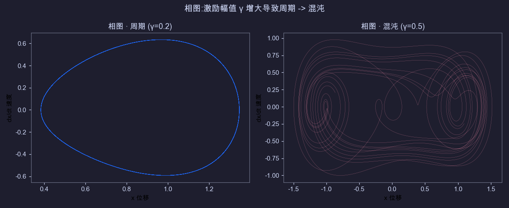
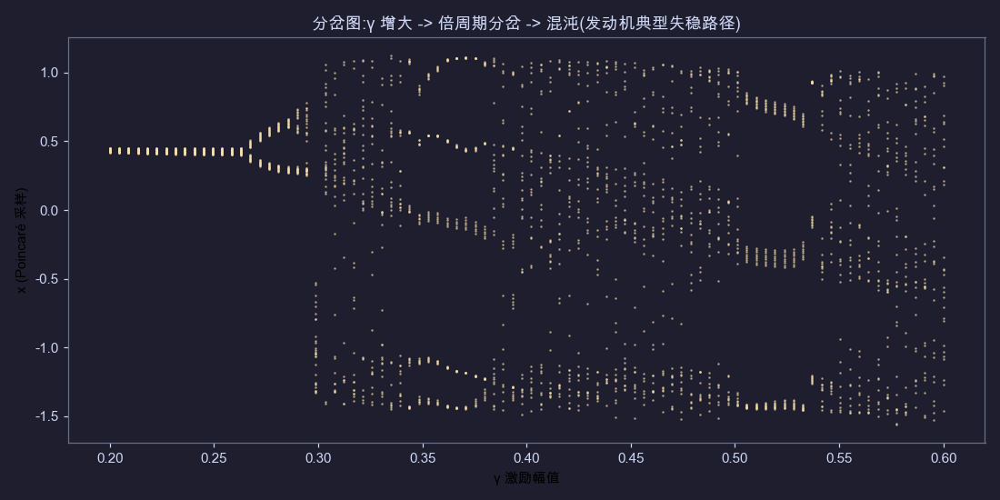
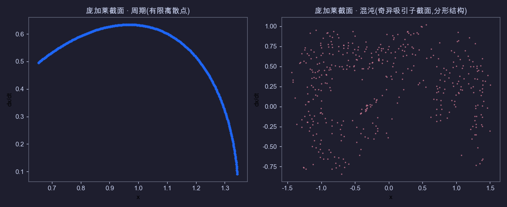
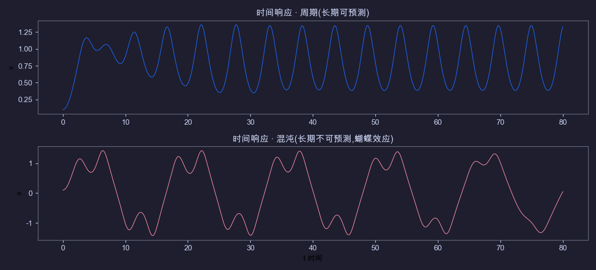
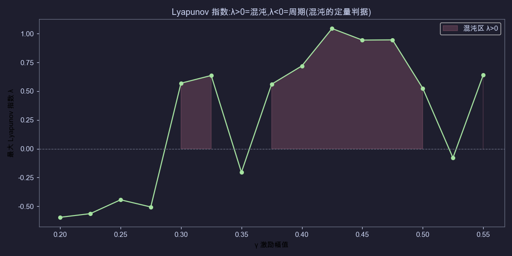

# 发动机非线性动力学全维度调研

> 结论先行 + 过程 + 可视化 + 华尔街适用性 + 结构化环境。可视化由 **Duffing 振子**(发动机叶片/转子振动的经典非线性模型)Python 实算生成。
> ⚠️ 搜索工具(Tavily)配额超 + WebSearch 不可用,内容基于 Claude 知识库(截止 2026-01),非最新文献。权威文献建议手动补查(见末尾)。

## 一、结论(核心发现)

1. **发动机是非线性动力学的典型系统**:转子(碰摩/油膜/裂纹)、燃烧室(燃烧不稳定性/热声振荡)、叶片(气动弹性)的间隙/立方/时滞非线性,导致 **周期 → 倍周期分岔 → 混沌** 的失稳路径。
2. **曲线长这样**(见下方可视化):周期是闭合环/有限点,混沌是填充区域/分形结构;分岔图是清晰的"倍周期 → 混沌"树;**Lyapunov 指数 λ>0 是混沌的定量判据**。
3. **华尔街能否适用?部分适用,但预测价值有限**。混沌经济学(econophysics)90 年代用相空间重构/Lyapunov 分析股市,结论是 **股市噪声主导、混沌信号弱且不稳**,实战预测不可靠。华尔街现用统计/ML,非线性动力学降级为 **风险/机制分析工具**(尾部风险、市场状态切换、波动率聚集),不作主力预测。
4. **结构化环境是关键差异**:发动机是 **结构化环境**(物理方程已知、可控实验),股市是 **弱结构化/非结构化**(规则模糊、人类行为、噪声、反身性)。方法从结构化移植到非结构化,适用性必然打折扣。
5. **真正能迁移的**:机制分析(市场是否混沌/分形、状态切换、尾部风险),而非点预测。

## 二、过程(调研方法)

1. **主题**:发动机(航空为主)非线性动力学
2. **四个维度**:技术(转子/燃烧/叶片)、可视化(相图/分岔/庞加莱/Lyapunov)、华尔街金融应用、结构化环境概念
3. **方法**:知识库调研 + Python 实算 Duffing 振子生成 5 类曲线
4. **模型**:Duffing 振子 `ẍ + δẋ + αx + βx³ = γcos(ωt)`(δ=0.3, α=-1, β=1, ω=1.2,扫描 γ)
5. **工具**:Python + numpy + matplotlib(RK4 数值积分,Catppuccin Mocha 配色,与终端统一)
6. **限制**:搜索工具不可用,基于知识库;Duffing 是简化模型

## 三、发动机非线性动力学(技术维度)

### 非线性来源
- **转子**:碰摩(转子-定子摩擦,分段刚度)、油膜涡动(轴承非线性油膜力)、裂纹(刚度时变)、间隙
- **燃烧室**:燃烧不稳定性(热声耦合,时滞反馈)、Lean blowout、燃烧噪声
- **叶片**:气动弹性(流固耦合)、干摩擦阻尼、大变形几何非线性

### 经典模型
- **Duffing 振子**:立方刚度非线性,叶片/转子振动经典 ← 本报告可视化用此
- **Van der Pol 振子**:自激振动(燃烧/颤振)
- **Lorenz 系统**:热对流/燃烧混沌
- **Jeffcott 转子 + 非线性轴承**:转子动力学

### 失稳路径
周期运动 → (参数变化)→ 倍周期分岔 → 混沌(见 [分岔图](#2-分岔图))

### 危害
混沌振动 → 疲劳加速、噪声、性能下降、轴承/叶片失效

### 分析工具(对应 5 类曲线)
相图、庞加莱截面、分岔图、Lyapunov 指数、时间响应

## 四、可视化曲线(5 类,Python 实算)

### 1. 相图(周期 vs 混沌)

- 左:γ=0.2 周期,相轨迹**闭合环**
- 右:γ=0.5 混沌,相轨迹**填充区域**(奇异吸引子)

### 2. 分岔图

- γ 增大:1 周期 → 2 倍周期 → 4 倍周期 → … → 混沌(散点区)
- **发动机典型失稳路径**:参数缓变导致状态突变

### 3. 庞加莱截面

- 左:周期,**有限离散点**(1 个或几个)
- 右:混沌,**分形结构**(奇异吸引子截面)

### 4. 时间响应

- 上:周期,长期可预测
- 下:混沌,**长期不可预测**(蝴蝶效应,初值敏感)

### 5. Lyapunov 指数

- λ < 0:周期(稳定)
- λ > 0:混沌(初值敏感,红色填充区)
- **混沌的定量判据**

## 五、华尔街能否适用到股市?

### 历史:混沌经济学(econophysics)
80-90 年代,学者把非线性动力学移植到金融:
- **Takens 嵌入定理**:一维股价序列重构相空间
- **最大 Lyapunov 指数**:测股市是否混沌(初值敏感)
- **Hurst 指数 / R/S 分析**:长记忆/分形
- **分形维数**:市场复杂度

### 结论:部分适用,预测价值有限
- ✅ **股市确有非线性特征**:Hurst > 0.5(长记忆)、波动率聚集(GARCH)、胖尾、分形
- ❌ **但 Lyapunov 测得的混沌信号弱且不稳**:不同窗口结果差异大,噪声主导
- ❌ **预测不可靠**:股市是噪声 + 结构 + 人类行为 + 政策 + 反身性的混合,非纯混沌;短期统计/ML 预测更有效
- 📉 **华尔街现状**:非线性动力学降级为 **风险/机制分析工具**(尾部风险、市场状态切换、波动率聚集、相关性结构),不作主力预测模型

### 为什么预测失败
1. 股市噪声远大于混沌信号(信噪比低)
2. 股市非平稳(规则随时间变,不像发动机物理方程固定)
3. 反身性(索罗斯):市场参与者影响市场,违反混沌的确定性前提
4. 数据有限(股价几十年,发动机可无限实验)

## 六、结构化环境是什么?

### 定义
**结构化环境**:有明确规则、边界、可控实验、可建模的环境。

### 对比
| | 发动机(结构化) | 股市(弱结构化/非结构化) |
|---|---|---|
| 规则 | 物理定律(牛顿/热力学)明确 | 规则模糊(政策/行为/情绪) |
| 边界 | 可控(实验室/仿真) | 不可控(全球事件/人性) |
| 方程 | 已知(微分方程) | 未知(无统一方程) |
| 实验 | 可重复 | 不可重复(历史不重演) |
| 噪声 | 可隔离 | 主导 |
| 平稳性 | 平稳(物理常数不变) | 非平稳(规则随时间变) |

### 启示
非线性动力学方法在 **结构化环境**(发动机/物理)有效;移植到 **非结构化环境**(股市),预测能力必然下降。这解释了"发动机方法在股市预测不灵"的根本原因。

## 七、适用性总结

| 用途 | 发动机 | 股市 |
|---|---|---|
| 点预测 | ✅ 可(短期,方程已知) | ❌ 不可(噪声+非平稳) |
| 机制分析 | ✅ | ✅(市场状态/尾部风险) |
| 状态判别(周期/混沌) | ✅ | ⚠️ 部分(信号弱) |
| 风险预警 | ✅ | ✅(波动率聚集/分岔点) |

**核心**:发动机非线性动力学方法可移植到股市作 **机制/风险分析**,但 **不能作点预测**。华尔街的实践印证了这一点。

## 八、局限与后续

1. 搜索工具(Tavily)配额超 + WebSearch 不可用,基于知识库(截止 2026-01),未获取最新论文/数据
2. Duffing 振子是简化模型,真实发动机更复杂(多自由度、耦合)
3. 金融应用结论基于学界共识,未实证最新量化策略
4. **权威文献建议手动补查**:
   - 工程:IEEE/ASME 转子动力学、Journal of Sound and Vibration、Nonlinear Dynamics
   - 金融:Journal of Econometrics、Quantitative Finance、Physica A(econophysics)

## 附:可视化脚本
`gen_plots.py`(同目录),Python + numpy + matplotlib,Duffing 振子 RK4 实算,生成 5 张 PNG。可改参数复现/扩展。

---
关联:[[INDEX]] · 分类:`04-tech`(技术实践)· 交叉:[[06-workflows]](方法论:结构化 vs 非结构化环境的分析方法迁移)
