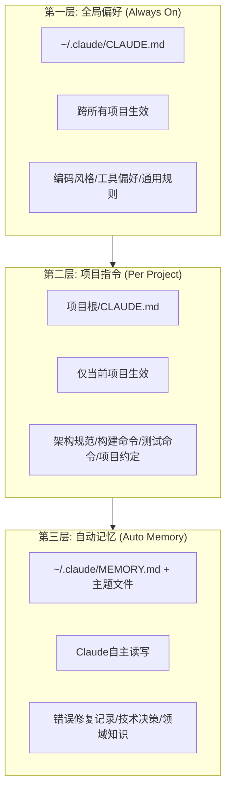
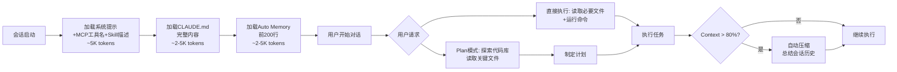
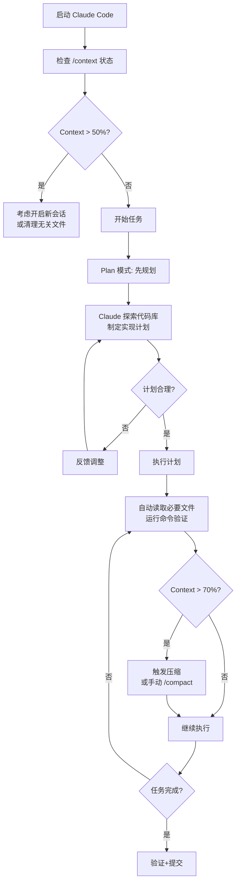

# Claude Code Context 全景深度分析

## 一、Context 是什么

Claude Code 的 Context（上下文）是**模型在一次会话中能引用的全部信息集合**，相当于它的"工作记忆"。它不是训练数据，而是当前会话中所有可被模型在生成响应时参考的token总量【turn0search2】。

### Context 的构成

```
┌─────────────────────────────────────────────────────┐
│              Context Window (200K tokens)           │
├─────────────────────────────────────────────────────┤
│  系统层                                          │
│  ├─ 系统提示词 (System Prompt)                    │
│  ├─ MCP 工具定义 (Tool Descriptions)             │
│  ├─ Skill 描述 (仅name+description,约100token)   │
│  └─ 权限规则 (Permission Rules)                   │
├─────────────────────────────────────────────────────┤
│  项目层                                          │
│  ├─ CLAUDE.md (完整加载,每次会话开始)            │
│  ├─ Auto Memory (前200行/25KB自动加载)             │
│  ├─ Hooks 配置                                   │
│  └─ 插件定义 (Plugin Definitions)                  │
├─────────────────────────────────────────────────────┤
  会话层
│  ├─ 用户消息历史 (Conversation History)            │
│  ├─ 工具调用记录 (Tool Call Results)              │
│  ├─ 文件读取内容 (File Read Contents)             │
│  ├─ 命令输出 (Command Outputs)                   │
│  └─ 子代理返回结果 (Subagent Returns)            │
└─────────────────────────────────────────────────────┘
```

### Context 的核心约束

| 维度 | 数据 |
|---|---|
| **总容量** | 200K tokens (Sonnet/Opus) |
| **建议使用率** | <70% (超过后质量下降)【turn0search14】 |
| **自动压缩触发** | 约80-90%时触发 |
| **压缩后释放** | 约60-70%的context |
| **每次文件读取** | 消耗tokens（大文件可能数千tokens） |
| **每次工具调用** | 结果计入context |

---

## 二、Context 如何设计——解决什么问题

### 2.1 设计目标

Claude Code 的 context 系统要解决三个核心矛盾：

| 矛盾 | 解决方案 |
|---|---|
| **有限容量 vs 无限代码库** | 分层加载 + 按需读取 + 子代理隔离 |
| **长期记忆 vs 会话失忆** | 三层记忆体系（CLAUDE.md + Auto Memory + 会话历史） |
| **上下文噪音 vs 精准聚焦** | 渐进式加载 + 压缩 + 子代理隔离 |

### 2.2 三层记忆体系



**第一层**：全局偏好文件 `~/.claude/CLAUDE.md`，在所有项目中始终加载。存放跨项目的个人编码习惯、工具偏好、通用规则【turn0search3】。

**第二层**：项目指令文件 `CLAUDE.md`（项目根目录），在进入项目时完整加载。存放项目架构、构建/测试命令、命名规范、领域知识【turn0search0】。

**第三层**：自动记忆目录 `~/.claude/MEMORY.md` + 主题文件。Claude 自主读写，记录跨会话学习到的项目知识、错误修复经验、技术决策。每次会话开始时加载前200行（约25KB）【turn0search6】。

### 2.3 渐进式加载设计



**关键设计**：Skill 采用"渐进式加载"——启动时仅加载每个 Skill 的 name + description（约100 token/skill），只有当任务匹配时才加载完整 SKILL.md 内容【turn0search6】。

### 2.4 子代理上下文隔离

```mermaid
flowchart TB
    subgraph Main["主会话 Context (200K)"]
        M1[用户指令]
        M2[CLAUDE.md]
        M3[Auto Memory]
        M4[已读文件]
        M5[对话历史]
    end
    
    subgraph Sub1["子代理 Context (独立200K)"]
        S1[子代理系统提示]
        S2[父代理传入的任务描述]
        S3[子代理探索的文件]
        S4[子代理的推理过程]
    end
    
    subgraph Sub2["子代理 Context (独立200K)"]
        S5[子代理系统提示]
        S6[父代理传入的任务描述]
        S7[子代理探索的文件]
        S8[子代理的推理过程]
    end
    
    Main -.->|Task(prompt only)| Sub1
    Main -.->|Task(prompt only)| Sub2
    Sub1 -.->|Result(summary only)| Main
    Sub2 -.->|Result(summary only)| Main
```

子代理的核心价值不是"并行"，而是**上下文隔离**——将大量文件读取和探索操作隔离在子代理的独立context中，只将摘要结果返回主会话，保护主会话的context不被噪音污染【turn1search13】【turn1search14】。

### 2.5 自动压缩机制

当 context 使用率达到阈值（约80-90%）时，Claude Code 自动触发压缩：

| 压缩策略 | 保留 | 丢弃 |
|---|---|---|
| **近因优先** | 最近的对话和文件读取 | 早期的探索性读取 |
| **频率优先** | 多次引用的文件/决策 | 仅读取一次的文件 |
| **相关性优先** | 当前任务相关的上下文 | 离题的讨论 |
| **结构化优先** | CLAUDE.md/Memory | 对话中的冗余信息 |

**压缩的代价**：压缩是**有损**的。项目约定、架构决策等"只提一次"的信息容易被压缩掉【turn0search14】。这就是为什么 CLAUDE.md 需要精炼——它在压缩后仍然保留，但过大的 CLAUDE.md 本身就是负担【turn0search15】。

---

## 三、如何融入工作流

### 3.1 日常开发工作流



### 3.2 大型任务工作流

```mermaid
flowchart TB
    A[大型任务: 重构/新功能] --> B[Plan 模式]
    B --> C[Claude 制定计划]
    C --> D[将计划保存为文件<br/>plan.md]
    D --> E[关闭 Plan 模式]
    E --> F[执行 Phase 1]
    F --> G[子代理: 探索相关文件]
    G --> H[主会话: 实施变更]
    H --> I[验证: 运行测试]
    I --> J{通过?}
    J -->|否| K[修复]
    K --> I
    J -->|是| L[提交 Phase 1]
    L --> M[/clear 清理context]
    M --> N[读取 plan.md 恢复全貌]
    N --> O[执行 Phase 2]
    O --> P[重复 F-N]
```

**关键操作**：阶段间用 `/clear` 清理 context，通过 `plan.md` 文件传递跨阶段上下文，避免单会话 context 爆炸【turn0search8】。

---

## 四、经典场景最佳实践

### 场景一：大型代码库探索与修改

**问题**：100K+ 行代码库，单次文件读取就可能消耗大量 context。

**最佳实践**：

```
1. Plan 模式先行
   → /plan
   → "探索这个代码库的认证模块，理解架构后制定重构计划"
   → Claude 只读关键文件，不修改

2. 子代理做深度探索
   → 主会话调用 Task("分析 src/auth/ 目录所有文件的依赖关系")
   → 子代理在独立context中读取所有文件，返回摘要

3. 主会话基于摘要执行
   → 只加载需要修改的文件
   → 依赖关系从子代理摘要中获取
```

### 场景二：长会话质量保持

**问题**：3-4小时后，Claude 开始"遗忘"早期决策，代码风格漂移。

**最佳实践**：

```
1. 关键决策写入文件
   → 不是在对话中讨论，而是让Claude写入 DECISIONS.md
   → 压缩后这些文件仍在

2. 定期主动压缩
   → 不要等自动压缩
   → 完成一个子任务后 /compact
   → 在压缩前让 Claude 总结当前状态到 STATUS.md

3. 阶段性 /clear
   → 大任务拆成阶段
   → 每阶段 /clear
   → 用 plan.md 传递全局上下文
```

### 场景三：并行多任务

**问题**：同时开发多个独立功能，互相干扰。

**最佳实践**：

```
1. Git Worktree 隔离
   → git worktree add ../feature-a feature-a
   → git worktree add ../feature-b feature-b
   → 每个worktree开一个Claude Code会话

2. 子代理处理子任务
   → 主会话: 核心功能开发
   → 子代理1: "编写测试用例"（独立context）
   → 子代理2: "更新文档"（独立context）

3. 共享契约
   → 定义接口契约文件
   → 各子代理/会话遵循同一契约
   → 避免合并冲突
```

### 场景四：CLAUDE.md 精炼

**问题**：CLAUDE.md 过大导致每次会话浪费 context，且过时信息误导模型【turn0search15】。

**最佳实践**：

```markdown
# 精炼的 CLAUDE.md 示例

## 构建与测试
- `pnpm build` - 构建
- `pnpm test` - 运行测试
- `pnpm lint` - 代码检查

## 架构约定
- 使用函数式组件，禁止 class 组件
- API 路由放在 app/api/ 下
- 所有数据库操作通过 Prisma Client

## 禁止事项
- 不要修改 prisma/schema.prisma
- 不要安装新的 UI 库
```

**规则**：CLAUDE.md 只放"规则和指令"（应该怎么做），Auto Memory 放"学习到的知识"（之前犯过的错误）【turn0search8】。

---

## 五、Context 管理进阶策略

### 5.1 主动 Context 设计

不要被动等待 context 填满，而是主动设计 context 结构：

| 策略 | 做法 | 效果 |
|---|---|---|
| **预加载关键文件** | 任务开始前用 `@file` 引用核心文件 | Claude 立即获得架构全貌 |
| **子代理做脏活** | 探索/搜索/分析交给子代理 | 保护主会话 context |
| **文件替代对话** | 决策写入文件而非对话 | 压缩后仍可恢复 |
| **阶段性清理** | 子任务完成后 `/clear` | 每阶段从干净状态开始 |
| **Plan 文件传递** | 大任务用 plan.md 传递 | 跨会话保持全局视角 |

### 5.2 /context 审计

定期用 `/context` 命令审计当前 context 构成：

```
/context 输出示例:

System Prompt          ████████████ 12K tokens
CLAUDE.md             ████ 4K tokens  
Auto Memory           ██ 2K tokens
Conversation History   ████████████████████████████████ 35K tokens
File Reads            ██████████████████████████ 28K tokens
Tool Results          ██████████████ 15K tokens
MCP Definitions       ████ 4K tokens

Total: 100K / 200K (50%)
```

**审计后行动**：
- **File Reads 占比过高** → 用子代理替代直接读取
- **Conversation History 占比过高** → `/compact` 或 `/clear`
- **MCP Definitions 占比过高** → 审计 MCP 服务器，移除不用的

### 5.3 Context 与任务全貌的协同设计

```
┌──────────────────────────────────────────────┐
│         任务全貌 (Task Landscape)          │
│                                          │
│  ┌─────────┐  ┌─────────┐  ┌─────────┐│
│  │ 全局规则 │  │ 项目架构 │  │ 领域知识 ││
│  │CLAUDE.md│  │plan.md  │  │MEMORY.md││
│  └────┬────┘  └────┬────┘  └────┬────┘│
│       │            │            │      │
│       ▼            ▼            ▼      │
│  ┌────────────────────────────────────┐ │
│  │     主会话 Context (200K)        │ │
│  │  ┌──────────────────────────┐    │ │
│  │  │  系统层 (固定开销)       │    │ │
│  │  │  项目层 (CLAUDE.md等)    │    │ │
│  │  │  会话层 (动态变化)       │    │ │
│  │  └──────────────────────┘    │ │
│  └──────────────────────────────┘ │
│                                      │
│  ┌─────────┐  ┌─────────┐  ┌──────┐│
│  │子代理Ctx │  │子代理Ctx │  │文件  ││
│  │ (隔离)  │  │ (隔离)  │  │传递  ││
│  └─────────┘  └─────────┘  └──────┘│
│                                      │
│  ┌──────────────────────────────────┐  │
│  │     持久化层 (跨会话)           │  │
│  │  plan.md | DECISIONS.md | git  │  │
│  └──────────────────────────────────┘  │
└──────────────────────────────────────┘
```

**协同设计的核心原则**：

1. **全貌在文件中，不在对话中**——对话会被压缩，文件不会
2. **子任务在子代理中，不在主会话中**——隔离噪音
3. **阶段间用文件传递，不用对话记忆**——/clear 后仍可恢复
4. **CLAUDE.md 精炼，Auto Memory 丰满**——规则要短，知识要深

### 5.4 决策记录模式

让 Claude 和你一起做出更好的决策，关键是在 context 中建立**可恢复的决策链**：

```
# 让 Claude 主动记录决策
"在修改认证逻辑前，先在 DECISIONS.md 中记录：
1. 当前问题是什么
2. 考虑了哪些方案
3. 为什么选择这个方案
4. 预期影响范围"

# 压缩后恢复决策上下文
"读取 DECISIONS.md，回顾之前的认证重构决策，
然后继续实施 Phase 2"
```

这样即使 context 被压缩或清理，决策全貌始终可通过文件恢复，Claude 能做出与之前一致的选择。

---

## 六、总结：Context 工程的核心原则

| 原则 | 实践 |
|---|---|
| **文件优于对话** | 重要信息写入文件，不依赖对话记忆 |
| **隔离优于堆积** | 用子代理隔离噪音，保护主会话 |
| **精炼优于详尽** | CLAUDE.md 越短越好，Memory 越具体越好 |
| **阶段优于马拉松** | 大任务拆阶段，每阶段 /clear |
| **审计优于盲目** | 定期 /context 审查，主动优化构成 |

Context 不是"越多越好"，而是"越精准越好"。工程化地管理 context，就是工程化地管理 Claude 的注意力——让它在你需要的地方聚焦，在你不需要的地方失忆。