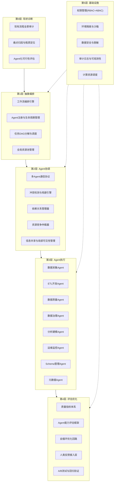
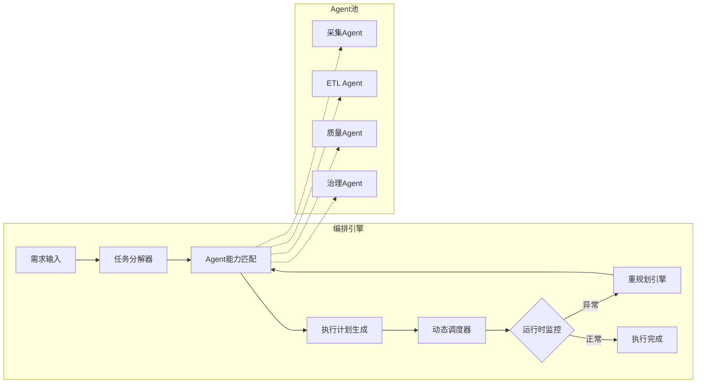
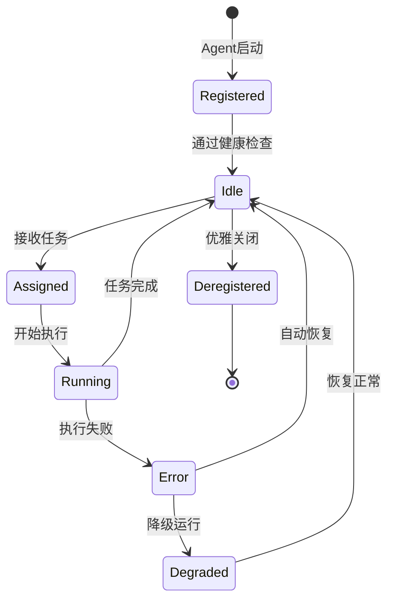
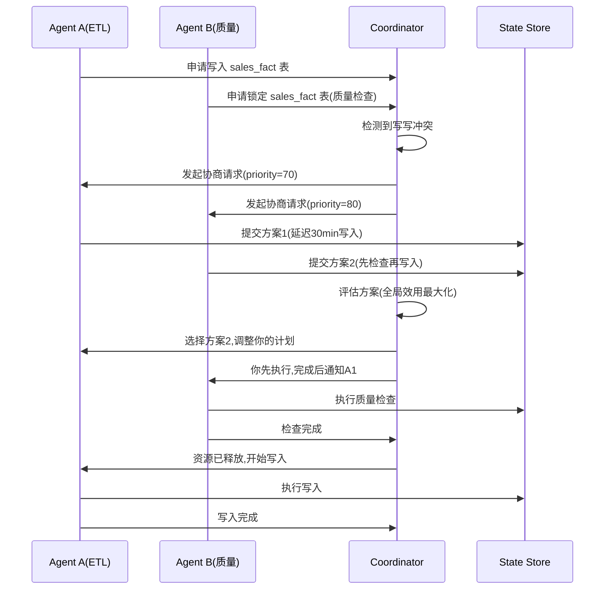
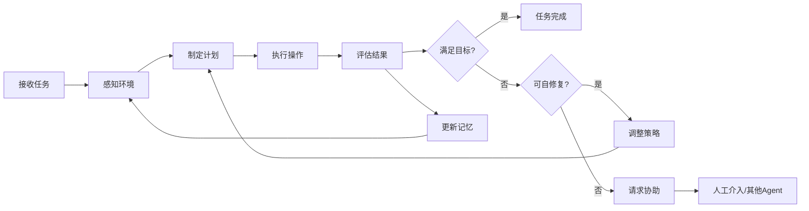
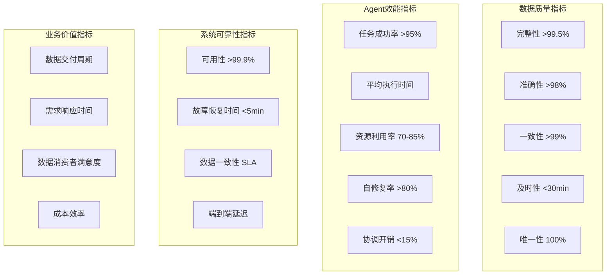

# 企业大数据开发全流程Agent化重构方案

## 第一部分:整体Plan与任务拆分



---

## 第二部分:各层深度设计

### 第0层:现状诊断与瓶颈归因

**目标**:对现有大数据开发流程进行全景审计,定位痛点,为Agent化重构提供基线。

| 诊断维度 | 审计内容 | 归因方法 | 输出 |
|---|---|---|---|
| **流程效率** | 端到端开发周期、各环节耗时分布 | 价值流图(VSM)分析,识别等待时间和浪费 | 瓶颈环节清单 |
| **数据质量** | 数据一致性、完整性、及时性基线 | 六西格玛DMAIC方法,定义质量CTQ | 质量基线报告 |
| **资源利用** | 计算资源利用率、存储I/O瓶颈 | 容量规划分析,识别资源争抢点 | 资源优化建议 |
| **协作效率** | 跨团队沟通成本、需求传递损耗 | 组织级 retrospective + 依赖关系图 | 协作模式重构建议 |
| **技术债务** | 重复脚本、硬编码、无文档ETL | 代码静态分析 + 技术债务雷达 | 技术债务清单 |

---

### 第1层:抽象编排层设计

#### 1.1 工作流编排引擎

**核心设计原则**:将传统DAG调度升级为**Agent可编排的动态工作流**,支持运行时任务重规划。



**编排引擎核心组件**:

| 组件 | 职责 | 技术选型 |
|---|---|---|
| **任务分解器** | 将复杂需求拆解为原子任务,生成任务DAG | 基于LLM的任务分解 + 规则引擎校验 |
| **Agent能力匹配** | 根据任务需求匹配最合适的Agent | 能力矩阵 + 负载均衡算法 |
| **执行计划生成** | 生成可执行的并行/串行计划 | DAG拓扑排序 + 资源约束求解 |
| **动态调度器** | 运行时调度,支持抢占、优先级、重试 | 基于Kubernetes的调度策略 |
| **重规划引擎** | 异常时自动重新规划任务路径 | 状态机回滚 + 替代路径搜索 |

**编排DSL示例**(伪代码):

```yaml
# 工作流定义示例:数据管道自动化
workflow:
  name: "daily_sales_pipeline"
  trigger:
    type: "schedule"
    cron: "0 2 * * *"
    
  agents:
    - id: "ingestion_agent"
      role: "data_ingestion"
      capabilities: ["kafka", "cdc", "batch"]
      
    - id: "etl_agent"
      role: "transformation"
      capabilities: ["spark", "sql", "python"]
      depends_on: ["ingestion_agent"]
      
    - id: "quality_agent"
      role: "data_quality"
      capabilities: ["validation", "profiling", "anomaly_detection"]
      depends_on: ["etl_agent"]
      parallel_with: ["governance_agent"]
      
    - id: "governance_agent"
      role: "data_governance"
      capabilities: ["lineage", "classification", "policy"]
      depends_on: ["etl_agent"]
      
  coordination:
    conflict_resolution: "priority_based"
    resource_sharing: "time_sliced"
    information_visibility: "need_to_know"
    
  evaluation:
    success_criteria:
      data_freshness: "< 30min"
      quality_score: "> 0.95"
      completeness: "100%"
    fallback:
      - "retry_3x"
      - "human_escalation"
```

#### 1.2 Agent注册与生命周期管理



**Agent注册信息模型**:

```json
{
  "agent_id": "etl_agent_001",
  "agent_type": "ETL_TRANSFORMATION",
  "version": "2.1.0",
  "capabilities": {
    "engines": ["spark", "flink", "sql"],
    "data_formats": ["parquet", "orc", "avro", "json"],
    "scales": ["GB", "TB"],
    "specialties": ["incremental_load", "scd_type2", "data_quality"]
  },
  "resource_profile": {
    "cpu": 8,
    "memory": "32GB",
    "gpu": 0,
    "storage": "500GB"
  },
  "performance_baseline": {
    "avg_task_duration": "12min",
    "success_rate": 0.98,
    "avg_resource_utilization": 0.72
  },
  "permissions": {
    "data_sources": ["sales_db", "crm_db", "log_stream"],
    "write_targets": ["data_warehouse", "data_lake"],
    "admin_actions": ["create_table", "drop_table"]
  },
  "health_check": {
    "interval": "30s",
    "timeout": "5s",
    "failure_threshold": 3
  }
}
```

---

### 第2层:Agent协调机制深度设计

这是整个系统最核心的部分,直接对应用户要求的"多个具备独立决策能力的智能体,在资源约束、任务依赖、目标冲突、信息局部可见条件下协同"。

#### 2.1 多Agent通信协议

**设计目标**:在信息局部可见的条件下,实现高效、可靠、低延迟的Agent间通信。

```
┌─────────────────────────────────────────────────────┐
│              Agent Communication Layer               │
├──────────┬──────────┬──────────┬──────────────────┤
│ 直接通信  │ 广播通信  │ 主题订阅  │  状态共享        │
│ (P2P)    │ (Broadcast)│ (Pub/Sub)│  (State Store)  │
├──────────┴──────────┴──────────┴──────────────────┤
│              消息总线 (Message Bus)                 │
├─────────────────────────────────────────────────────┤
│  传输层: gRPC + Kafka + Redis Streams              │
└─────────────────────────────────────────────────────┘
```

**通信消息类型定义**:

| 消息类型 | 场景 | 示例 |
|---|---|---|
| **TaskRequest** | Agent请求其他Agent执行子任务 | ETL Agent向质量Agent请求质量检查 |
| **TaskResponse** | 任务执行结果返回 | 质量Agent返回检查报告 |
| **ResourceClaim** | 资源申请 | ETL Agent申请Spark集群资源 |
| **ResourceRelease** | 资源释放 | 任务完成后释放计算资源 |
| **ConflictAlert** | 冲突预警 | 两个Agent同时写入同一张表 |
| **DependencyNotify** | 依赖状态通知 | 上游数据就绪通知 |
| **StateSync** | 状态同步 | Agent共享当前执行进度 |
| **Negotiation** | 协商消息 | 资源争抢时的优先级协商 |

**消息协议格式**:

```protobuf
message AgentMessage {
  string message_id = 1;
  string source_agent_id = 2;
  string target_agent_id = 3;      // "broadcast" for broadcast
  MessageType type = 4;
  int64 timestamp = 5;
  int32 priority = 6;              // 0-100, higher = more urgent
  
  oneof payload {
    TaskRequest task_request = 10;
    TaskResponse task_response = 11;
    ResourceClaim resource_claim = 12;
    ConflictAlert conflict_alert = 13;
    DependencyNotify dependency_notify = 14;
    StateSync state_sync = 15;
    NegotiationMessage negotiation = 16;
  }
  
  map<string, string> metadata = 20;  // 追踪链路信息
}
```

#### 2.2 冲突检测与规避引擎

**冲突类型矩阵**:

| 冲突类型 | 描述 | 检测方法 | 规避策略 |
|---|---|---|---|
| **写写冲突** | 两个Agent同时写入同一数据集 | 表级锁 + 版本号校验 | 优先级仲裁 + 串行化 |
| **读写冲突** | 一个Agent读,另一个Agent正在写 | MVCC + 快照隔离 | 读旧版本 + 完成通知 |
| **资源冲突** | 多个Agent争抢同一计算资源 | 资源配额 + 队列 | 时间片轮转 + 优先级抢占 |
| **依赖冲突** | 任务依赖循环或乱序 | DAG环路检测 | 拓扑排序 + 等待通知 |
| **目标冲突** | 不同Agent的目标互斥 | 目标函数冲突分析 | 协商机制 + 全局仲裁 |
| **信息冲突** | Agent持有的信息不一致 | 版本向量 + 向量时钟 | 最终一致性 + 冲突解决 |

**冲突检测算法**(基于资源依赖图):

```python
class ConflictDetector:
    def __init__(self):
        self.resource_lock_table = {}  # resource_id -> holder_agent_id
        self.dependency_graph = DAG()
        self.active_negotiations = {}
    
    def check_conflict(self, agent_id, task) -> ConflictReport:
        conflicts = []
        
        # 1. 写写冲突检测
        for resource in task.write_targets:
            if resource in self.resource_lock_table:
                holder = self.resource_lock_table[resource]
                if holder != agent_id:
                    conflicts.append(WriteWriteConflict(
                        resource=resource,
                        holder=holder,
                        requester=agent_id
                    ))
        
        # 2. 依赖冲突检测
        unresolved_deps = self.dependency_graph.get_unresolved(task.depends_on)
        if unresolved_deps:
            conflicts.append(DependencyConflict(
                unresolved=unresolved_deps
            ))
        
        # 3. 资源冲突检测
        required_resources = task.resource_requirements
        available = self.resource_pool.check_availability(required_resources)
        if not available.sufficient:
            conflicts.append(ResourceConflict(
                required=required_resources,
                available=available
            ))
        
        # 4. 目标冲突检测
        for active_task in self.active_tasks.values():
            if self._goals_conflict(task.goals, active_task.goals):
                conflicts.append(GoalConflict(
                    conflicting_task=active_task.id
                ))
        
        return ConflictReport(conflicts=conflicts)
    
    def resolve_conflict(self, conflict) -> Resolution:
        """基于优先级、时间窗口、资源效率的综合仲裁"""
        if isinstance(conflict, WriteWriteConflict):
            return self._resolve_write_conflict(conflict)
        elif isinstance(conflict, ResourceConflict):
            return self._resolve_resource_conflict(conflict)
        elif isinstance(conflict, GoalConflict):
            return self._initiate_negotiation(conflict)
```

#### 2.3 多Agent协商协议

在目标冲突场景下,Agent需要通过协商达成一致:



**协商策略矩阵**:

| 策略 | 适用场景 | 实现方式 |
|---|---|---|
| **优先级仲裁** | 有明确的优先级层级 | 基于SLA等级和业务影响 |
| **资源拍卖** | 多个Agent竞争稀缺资源 | 第二价格密封拍卖 |
| **合同网协议** | 任务分解后的分配 | 招标-投标-中标 |
| **多步协商** | 复杂目标冲突 | 轮流出价-反价 |
| **中央仲裁** | 紧急冲突快速解决 | Coordinator直接决策 |

#### 2.4 信息共享与局部可见性管理

**设计原则**:每个Agent只能看到与其任务相关的信息,通过**need-to-know**机制控制信息可见性。

```python
class InformationVisibilityManager:
    """管理Agent间的信息可见性"""
    
    def __init__(self):
        self.visibility_policies = {
            "full": "Agent可以看到所有相关信息",
            "partial": "Agent只能看到直接依赖的信息",
            "minimal": "Agent只看到任务输入输出契约"
        }
    
    def get_visible_state(self, agent_id, global_state):
        """根据Agent角色和当前任务,过滤可见状态"""
        agent = self.registry.get(agent_id)
        visible = {}
        
        # 1. 总是可见的信息
        visible["self_status"] = global_state.get_agent_status(agent_id)
        visible["task_assignment"] = global_state.get_task(agent_id)
        
        # 2. 基于依赖关系可见的信息
        for dep in agent.current_task.depends_on:
            dep_status = global_state.get_task_status(dep)
            visible[f"dependency_{dep}"] = {
                "status": dep_status.state,
                "output_schema": dep_status.output_schema,
                "quality_report": dep_status.quality_report
            }
        
        # 3. 基于角色可见的信息
        role = agent.role
        if role == "ETL_AGENT":
            visible["source_schemas"] = global_state.get_source_schemas()
            visible["target_constraints"] = global_state.get_target_constraints()
        elif role == "QUALITY_AGENT":
            visible["data_profile"] = global_state.get_data_profile()
            visible["quality_rules"] = global_state.get_quality_rules()
        
        # 4. 敏感信息脱敏
        visible = self._mask_sensitive(visible, agent.clearance_level)
        
        return visible
```

---

### 第3层:Agent执行层设计

#### 3.1 Agent整体架构

每个Agent采用统一的六层架构:

```
┌─────────────────────────────────────────┐
│         交互层(Interaction)            │  ← 与编排层、其他Agent通信
├─────────────────────────────────────────┤
│         决策层(Decision)               │  ← 任务规划、策略选择
├─────────────────────────────────────────┤
│         执行层(Execution)               │  ← 具体操作执行
├─────────────────────────────────────────┤
│         感知层(Perception)              │  ← 环境感知、数据探查
├─────────────────────────────────────────┤
│         记忆层(Memory)                  │  ← 短期/长期记忆
├─────────────────────────────────────────┤
│         工具层(Tools)                   │  ← SQL引擎、IDE、诊断工具
└─────────────────────────────────────────┘
```

#### 3.2 各Agent详细设计

##### A. 数据采集Agent

**职责**:自动发现数据源、增量捕获、格式适配、数据接入

```python
class IngestionAgent(BaseAgent):
    """数据采集Agent"""
    
    capabilities = ["kafka", "cdc", "batch", "api", "file"]
    
    def execute_task(self, task: IngestionTask) -> TaskResult:
        # 1. 感知:探查数据源
        source_profile = self.perceive_source(task.source_config)
        
        # 2. 决策:选择最优采集策略
        strategy = self.decide_strategy(source_profile, task.constraints)
        
        # 3. 执行:实施数据接入
        if strategy == "cdc":
            result = self._execute_cdc(task, source_profile)
        elif strategy == "batch":
            result = self._execute_batch(task, source_profile)
        elif strategy == "stream":
            result = self._execute_stream(task, source_profile)
        
        # 4. 自评估
        quality = self._evaluate_ingestion_quality(result)
        
        # 5. 通知下游
        self.notify_downstream(task.downstream, result.metadata)
        
        return TaskResult(
            status="success",
            output=result.data_location,
            quality_report=quality,
            metadata=result.metadata
        )
    
    def perceive_source(self, config) -> SourceProfile:
        """探查数据源特征"""
        profile = SourceProfile()
        profile.schema = self._probe_schema(config)
        profile.volume = self._estimate_volume(config)
        profile.update_frequency = self._detect_frequency(config)
        profile.data_quality_baseline = self._profile_quality(config)
        return profile
    
    def decide_strategy(self, profile, constraints) -> str:
        """基于数据源特征和约束选择采集策略"""
        if profile.update_frequency == "realtime":
            return "cdc" if profile.supports_cdc else "stream"
        elif profile.volume > constraints.batch_threshold:
            return "batch"
        else:
            return "batch"
```

##### B. ETL开发Agent

**职责**:自动生成ETL代码、执行数据转换、优化性能

```python
class ETLAgent(BaseAgent):
    """ETL开发Agent - 核心数据转换执行者"""
    
    capabilities = ["spark", "flink", "sql", "python", "scala"]
    
    def execute_task(self, task: ETLTask) -> TaskResult:
        # 1. 理解转换需求
        spec = self._understand_transformation(task.spec)
        
        # 2. 生成ETL代码
        code = self._generate_etl_code(spec, task.engine)
        
        # 3. 代码自审查
        review = self._self_review(code)
        if review.has_issues:
            code = self._fix_issues(code, review.issues)
        
        # 4. 资源申请(通过协调层)
        resources = self._request_resources(task.estimated_cost)
        
        # 5. 执行
        execution = self._execute(code, resources)
        
        # 6. 性能优化
        if execution.duration > task.sla:
            optimized = self._optimize(execution)
            execution = self._re_execute(optimized)
        
        # 7. 数据血缘记录
        self._record_lineage(task, execution)
        
        return TaskResult(
            status="success",
            output=execution.output_location,
            metrics={
                "rows_processed": execution.row_count,
                "duration": execution.duration,
                "resource_used": execution.resource_usage
            }
        )
    
    def _generate_etl_code(self, spec, engine) -> str:
        """基于规范自动生成ETL代码"""
        prompt = self._build_generation_prompt(spec, engine)
        raw_code = self.llm.generate(prompt)
        
        # 语法验证
        if not self._validate_syntax(raw_code, engine):
            raw_code = self._regenerate_with_feedback(raw_code)
        
        # 安全检查
        raw_code = self._sanitize_code(raw_code)
        
        return raw_code
```

##### C. 数据质量Agent

**职责**:自动化质量检查、异常检测、质量报告

```python
class DataQualityAgent(BaseAgent):
    """数据质量守护Agent"""
    
    def execute_task(self, task: QualityTask) -> TaskResult:
        # 1. 获取数据样本
        sample = self._get_representative_sample(task.data_source)
        
        # 2. 多维度质量检查
        checks = {
            "completeness": self._check_completeness(sample, task.rules),
            "accuracy": self._check_accuracy(sample, task.rules),
            "consistency": self._check_consistency(sample, task.rules),
            "timeliness": self._check_timeliness(task.data_source),
            "uniqueness": self._check_uniqueness(sample, task.rules),
            "validity": self._check_validity(sample, task.rules)
        }
        
        # 3. 异常检测
        anomalies = self._detect_anomalies(sample, task.baseline)
        
        # 4. 质量评分
        score = self._calculate_quality_score(checks, anomalies)
        
        # 5. 决策:是否阻断
        if score < task.blocking_threshold:
            return TaskResult(
                status="blocked",
                quality_report=QualityReport(checks, anomalies, score),
                action="notify_upstream_for_fix"
            )
        
        return TaskResult(
            status="passed",
            quality_report=QualityReport(checks, anomalies, score)
        )
```

##### D. 数据治理Agent

**职责**:元数据管理、数据血缘、数据分类分级、策略执行

##### E. 分析建模Agent

**职责**:特征工程、模型训练、模型评估、模型部署

##### F. 运维监控Agent

**职责**:系统监控、告警、故障自愈、容量规划

#### 3.3 Agent自循环运行机制



**自循环优化核心算法**:

```python
class AgentSelfLoop:
    """Agent自循环执行与优化"""
    
    def run(self, task, max_iterations=5):
        iteration = 0
        best_result = None
        learning_history = []
        
        while iteration < max_iterations:
            # 1. 感知当前状态
            state = self.perceive(task, learning_history)
            
            # 2. 基于记忆和状态制定策略
            strategy = self.plan(state, learning_history)
            
            # 3. 执行
            result = self.execute(strategy, task)
            
            # 4. 评估
            evaluation = self.evaluate(result, task.criteria)
            
            # 5. 学习
            learning = self.learn(result, evaluation, strategy)
            learning_history.append(learning)
            
            # 6. 更新最佳结果
            if best_result is None or evaluation.score > best_result.score:
                best_result = AgentResult(
                    result=result,
                    evaluation=evaluation,
                    strategy=strategy,
                    iteration=iteration
                )
            
            # 7. 检查终止条件
            if evaluation.meets_threshold(task.success_criteria):
                return best_result
            
            iteration += 1
        
        # 未达到阈值,返回最佳结果并标记需要协助
        best_result.needs_assistance = True
        return best_result
    
    def learn(self, result, evaluation, strategy):
        """从每次执行中学习,更新Agent能力"""
        return LearningRecord(
            what_worked=strategy.effective_actions,
            what_failed=strategy.ineffective_actions,
            performance_delta=evaluation.score - evaluation.previous_score,
            context_snapshot=result.context
        )
```

---

### 第4层:评估指标与优化体系

#### 4.1 多维度指标体系



#### 4.2 Agent能力评估框架

| 评估维度 | 指标 | 测量方法 | 目标值 |
|---|---|---|---|
| **任务完成率** | 成功完成的任务比例 | completed/assigned | >95% |
| **执行效率** | 相同任务的执行时间趋势 | P50/P90/P99时延 | 持续下降 |
| **质量产出** | 产出数据的质量评分 | 六维质量评分加权 | >0.95 |
| **自优化能力** | 无人工干预的优化次数 | auto_optimized/total | >60% |
| **协调效率** | 协调开销占总执行时间比例 | coordination_time/total_time | <15% |
| **错误恢复** | 自动恢复成功率 | auto_recovered/errors | >80% |
| **学习能力** | 相似任务的效率提升率 | efficiency_improvement | >10%/月 |

#### 4.3 自循环优化回路

```python
class OptimizationLoop:
    """全局优化回路"""
    
    def __init__(self):
        self.metrics_collector = MetricsCollector()
        self.anomaly_detector = AnomalyDetector()
        self.optimization_engine = OptimizationEngine()
        self.ab_tester = ABTester()
    
    def run_continuous_optimization(self):
        while True:
            # 1. 收集指标
            metrics = self.metrics_collector.collect_all()
            
            # 2. 异常检测
            anomalies = self.anomaly_detector.detect(metrics)
            
            # 3. 生成优化建议
            for anomaly in anomalies:
                suggestion = self.optimization_engine.suggest(anomaly)
                
                # 4. A/B测试验证
                test_result = self.ab_tester.run(
                    control=current_config,
                    treatment=suggestion.new_config,
                    duration="7d"
                )
                
                # 5. 如果显著改善,应用优化
                if test_result.is_significant_improvement:
                    self._apply_optimization(suggestion)
                    self._log_optimization(anomaly, suggestion, test_result)
            
            # 6. 定期全量评估
            if self._is_evaluation_cycle():
                self._full_system_evaluation()
```

---

### 第5层:基础设施与安全

#### 5.1 权限管理体系

**双层权限模型**: RBAC(角色) + ABAC(属性)

```python
class AgentPermissionManager:
    """Agent权限管理"""
    
    def check_permission(self, agent_id, action, resource):
        # 1. RBAC检查
        agent = self.registry.get(agent_id)
        role = agent.role
        role_perms = self.role_permissions[role]
        
        if action not in role_perms:
            return False
        
        # 2. ABAC检查
        agent_attrs = {
            "clearance_level": agent.clearance_level,
            "current_task": agent.current_task_id,
            "environment": agent.environment,
            "time_window": datetime.now()
        }
        
        resource_attrs = self._get_resource_attrs(resource)
        
        for policy in self.abac_policies:
            if not policy.evaluate(agent_attrs, action, resource_attrs):
                return False
        
        # 3. 动态约束检查
        if not self._check_dynamic_constraints(agent_id, action, resource):
            return False
        
        return True
    
    def _check_dynamic_constraints(self, agent_id, action, resource):
        """检查运行时动态约束"""
        # 当前是否有其他Agent正在写该资源
        if action == "write":
            lock = self.resource_lock_table.get(resource)
            if lock and lock != agent_id:
                return False
        
        # 是否在允许的时间窗口内
        if not self._is_within_time_window(agent_id):
            return False
        
        # 资源配额是否充足
        if not self._check_quota(agent_id, resource):
            return False
        
        return True
```

#### 5.2 环境隔离与沙箱

| 隔离层 | 机制 | 用途 |
|---|---|---|
| **Agent级沙箱** | Docker容器 + 资源限制 | 防止Agent越权操作 |
| **任务级隔离** | 独立Spark session + 临时Schema | 防止任务间数据污染 |
| **数据级隔离** | 行级/列级安全 + 动态视图 | 防止敏感数据泄露 |
| **网络级隔离** | NetworkPolicy + Service Mesh | 控制Agent间网络访问 |

---

## 第三部分:落地执行路线图

### 阶段一:基础设施搭建(月1-3)

| 任务 | 交付物 | 验收标准 |
|---|---|---|
| 编排引擎原型 | DAG调度器 + Agent注册中心 | 能调度3种Agent类型 |
| 通信层 | gRPC + Kafka消息总线 | 消息延迟<100ms |
| 权限框架 | RBAC+ABAC权限引擎 | 覆盖所有Agent操作 |
| 监控基础 | 指标采集 + 仪表盘 | 全链路可观测 |

### 阶段二:核心Agent开发(月4-8)

| Agent | 核心能力 | 里程碑 |
|---|---|---|
| 采集Agent | 3种数据源接入 | 月6完成 |
| ETL Agent | 自动生成Spark SQL | 月7完成 |
| 质量Agent | 6维质量检查 | 月8完成 |
| 治理Agent | 血缘+分类 | 月8完成 |

### 阶段三:协调机制完善(月9-12)

| 任务 | 交付物 |
|---|---|
| 冲突检测引擎 | 自动识别5类冲突 |
| 协商协议实现 | 3种协商策略 |
| 自循环优化 | Agent自学习回路 |
| A/B测试框架 | 优化效果验证 |

### 阶段四:全流程贯通(月13-18)

| 任务 | 交付物 |
|---|---|
| 端到端管道 | 数据采集→ETL→质量→服务 |
| 多Agent协调实战 | 复杂场景下5+Agent协同 |
| 优化回路 | 自动性能调优 |
| 人工反馈接入 | Human-in-the-loop |

### 阶段五:生产化与规模化(月19-24)

| 任务 | 交付物 |
|---|---|
| 生产部署 | K8s + 自动扩缩容 |
| 灾备方案 | 多活 + 故障转移 |
| 治理体系 | Agent生命周期管理 |
| 成本优化 | 资源利用率最大化 |

---

## 第四部分:关键设计决策说明

### 为什么选择"抽象编排层"而非"中心化控制"?

传统大数据平台采用中心化调度(Airflow/DolphinScheduler),所有任务由一个调度器统一管理。但在Agent化架构中,每个Agent具备独立决策能力,中心化控制会成为瓶颈。抽象编排层提供的是**协调而非控制**——它定义规则和边界,让Agent在框架内自主决策。

### 为什么强调"信息局部可见"?

在多Agent系统中,如果每个Agent都能看到全局信息,会导致:
1. **信息过载**:Agent决策效率下降
2. **安全风险**:敏感信息泄露
3. **耦合过紧**:一个Agent的状态变化影响所有Agent

采用need-to-know原则,每个Agent只看到与其任务相关的信息,通过协调层进行信息聚合和传递。

### 为什么需要"自循环优化"?

大数据环境是动态变化的——数据量增长、Schema漂移、业务规则变化。静态配置的ETL管道会逐渐失效。Agent自循环优化使系统能够:
1. **自动适应**:检测性能下降并自动调优
2. **持续学习**:从每次执行中积累经验
3. **预防性维护**:在问题发生前预判并调整

### Agent协调与传统工作流调度的本质区别

| 维度 | 传统工作流调度 | Agent协调 |
|---|---|---|
| **决策方式** | 中心化预定义 | 分布式自主决策 |
| **异常处理** | 预设重试策略 | Agent自主评估并选择最优恢复路径 |
| **资源分配** | 静态队列 | 动态协商 + 竞拍 |
| **信息流动** | 全局共享 | 按需共享 + 局部可见 |
| **优化方式** | 人工调参 | 自循环学习 + A/B测试 |

---

## 总结

这套方案的核心创新在于:

1. **从"工具调用"到"Agent协调"**:不是让AI工具辅助人类开发,而是让AI Agent自主完成开发全流程,人类只做监督和决策

2. **从"静态DAG"到"动态协调"**:工作流不再是预先定义的静态图,而是Agent根据实时环境动态协商、自主调整的执行计划

3. **从"一次性开发"到"持续自优化"**:系统不是一次性构建完成,而是通过自循环学习持续进化,适应数据和业务的变化

4. **从"全知调度"到"局部可见协调"**:承认信息不对称的现实,设计在局部可见条件下仍能高效协同的机制

这个方案不是一个产品,而是一个**新的范式**——将企业大数据开发从"人驱动+工具辅助"转变为"Agent驱动+人监督"。