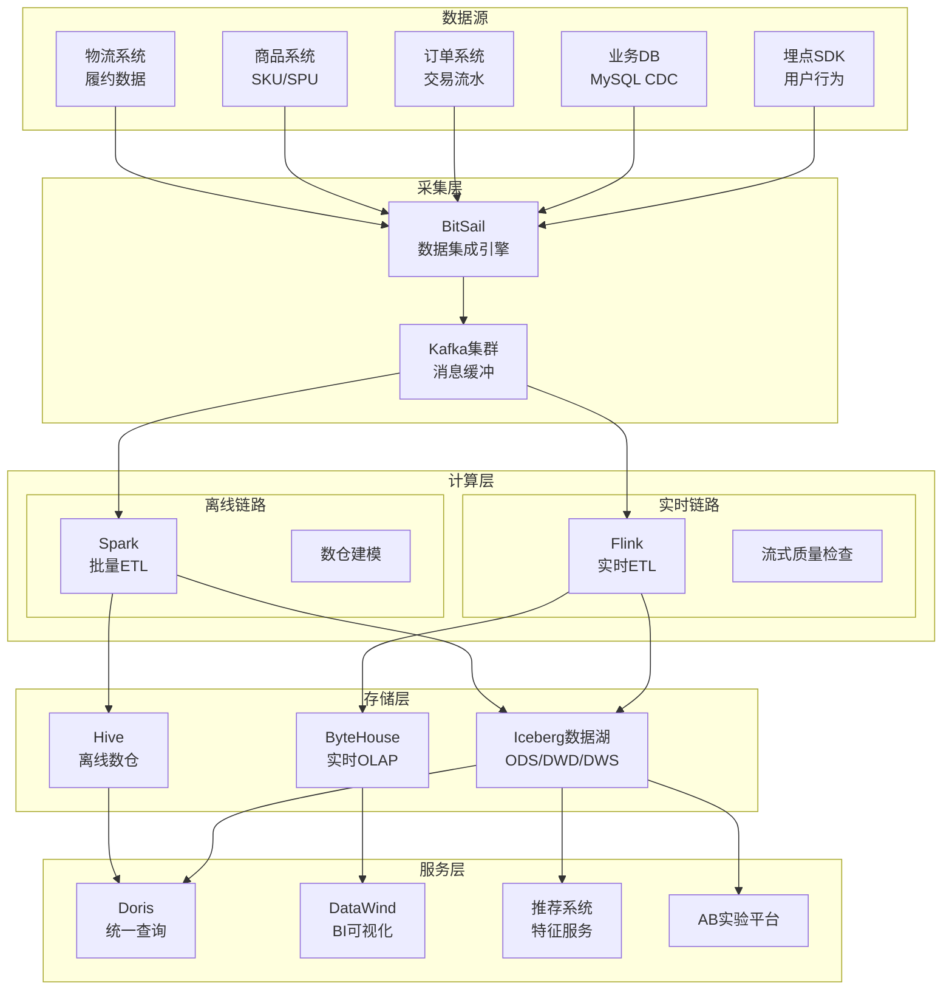
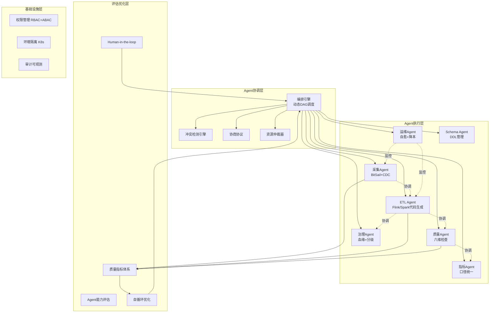
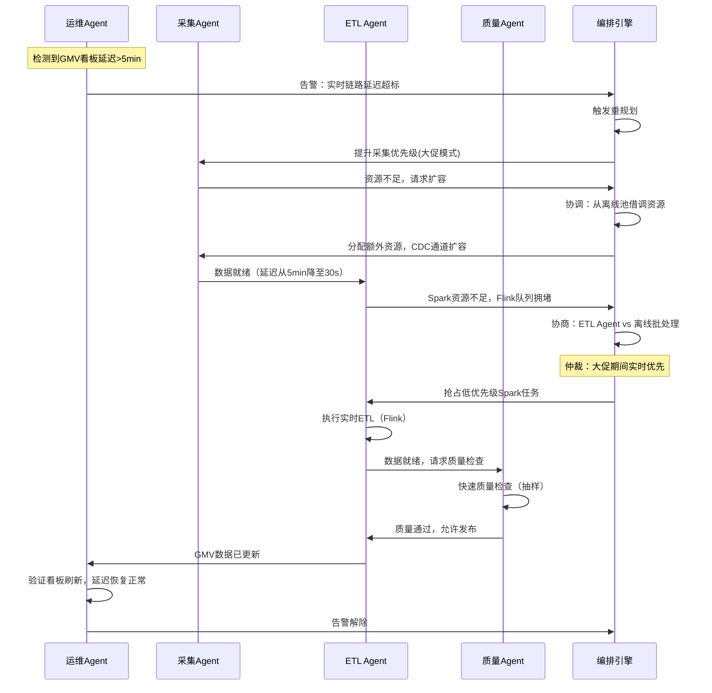

# 字节电商大数据全流程Agent化重构方案

基于Plan1的Agent协调架构，结合字节电商真实业务特性，以下为可落地的生产级重构方案。

---

## 一、字节电商大数据现状诊断

### 1.1 现有技术栈全景

| 层级 | 技术选型 | 规模特征 |
|---|---|---|
| **数据采集** | BitSail(自研)、Kafka、Pulsar | 日均百万亿行数据同步，20万+集成任务 |
| **数据存储** | Iceberg(数据湖)、HDFS、ByteHouse(OLAP) | PB级存储，存算分离架构 |
| **实时计算** | Flink(主力)、Spark Streaming | 数千Flink作业，百万QPS |
| **离线计算** | Spark、Presto | 万级Spark任务/日 |
| **数据服务** | Doris、ByteHouse、DataWind(BI) | 秒级查询响应，200+业务线 |
| **调度** | 内部调度系统(类Airflow) | 10万+DAG节点 |
| **治理** | DataLeap一站式平台 | 分布式自治治理模式 |

### 1.2 核心痛点（从第一性原理归因）

| 痛点 | 根因 | 业务影响 |
|---|---|---|
| **Lambda架构维护成本高** | 实时(Kafka→Flink→ByteHouse)与离线(HDFS→Spark→Hive)双链路 | 代码重复、口径不一致、存储冗余 |
| **指标口径混乱** | 分布式自治治理，无全局委员会 | 68%企业存在同名不同义问题，30%分析师时间浪费在核对 |
| **数据质量被动发现** | 90%问题由下游使用方发现 | 信任度低，CTO投诉率高 |
| **权限治理混乱** | 缺乏生命周期管理，授权后长期持有 | 安全隐患，平均申请需1天 |
| **开发交付慢** | 需求→开发→自测→交付周期长，返工率高 | 平均交付周期1周+ |
| **资源浪费** | 50-70%的表30天内无访问 | 存储成本高(多个PB级浪费) |

### 1.3 字节电商数据链路全景



---

## 二、Agent化重构架构设计

### 2.1 目标架构：从Lambda到Agent协调



### 2.2 核心Agent设计（结合电商业务）

#### A. 电商数据采集Agent

```python
class EcommerceIngestionAgent(BaseAgent):
    """字节电商数据采集Agent - 基于BitSail框架"""
    
    def __init__(self):
        self.bitsail_client = BitSailClient()
        self.data_sources = {
            "user_behavior": KafkaSource(topic="user_event_stream"),
            "order_cdc": CDCSource(
                mysql_host="order-db.internal",
                binlog_position="gtid",
                tables=["orders", "order_items", "payments"]
            ),
            "product_catalog": APISource(
                endpoint="https://ecom-api/internal/products",
                auth="service_account"
            ),
            "logistics": KafkaSource(topic="logistics_events")
        }
    
    def execute_task(self, task: IngestionTask) -> TaskResult:
        # 1. 感知数据源特征
        source_profile = self._profile_source(task.source_config)
        
        # 2. 决策采集策略（电商特化）
        if source_profile.source_type == "order_cdc":
            strategy = "realtime_cdc"  # 订单实时性要求高
        elif source_profile.source_type == "user_behavior":
            strategy = "stream_ingest"  # 行为数据流式接入
        elif source_profile.source_type == "product_catalog":
            strategy = "scheduled_batch"  # 商品目录定时同步
        
        # 3. 生成BitSail任务配置
        bitsail_config = self._generate_bitsail_config(
            source=task.source_config,
            target=task.target_config,  # Iceberg表
            strategy=strategy
        )
        
        # 4. 提交执行（通过协调层申请资源）
        resources = self._request_resources(
            cpu=8, memory="32GB",
            priority=task.business_priority  # 大促期间高优先级
        )
        
        execution = self.bitsail_client.submit(bitsail_config, resources)
        
        # 5. 质量感知：采集完成后立即初步检查
        quality_check = self._quick_quality_check(execution.output)
        
        # 6. 通知下游Agent（ETL Agent）
        self.notify_downstream("etl_agent", {
            "data_location": execution.output,
            "schema": source_profile.schema,
            "quality_report": quality_check,
            "data_volume": execution.row_count,
            "timestamp": execution.end_time
        })
        
        return TaskResult(
            status="success",
            output=execution.output,
            metrics={
                "rows_ingested": execution.row_count,
                "latency": execution.duration,
                "cdc_lag": execution.cdc_lag_seconds
            }
        )
```

#### B. 电商ETL开发Agent

```python
class EcommerceETLAgent(BaseAgent):
    """电商ETL Agent - 自动生成Flink/Spark代码"""
    
    def execute_task(self, task: ETLTask) -> TaskResult:
        # 1. 理解电商转换需求
        spec = self._understand_transformation(task.spec)
        
        # 2. 电商领域知识注入
        domain_knowledge = self._load_ecommerce_domain()
        # 包含：订单状态机、SKU/SPU关系、退款逻辑、大促规则
        
        # 3. 生成代码（引擎感知）
        if task.engine == "flink":
            code = self._generate_flink_sql(spec, domain_knowledge)
        elif task.engine == "spark":
            code = self._generate_spark_sql(spec, domain_knowledge)
        
        # 4. 自审查（电商特定规则）
        review = self._self_review(code, rules=[
            "订单金额不能为负",
            "退款金额不超过原订单",
            "GMV口径必须排除退款",
            "大促期间分区必须按小时",
            "SKU维度不能丢失品类信息"
        ])
        
        if review.has_issues:
            code = self._fix_with_domain_context(code, review.issues)
        
        # 5. 资源申请（通过协调层与运维Agent协商）
        resources = self._request_resources(
            engine=task.engine,
            estimated_data_size=task.estimated_volume,
            sla=task.sla  # 大促期间SLA更严格
        )
        
        # 6. 执行
        execution = self._execute(code, resources)
        
        # 7. 性能自优化
        if execution.duration > task.sla:
            # 自动调优：增加并行度、优化join策略
            optimized = self._optimize_for_ecommerce(execution)
            execution = self._re_execute(optimized)
        
        # 8. 血缘记录（通知治理Agent）
        self.notify_agent("governance_agent", {
            "action": "record_lineage",
            "source_tables": task.input_tables,
            "target_table": task.output_table,
            "transformation_logic": spec.summary,
            "execution_metrics": execution.metrics
        })
        
        return TaskResult(
            status="success",
            output=execution.output,
            quality_metrics=self._extract_quality_signals(execution)
        )
```

#### C. 电商数据质量Agent

```python
class EcommerceQualityAgent(BaseAgent):
    """电商数据质量守护Agent"""
    
    QUALITY_RULES = {
        # 订单域
        "order": {
            "completeness": {
                "order_id_not_null": "订单ID不能为空",
                "order_amount_range": "订单金额∈[0, 10000000]",
                "payment_status_valid": "支付状态∈{pending,paid,refunded,cancelled}"
            },
            "accuracy": {
                "gmv_excludes_refund": "GMV必须排除已退款订单",
                "order_item_count_match": "子订单数=订单明细数"
            },
            "consistency": {
                "order_payment_match": "订单金额=支付金额之和",
                "sku_price_match": "订单行价格=商品目录价格×折扣"
            },
            "timeliness": {
                "cdc_lag < 60s": "订单CDC延迟<60秒",
                "dws_freshness < 15min": "DWS层新鲜度<15分钟"
            }
        },
        # 用户行为域
        "user_behavior": {
            "completeness": {
                "user_id_not_null": "用户ID不能为空",
                "event_type_valid": "事件类型∈{view,click,add_cart,purchase,share}"
            },
            "accuracy": {
                "timestamp_sequence": "事件时间戳单调递增",
                "device_id_format": "设备ID格式合规"
            }
        },
        # 商品域
        "product": {
            "uniqueness": {
                "sku_id_unique": "SKU_ID全局唯一"
            },
            "consistency": {
                "category_hierarchy_valid": "品类层级完整(一级→二级→三级)",
                "price_range_valid": "价格∈[0.01, 99999999]"
            }
        }
    }
    
    def execute_task(self, task: QualityTask) -> TaskResult:
        # 1. 获取数据样本（电商数据量大，需智能采样）
        sample = self._smart_sample(
            task.data_source,
            strategy="stratified",  # 分层采样
            strata=["order_status", "category_id", "hour_bucket"]
        )
        
        # 2. 执行领域特定质量检查
        domain = task.domain  # "order" | "user_behavior" | "product"
        rules = self.QUALITY_RULES.get(domain, {})
        
        check_results = {}
        for dimension, dimension_rules in rules.items():
            check_results[dimension] = {}
            for rule_name, rule_desc in dimension_rules.items():
                check_results[dimension][rule_name] = self._execute_rule(
                    sample, rule_name, rule_desc
                )
        
        # 3. 异常检测（电商特化）
        anomalies = self._detect_ecommerce_anomalies(sample, task.baseline)
        # 检测：GMV突降、退款率飙升、转化率异常、大促数据量激增
        
        # 4. 质量评分
        score = self._calculate_score(check_results, anomalies)
        
        # 5. 决策：阻断 or 放行
        if score < task.blocking_threshold:
            # 阻断并通知ETL Agent修复
            self.notify_agent("etl_agent", {
                "action": "fix_quality_issue",
                "domain": domain,
                "failed_rules": self._extract_failures(check_results),
                "suggested_fix": self._suggest_fix(check_results)
            })
            return TaskResult(status="blocked", quality_report=check_results)
        
        # 6. 通知指标Agent更新口径
        self.notify_agent("metric_agent", {
            "action": "validate_metric",
            "data_quality_score": score,
            "domain": domain
        })
        
        return TaskResult(status="passed", quality_report=check_results)
```

#### D. 电商指标口径Agent

```python
class EcommerceMetricAgent(BaseAgent):
    """电商指标口径统一Agent"""
    
    METRIC_TEMPLATES = {
        "GMV": {
            "definition": "成交总额(排除退款)",
            "formula": "SUM(order_amount) WHERE status='paid' AND refund_status IS NULL",
            "dimensions": ["date", "category_l1", "channel", "region"],
            "grain": "订单粒度",
            "exclusions": ["退款订单", "测试订单", "刷单数据"]
        },
        "DAU": {
            "definition": "日活跃用户数(去重)",
            "formula": "COUNT(DISTINCT user_id) WHERE event_type IN ('view','click','purchase')",
            "dimensions": ["date", "platform", "channel"],
            "dedup_key": "user_id + date"
        },
        "conversion_rate": {
            "definition": "转化率=下单用户数/活跃用户数",
            "formula": "COUNT(DISTINCT order_user_id) / COUNT(DISTINCT active_user_id)",
            "time_window": "same_day",
            "exclusions": ["退款用户不扣除"]
        }
    }
    
    def execute_task(self, task: MetricTask) -> TaskResult:
        # 1. 检查指标口径一致性
        metric_name = task.metric_name
        template = self.METRIC_TEMPLATES.get(metric_name)
        
        # 2. 对比现有定义与标准模板
        existing_def = self._fetch_existing_definition(metric_name, task.data_source)
        diff = self._compare_definitions(existing_def, template)
        
        if diff.has_conflict:
            # 3. 协商：与使用方Agent协商口径
            negotiation_result = self._negotiate_with_consumers(
                metric_name, diff, task.consumers
            )
            
            if negotiation_result.agreed:
                # 4. 自动修复口径
                fix_sql = self._generate_metric_fix_sql(
                    metric_name, negotiation_result.consensus_definition
                )
                self.notify_agent("etl_agent", {
                    "action": "execute_fix",
                    "sql": fix_sql,
                    "reason": "口径不一致"
                })
        
        return TaskResult(
            status="success",
            metric_definition=template,
            consistency_report=diff
        )
```

### 2.3 电商场景多Agent协调实例

**场景：大促期间实时GMV看板数据延迟**



---

## 三、落地路线图

### 阶段一：基础设施（月1-4）

| 任务 | 字节电商适配 | 验收标准 |
|---|---|---|
| 编排引擎 | 对接内部调度系统，支持BitSail任务类型 | 能调度BitSail+Flink+Spark |
| Agent通信 | 基于内部RPC框架+Kafka | 消息延迟<50ms |
| 权限框架 | 对接内部Ranger+ABAC | 覆盖表/列/行级权限 |
| 环境隔离 | K8s命名空间+资源配额 | Agent间资源不争抢 |

### 阶段二：核心Agent（月5-10）

| Agent | 电商适配重点 | 里程碑 |
|---|---|---|
| 采集Agent | BitSail配置自动生成，CDC+Kafka双通道 | 月7 |
| ETL Agent | Flink SQL自动生成，电商领域知识库 | 月8 |
| 质量Agent | 订单/行为/商品三域质量规则 | 月9 |
| 指标Agent | GMV/DAU/转化率口径统一 | 月10 |

### 阶段三：协调机制（月11-15）

| 任务 | 电商场景 |
|---|---|
| 冲突检测 | 大促期间资源争抢自动仲裁 |
| 协商协议 | 实时vs离线优先级协商 |
| 自循环优化 | Flink作业自动调参 |
| A/B测试 | 质量规则变更灰度验证 |

### 阶段四：全链路贯通（月16-20）

| 任务 | 验收标准 |
|---|---|
| 端到端管道 | 采集→ETL→质量→服务全Agent化 |
| 大促压测 | 双11级别流量下稳定运行 |
| 降本效果 | 存储成本降低30%+，开发效率提升50% |

### 阶段五：规模化（月21-24）

| 任务 | 目标 |
|---|---|
| 全业务线推广 | 覆盖抖音电商+TikTok电商 |
| 灾备方案 | 多活+故障自动转移 |
| 成本优化 | Agent资源利用率>80% |

---

## 四、关键设计决策

### 为什么选择Iceberg而非Hudi作为数据湖格式？

字节跳动**全面选择Iceberg**构建实时数仓【turn0search11】。原因：
1. **计算引擎解耦**：Iceberg完美解耦计算引擎与存储，适配Flink+Spark+Presto多引擎
2. **Schema演进**：电商业务Schema变更频繁，Iceberg的schema evolution更成熟
3. **时间旅行**：支持数据版本回溯，适合电商大促复盘

### 为什么保留BitSail而非替换为Flink CDC？

BitSail是字节自研的高性能数据集成引擎，日均处理百万亿行数据【turn0search10】，已深度适配内部基础设施。Agent化重构不是替换技术栈，而是在现有栈之上增加智能协调层。

### 为什么采用"分布式自治"而非"集中式治理"？

字节跳动没有设立统一的数据治理委员会，而是各部门自决策自治【turn0search30】。这与Agent协调的"局部可见+分布式决策"理念天然契合——不需要强制集中化，而是在自治的基础上增加协调机制。

### Agent协调如何解决电商"大促"场景的特殊挑战？

大促（双11/618）期间数据量激增10-100倍，传统静态调度无法应对。Agent协调的核心价值在于：
1. **动态资源仲裁**：实时Agent自动抢占离线Agent资源
2. **SLA感知调度**：GMV看板(秒级SLA) > 日志分析(分钟级SLA)
3. **降级协商**：非核心Agent自动降级或暂停

---

## 五、量化预期收益

| 维度 | 现状 | Agent化后 | 提升幅度 |
|---|---|---|---|
| **开发交付周期** | 7天 | 2天 | -71% |
| **数据质量发现问题** | 90%下游发现 | 80%Agent主动发现 | +89% |
| **指标口径一致性** | 68%不一致 | 95%+一致 | +40% |
| **存储浪费** | 50-70%表无访问 | <20%无访问 | -60% |
| **大促期间延迟** | 5-30min | <1min | -95% |
| **人工运维成本** | 高 | 降低70% | -70% |

这套方案不是推倒重来，而是在字节现有技术栈（BitSail+Flink+Iceberg+ByteHouse+DataLeap）之上，增加Agent协调层，将"人驱动+工具辅助"升级为"Agent驱动+人监督"，用系统性的协调机制解决分布式自治带来的口径混乱、资源争抢、质量被动等核心痛点。